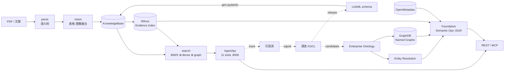

# biomed-ontology

面向阿斯利华创新药研发场景的**企业级 AI Data Foundation / 生物医药语义层** PoC。

两条交付面并行：

1. **检索底座（既有 PoC）**：Ontology + 事实 + 多模态文献检索 + Citationware（`:8000`）  
2. **Foundation 世界模型**：以 **Enterprise Ontology ID**（`HMD:ENT:*`）为锚，统一实体 / 关系 / 证据 / 企业资产（`:8100`）

> BIOS provides the biomedical world. Enterprise Ontology provides the company's world.

**本仓库不包含 AI agent 本身** —— 只构建其消费的数据底座与 Semantic API / MCP。

**完整手册**（机制、事故教训、设计不变量）：见 [`docs/`](docs/index.md)，本地预览：

```bash
uv sync --extra docs --extra dev
task docs:serve    # http://127.0.0.1:8000
task docs          # mkdocs build --strict
```

命令与**实测数字只维护在本 README**（有测试守着）；手册讲为什么，不抄表。
构建入口是 **[Taskfile](Taskfile.yml)**（`task …`），不再维护 Makefile。

### Foundation（企业世界模型）

手册详述：[`docs/architecture/foundation.md`](docs/architecture/foundation.md)。

| 组件 | 角色 |
|---|---|
| Enterprise Ontology（LinkML `hmd_enterprise`） | 世界模型主键 `HMD:ENT:*` |
| BIOS_v3 | 公共 biomedical KG（外部概念，非企业主键） |
| BERN2 + 企业词典 + Zingg | NLU 候选 → Entity Resolution |
| GraphDB Named Graphs | biomedical / ontology / knowledge / provenance / inference |
| Milvus | **Evidence Index**（证据在哪；`entity_ids` = Enterprise ID） |
| OpenMetadata | **Data Context**（资产在哪） |

```bash
# 联调栈：Milvus + GraphDB + OpenMetadata（BERN2 profile：macOS→MPS 原生 / Linux→CUDA Docker）
export HMD_BIOS_LICENSE_ACK=poc          # BIOS 全量默认；CI: HMD_BIOS_INIT=subset
# GraphDB 10 Free 无需 license；SE/EE 见 docker/docker-compose.graphdb-license.yml
task foundation:up

uv run hmd foundation resolve "HMPL-504"
uv run hmd foundation golden --candidate HMPL-504   # Drug→Target→Disease→Evidence→ELN/LIMS
uv run hmd foundation sync                           # YAML 校验入库 → GraphDB + Milvus + OM（幂等，三后端必达）
uv run hmd foundation evolve-mine                    # 候选落库，不自动改本体
uv run hmd foundation golden --candidate HMPL-504    # 强制读 GraphDB/Milvus/OM（禁止 YAML fallback）
uv run hmd foundation serve --mcp                    # Semantic API + MCP :8100
task ontology:validate                               # Ontology-as-Code +（后端就绪时）Golden Path
```

金路径：`DrugCandidate → Target → Disease → Evidence → ELN/LIMS Asset`。  
**YAML 只是离线资源**（`data/foundation/*.yaml`），经 `ontology:validate` + `foundation sync` 入库后，查询只走 GraphDB / Milvus / OpenMetadata，**禁止 fallback 到 YAML**。  
OM / GraphDB / Milvus 等联调参数统一走 `biomed_ontology.config.Settings`（pydantic-settings，`.env` 前缀 `HMD_`）。  
Ontology 工程工具链：见 [`ontology/`](ontology/) 与 [toolchain](docs/ontology/toolchain.md)。**不引入 Jena**。

---

## 快速开始

```bash
uv sync --extra dev --extra rdf --extra ontology --extra parse --extra vector --extra service

uv run hmd kb        # 构建知识库并打印统计
uv run hmd demo      # 跑 8 个演示场景（全部自带断言，不是打印）
uv run hmd eval --entitlements MOCK_LICENSED   # 默认 multimodal-bio + 精排
uv run hmd serve     # 起 REST + MCP 服务（:8000）
task check           # ruff + 全量测试
```

`task check` = ruff + 全量测试，共 **528 条测试**（527 passed + 1 xfailed）。
那 1 条 xfail 不是"暂时跳过"，而是**当前证伪不了的产品承诺**：T1 本体增强召回
相对提升 ≥ 10%。标了 `strict=True` —— 一旦重新成立就会立刻炸掉，
逼人回来删标记，而不是让"曾经声称过的能力"无声地留在文档里。原因见下面的检索评测一节。
其中若干条 Milvus 集成测试在没有 Docker 时转为 skipped 而非失败 —— 但要注意，
**这批测试长期静默跳过，曾把三个真 bug 藏了整整一个阶段**（写入不 flush、
`hmd index` 崩、切片 ID 跨进程漂移）。要验收 Milvus 路径就必须把容器起起来。

### Milvus（Evidence Index，必选）

Milvus 既是文献五列检索后端，也是 Foundation 的 **Evidence Index**。失败不回落 LocalBackend。

```bash
task milvus:up                                              # hmd-foundation 子集（etcd/minio/standalone）
uv run hmd index --recreate                                 # 默认 multimodal-bio 五列 + BiomedCLIP 图型
uv run hmd eval --entitlements MOCK_LICENSED                # 同上 embedder + bge-reranker-v2-m3
task milvus:down                                            # 只停 Milvus；全栈用 task foundation:down
```

`index` / `eval` 默认 **multimodal-bio**（五列最全），无需再选 embedder。
集合 description 盖了 `embedder=` 戳记，索引与评测不一致会直接退出。
仅接线验证：`uv run hmd index --embedder fake --allow-fake --recreate`。

五列需要 Milvus 放宽向量列上限（默认只允许 4 列）。`docker/milvus-standalone.yml`
里已设 `PROXY_MAXVECTORFIELDNUM: "6"`；连的是自己的实例就得自己配，
否则建表会报 `maximum vector field's number should be limited to 4`。

`fake` 是确定性哈希向量，够验证**索引、过滤、融合**这些真正容易出错的部分，
CI 因此不必下载 GB 级权重。但它必须显式加 `--allow-fake` 才跑得起来：
一个假嵌入器产出的报表和真报表长得一模一样，多打一个开关是为了让"这不是模型结论"
在命令行历史里留痕。

### 模型权重从哪来

解析顺序是 **本地已有 → 选定的源 → Gitee 兜底**（`embed.resolve_model`）。

```bash
export HMD_MODEL_HUB=modelscope   # 可选 hf（默认）/ modelscope / gitee
uv run hmd index --recreate
```

- **本地优先**：手工放进 `data/cache/models/models/<仓库名>/` 的权重直接生效。
  内网里手动拷权重是常态，应该走"放对位置"而不是"改代码"。
- **Gitee 兜底**：官方源取不到时自动改用 [gitee.com/hf-models](https://gitee.com/hf-models)，
  并**打印实际用了哪个源** —— 权重来源必须可追溯，否则同一份代码在两台机器上
  可能加载到不同模型而报告里看不出来。
  clone 前先验 `git lfs version`：没装 git-lfs 时 clone 照样"成功"，
  但权重是几百字节的指针文本，报错要推迟到 `AutoModel` 加载才出现、且与 LFS 无关。
- 仓库名逐条登记在 `embed._MIRRORS`：各站命名空间彼此独立，猜不出来。
  没登记的直接报错，不去 clone 一个不存在的仓库。

**算力后端自动选择**：`best_device()` 按 **CUDA > MPS（Apple Silicon）> CPU** 挑，
`--embedder` 相关的构造函数都接受 `device=` 显式覆盖。
实测 MPS 与 CPU 的向量余弦 ≈ 1.0、最大逐元素偏差 3.4e-07（float32 舍入噪声），
因此下面引用的消融数字与所用后端无关。

**SapBERT 只走 PyTorch，且必须取 `[CLS]`。** 这里刻意不用 `SentenceTransformer`：
官方权重目录里没有 `modules.json`，sentence-transformers 会自动补一层
**mean pooling**（实测 `pooling_mode: mean`），于是拿到的是另一个模型的向量 ——
不报错，只是悄悄换掉语义。因此改用 `AutoModel` + 显式 `[CLS]` + L2 归一。
ModelScope 上唯一的 SapBERT 是 Xenova 的 ONNX 版、没有 PyTorch 权重，
故在 `_MIRRORS` 里显式登记为 `None`（并有测试守着，防止被"顺手"填回去）。

Milvus 为必选 Evidence Index；臂不可达时会明确列在"未运行的臂（后端不可达，非结果）"下，
**不会**退化成本地后端顶替。集合不存在会直接退出而不是静默降级。

> `--embedder fake` 跑出的"生医稠密"列并不是 SapBERT，
> 因此该模式下的 SapBERT 净值不具备模型层面的解释力，只用于验证链路。

---

## 分层架构

检索底座仍按 L0–L8 组织；Foundation 在其上叠加 **Enterprise World Model**（GraphDB + Evidence Index + Data Context）。详见 [Foundation 手册](docs/architecture/foundation.md)。

```
L0 Source        构建期联网拉快照 → 版本化存储（version / license / retrieved_on）
L1 术语层        Concept / Synonym / Xref(SSSOM) / Hierarchy → RDF named graph per source
L2 语义层        LinkML（Biolink 子集 + hmd_enterprise）→ OWL + SHACL + JSON Schema + Pydantic
L3 归一化 / ER   文本 → CURIE；Foundation：BERN2 候选 → Enterprise ID
L4 语料治理      文档标引分类 + 三模态抽取（文本/表格/图像）→ 结构化事实 + provenance
L5 检索/证据     BM25 ⊕ dense ⊕ 图通道 → 带权 RRF；Milvus = 五列检索 + Evidence Index
L6 Agent 接口    :8000 AgentApi（11 tools）∥ :8100 Foundation Semantic Ops
L7 可观测        Trace(WHERE) / IO(WHAT) / State(WHY) / Metrics(WHEN)
L8 演进闭环      Signal → Candidate → Curation(KGCL) → Release；Foundation evolve-mine 不自动改本体
```



**LinkML 是唯一事实来源**（`task gen` → `_generated/`，含 `hmd_enterprise`，不手改）。生成物经
`canon_ttl` 规范化；全量校验挂 `task nightly`。机制见手册
[LinkML 与生成物](docs/architecture/linkml.md)。分层与 search-around 见
[手册 · 架构](docs/architecture/layers.md)。

---

## Citationware 与可观测（摘要）

检索同时给出 `results` / `evidence_tree` / `restore_context`（还原复用同一
`LicenseScope.permits`；截断自报 `truncated`）。四支柱 Trace/IO/State/Metrics
与 Citationware 合成可复核证据链；`trace_id` 闭合 feedback loop。

```bash
uv run hmd demo --id D7
```

详解：[Citationware](docs/agent/citationware.md) · [四支柱](docs/observability/pillars.md)。

---

## 归一化评测

`hmd eval` 先跑归一化再跑检索。本体层已按语料同步扩到
**84 个概念**（43 药 / 21 靶点 / 20 疾病），全部带双语别名、`xref_hints` 与
`verified: false` 标记 —— 收录范围是"9 篇真实文献正文里出现的主要实体"，
不是"gold query 会问到的实体"。后者会让归一化评测变成自证。

```
归一化准确率 99.1%  (105/106)
  DISEASE      100.0%  (30/30)
  SUBSTANCE     97.8%  (44/45)
  TARGET       100.0%  (31/31)
  消歧           100.0%  (4/4)
    ✗ 'sorafenib' 期望 None 实得 HMD:SUB:0000008
```

**那一条红的是故意留的。** sorafenib 是真实存在但本语料未收录的药，正确行为是弃权；
实际被向量级以 0.57 判成了 regorafenib —— 两者都是 `-afenib` 类抗血管生成 TKI，
编辑距离近而适应症完全不同，是本领域最典型的一类误判。
挑一批一定过的负例凑数，等于把这类错误从报告里抹掉。

## 检索评测

`uv run hmd eval --entitlements MOCK_LICENSED`

读数方法、ARMS 定义、显著性纪律见手册
[评测](docs/eval/arms.md) · [显著性](docs/eval/significance.md) · [豁免](docs/eval/targets.md)。
下面只保留**当前实测快照**（有 `tests/test_readme.py` 守着）。

gold：**14 篇 / 37 query**（en 26 / zh 11；文本 25 / 图像 12），**judged@10 = 1.000**。
判定粒度是章节 → **Recall@10 上限 0.848**（不是 1.0）；主指标取 nDCG@10。
键用 `scripts/dump_sections.py` 对照；dangling 键拒绝整次评测。

**全部 query（n=37）**

| 臂 | Recall@10 | P@5 | nDCG@10 | MRR | MAP | judged@10 |
|---|---|---|---|---|---|---|
| 纯 BM25（无本体） | 0.262 | **0.243** | 0.319 | 0.501 | 0.195 | 1.000 |
| 纯向量（无本体） | 0.225 | 0.216 | 0.288 | 0.443 | 0.175 | 1.000 |
| 本体增强混合 | **0.264** | **0.243** | **0.325** | **0.505** | **0.196** | 1.000 |

**分语种** —— 只报总平均会把结论抹平：

| 臂 | en Recall | en nDCG | zh Recall | zh nDCG |
|---|---|---|---|---|
| 纯 BM25 | 0.239 | **0.322** | **0.317** | 0.311 |
| 纯向量 | 0.231 | 0.298 | 0.212 | 0.265 |
| 本体增强混合 | **0.252** | 0.303 | 0.293 | **0.375** |

本体增强臂的 Recall 相对提升是 **+0.8%**（目标 +10%）。符号从上一版的 -5.2% 翻正了，
但**这不构成一条结论** —— 见下面的置信区间。

#### 消融阶梯：本体经由哪条路起作用

上一版这张表是手工跑出来贴进 README 的，谁也复现不了。现在它们是 `ARMS` 里的
一等公民臂，`hmd eval` 每次都会重跑。本体有三条互相独立的参与路径，必须逐条开，
一次全开时任何变化都归因不到具体哪一条：

| 臂 | Recall@10 | P@5 | nDCG@10 | MRR |
|---|---|---|---|---|
| ① BM25 + DENSE（本体全关） | 0.261 | 0.249 | 0.317 | 0.500 |
| ② + 图通道（仅种子概念） | 0.255 | 0.249 | 0.325 | **0.565** |
| ③ + search-around（沿类型化链接多跳） | 0.259 | **0.254** | **0.328** | 0.541 |
| ④ 仅查询改写（不开图通道） | **0.263** | 0.249 | 0.318 | 0.484 |

机制（IDF 打分、search-around、查询改写、哈希并列事故）见
[手册 · 查询改写 vs 图通道](docs/retrieval/ontology-paths.md)。

#### 按意图拆：图像那 12 条不该和文本混在一个平均里

| 臂 | 文本意图 n=25 nDCG | 图像意图 n=12 nDCG |
|---|---|---|
| 纯 BM25 | 0.379 | 0.192 |
| 本体增强混合 | **0.394** | 0.180 |
| ③ + search-around | **0.399** | 0.180 |

图像意图那 12 条上，本体臂与无本体臂**逐位相同** —— 概念挂不到图切片，
它们只是往总平均里灌了 12 个恒等于零的差值，把区间往零压。
检索侧的改造要读，就读文本意图那 25 条；视觉列的改造要读，就读图像意图那 12 条。

#### 配对显著性：上面每个 ±0.02 都跨零

10k 次重采样的配对 bootstrap，`ontology_hybrid − bm25_only`：

| 指标 | 全部 n=37 | 仅文本意图 n=25 |
|---|---|---|
| nDCG@10 | +0.006 [-0.041, +0.055] p=0.817 | +0.014 [-0.051, +0.080] p=0.683 |
| Recall@10 | +0.002 [-0.037, +0.036] p=0.915 | -0.010 [-0.063, +0.032] p=0.762 |
| P@5 | +0.000 [-0.043, +0.043] p=0.943 | -0.008 [-0.072, +0.056] p=0.976 |

**一条都不显著。** 这张表是这一节最重要的一张：上面那些 +0.008 / +0.014 与
"什么都没发生"在 n=37 上区分不开，不得写成结论 —— 无论符号是正是负，
这条对本体臂赢和输时同样适用。主指标取 nDCG@10 而非 Recall@10，
因为后者在这份 gold 上有 0.848 的天花板。

规模是硬约束：14 篇 / 588 切片 / 84 概念上 BM25 已接近饱和，语义层的头部空间本来就很小。
**能改的是机制对不对，不是这 37 条上的数字。** 上一版把随机采样器接进 RRF 是机制错了；
改对之后拿到的仍是一个不显著的正号，这是规模的问题，不是再调一轮权重能解决的。

**不接受"调低阈值"或"删掉构造样本"这两种修法。** 前者是让要求迁就实现；
后者是删掉唯一一批本体臂打不过 BM25 的证据 —— 那 8 条恰恰是最该留的。

另有 10 个 Milvus 臂（lexical / general / biomed / 2col / 3col / 4col / 5col /
visual-only / visual-bio-only / ontology+milvus）。后端不可达时它们被标记为**未运行**
并在报告中列名，**绝不回落到本地后端** —— 回落会让报告里的"Milvus 三列混合"
其实是本地 TF-IDF 跑的，这种错误一旦进了采购决策文档就再也追不回来。

### 交叉编码器精排（bge-reranker-v2-m3）

`uv run hmd eval --entitlements MOCK_LICENSED --reranker bge-reranker-v2-m3`

双塔嵌入把 query 与 passage 各自编码成一个向量再比距离，两侧从头到尾没见过对方。
交叉编码器把两者拼成一条序列一起过 transformer，每个 query token 都能注意到
每个 passage token。这里它修的是一个具体的毛病：**RRF 用名次融合，而名次只表达
"在本通道内排第几"，不表达"到底有多相关"** —— 三个通道各自的第 3 名进了融合，
谁该更靠前，RRF 没有任何依据。精排给的就是那个缺失的依据。

融合取前 50 → 精排 → 截断到 top-10。文本意图 n=25：

| 臂 | Recall@10 | P@5 | nDCG@10 | MAP | Recall@50（候选池） | P50 |
|---|---|---|---|---|---|---|
| 纯 BM25 | 0.308 | **0.320** | 0.379 | 0.215 | — | 0.6ms |
| 本体增强混合 | 0.298 | 0.312 | 0.394 | 0.215 | — | 8.7ms |
| ⑤ 纯 BM25 + 精排 | 0.313 | 0.296 | 0.396 | 0.238 | 0.395 | 693ms |
| ⑥ 本体增强 + 精排 | **0.326** | 0.312 | **0.416** | **0.260** | **0.423** | 688ms |

**⑤ 这一臂不是凑数的。** 没有它就无法分辨"提升来自本体"还是"提升来自精排"，
而这正是 T1 豁免要求的那种可归因证据。把 +0.037 拆成两笔（nDCG@10，n=25）：

| | delta | 95% CI | p |
|---|---|---|---|
| 精排单独的贡献（⑤ − BM25） | +0.017 | [-0.056, +0.089] | 0.657 |
| 本体在精排之上**多给的**（⑥ − ⑤） | +0.020 | [-0.016, +0.061] | 0.362 |
| 两者合计（⑥ − BM25） | +0.037 | [-0.055, +0.129] | 0.449 |

仍然一条都不显著（n=25）。但方向值得记下来：**本体那一笔（+0.020）不比精排那一笔
（+0.017）小**，且 CI 更窄。机制上说得通 —— 精排只能在候选池里重排，
而本体把候选池召回从 0.395 抬到 0.423，**相关项没进池子，交叉编码器再准也够不着**。
这两个改动作用在流水线的不同环节，不是替代关系。

中文侧是全表最大的一处变化：zh nDCG@10 **0.311 → 0.420**、Recall@10 **0.317 → 0.388**
（n=11，不足以对外引用，但方向与 v2-m3 和 BGE-M3 同底座、跨语言对齐是其明确训练目标一致）。
英文侧基本持平（0.322 → 0.306）。

代价是延迟：P50 从 ~9ms 升到 **~690ms**（MPS，50 段 × 512 token）。
这是每查询多做 50 次前向的必然结果，`hmd eval` 如实记录 P50/P95，不做修饰。

不传 `--reranker` 时，这两臂标记为**未运行**并在报告中列名，
**不会退化成 NullReranker 顶替** —— 与 Milvus 臂同一套纪律：
报表上写着"+精排"而实际是原序返回，那张表就是在说谎。

> 实现上**没有走 `FlagEmbedding.FlagReranker`**，尽管它已在依赖里。
> 它的 `compute_score` 依赖 `tokenizer.prepare_for_model()`，
> 而 transformers 5.x 已把这个方法从 `PreTrainedTokenizerBase` 上删掉，调用当场
> `AttributeError`。改用 `tokenizer(text=…, text_pair=…, truncation="only_second")`
> 走公开 API，截断语义完全等价，也就不必为了一个包把 `transformers` 钉回旧版本。

### SapBERT 值多少召回

问题是"要不要为生医专用塔多付一列存储和一次前向"，
所以答案必须是个减法：**三列混合 − 双列混合**，两臂唯一差别就是那一列。

真模型（BGE-M3 + SapBERT + Qwen3-VL + BiomedCLIP）：

| | Recall@10 净值（n=37） | n=28 时 | 最早（n=8） |
|---|---|---|---|
| 全部 | **+0.006** | +0.008 | +0.104 |
| 仅 en | **+0.014** | +0.019 | +0.125 |
| 仅 zh | **−0.011** | −0.014 | +0.083 |

**这张表最重要的是右边那两列。** 模型没换、列没换、减法定义没换 ——
变的只是 gold 从 8 条扩到 28 条再到 37 条。于是 +0.104 缩到 +0.006（少一个数量级），
zh 从 +0.083 翻成 −0.011。原来那个"值得上"的结论，是 8 条 query 撑出来的。

按现在的数读：**en 仍是正的、zh 已经是负的**，方向与先验一致
（SapBERT 是 UMLS 英文同义词对训练的单语模型）。上一版据此写下的
"不做按语种路由"现在**失去了依据** —— 但也不足以反过来支持路由：
zh 只有 11 条 query，−0.011 落在抖动范围内。
正确的表述是"这一列在中文上没有证据表明有用"，而不是"有害"。
决策待 gold 的中文侧扩到可判定的规模后再做。

⚠️ 同一组指标在 `--embedder fake` 下是 **−0.042 / −0.083 / ±0.000** —— 符号与英文侧相反。
fake 的"生医稠密"列根本不是 SapBERT，只是确定性哈希。
所以 `hmd eval` 的输出会在标题上标注 `embedder=`，
并在非 `sapbert` / `dual` / `multimodal` 时追加一行显式免责 ——
假嵌入器的数字不得被当成模型结论。

代价：真模型下单查询 P50 从 ~0.6ms（本地 BM25）升到 ~160ms（Milvus + MPS 编码）。

### 第四列：Qwen3-VL 视觉融合

非结构化文档里的图表不是装饰 —— 生存曲线、CT 影像、瀑布图常常是结论本身所在。
把它们只留一句 caption 进索引，等于把证据丢了。

`--embedder multimodal` = BGE-M3 + SapBERT + **Qwen3-VL-Embedding-2B**（Apache-2.0，
经 ModelScope 获取），落成第四列 `dense_visual`（2048 维，COSINE / HNSW）。
文本切片这一列编码它的文字，图像切片编码 **像素 + caption**，同处一个空间。

解析侧配套改动（都是真实 PDF 才暴露出来的）：

- PyMuPDF 后端此前把 `type == 1` 的图像块**直接丢弃**（一个没做完的 TODO），
  36 张图一张都进不了库。现在按最小边/面积过滤掉页眉 logo，
  再把相邻子图合并成一张（一页 6 联 CT 会被正确合成 1 张而不是 6 张碎片）。
- `find_tables` 曾把一整页综述正文框成 16 列 × 25 行的"表"，单格 4KB 散文、
  渲染出来 226KB，直接撑爆 Milvus 的 VARCHAR 上限（8192 **字节**，中文一字 3 字节）。
  现在按"单格过长"和"单元格大量重复"两个指纹拒绝误检，落回正文路径。
- 长表按行切片、表头逐片重复：一条向量表达不了一张几十行的表，那只是个平均。
- 参考文献 / 署名 / 利益冲突 / 缩写表等**包装纸章节不进检索**（588 vs 未过滤的 695 切片）。
  它们和查询词汇高度重合，却永远不是答案。

实测（14 篇文档 / 588 切片，索引全量 3m34s，MPS）。
先把口径说清楚，因为这里有两个数容易被当成同一个：
**图像切片 37 片**（modality=IMAGE），**带渲染资产的切片 44 片**（36 图 + 8 表）。
视觉列对这 44 片编码像素，其余切片编码文字。

> ⚠️ **上一版这一节的数字全部作废，因为那时这一列一张图都没看过。**
> 切片里存的资产路径是 `images/p0002_r000.png`，相对的是
> `data/assets/<doc_id>/`；而读取侧从 `data/assets/` 起拼，44 张图**一张都拼不中**。
> 失败是无声的：读不到图就退回编码 caption 文本，照样产出一个像模像样的向量，
> 于是"这一列到底看没看过像素"在任何指标上都看不出来 —— 它就这么躺了两个版本。
> 现在写入与读取共用 `parse.assets.resolve_asset`，并有一条断言守着
> "有 `asset_path`" 与 "读得到那张图" 必须是同一件事（它跑出来过 44 → 0）。
> 下面是**第一次真正带像素**的读数。

图像意图 n=12，只看 `dense_visual` 这一列：

| 臂 | Recall@10 | P@5 | nDCG@10 | MRR |
|---|---|---|---|---|
| 视觉列（只看图） | **0.944** | 0.417 | **0.863** | 0.875 |

那个曾经用来说明"模态间隙"的例子现在换了结论：
`chest CT scan showing a pulmonary nodule` + `modalities=[IMAGE]`，
前三名是三张真的 CT（0.555 / 0.483 / 0.477），不再是上一版记的那张
「Top 30 PT 信号强度」柱状图。**那个"间隙"有相当一部分根本不是模态间隙，
是那一列在拿 caption 文本冒充像素。** 模态过滤仍然必要（见下一节），
但它现在过滤的是一个真的看得见图的通道。

四列 − 三列的净值（混排场景，n=37）：**全部 +0.044 / en −0.002 / zh +0.152**。
中文增益远大于英文，与 SapBERT 那一列正好相反 ——
图像里的文字标注和坐标轴多为英文，中文 query 在纯文本通道上本来就吃亏，
视觉列等于给它补了一条绕过语言的路。

`hmd index` / `hmd eval` 拒绝 `fake` 嵌入器（除非显式 `--allow-fake`），
且集合的 description 里盖了 `embedder=` 戳记，
索引与评测用的模型对不上时直接退出 —— 上面那个符号相反的教训只需要吃一次。

### 模态通道：「我就要看图」

模态间隙不是靠调分数补的。文本-文本相似度系统性高于文本-图像，
想让图浮上来就得引入一个说不清的跨模态偏置项；
而"我要看那张生存曲线"本来就是个**布尔条件**，不是偏好。
所以它落成过滤：契约里的 `modalities` 槽 → `AgentApi.search_documents` →
`RetrievalRequest` → 两个后端各自执行（Milvus 下推成 `modality in [...]`，
本地后端在候选集上过滤），GRAPH 通道的产物也走同一道过滤。

```python
api.search_documents(query="Kaplan-Meier overall survival curve", modalities=["IMAGE"])
```

`SearchHit` 随之带回 `modality` 字段 —— 不回传的话，调用方无从验证过滤真的生效了。

```bash
uv run hmd demo --id D8
```

```
✓ [D8] 看图通道
   语料 588 片中图像切片 37 片（6.3%）
   不过滤时前十模态构成：{'IMAGE': 2, 'TEXT': 8}
   modalities=[IMAGE] 时命中 5 条，全部为图：
     [IMAGE] DOC:PMID.32821245  p6 :: Kaplan-Meier curve of progression-free survival
     [IMAGE] DOC:PMC13116735    p6 :: Figure 2. Overall survival probability over time
     [IMAGE] DOC:PMC13052964    p4 :: Figure 2. Distribution of AEs over time
     … 另 2 条
   其中 3 条在不过滤时进不了前十
   无凭据 + modalities=[TEXT] 时命中受限文档 0 条（应为 0）
```

评测侧新增 `milvus_visual_only` 臂（只看 `dense_visual` + `IMAGE`）。
它只跑 gold 里标了 `modality_intent: IMAGE` 的那批 query ——
把它放到全部 37 条上跑没有意义：其余 25 条要的根本不是图，
一个只返回图的臂在那些 query 上必然是 0，均值会被稀释成一个看不出所以然的数。
`hmd eval` 因此会在表下**显式标出哪些臂跑的是子集**（`n=12` vs `n=37`），
防止有人把它和上面那些 0.3 横着比。

图像意图的 gold 这一版从 3 条扩到 **12 条**（Q26–Q37，含 2 条中文），
覆盖放射影像、病理镜检、生存曲线、瀑布图、森林图、CONSORT 流程图等不同图型。
这是**视觉侧任何结论的前置条件**，不是锦上添花：
SapBERT 那一列的教训（n=8 时 +0.104，n=28 时缩到 +0.008，少一个数量级）
在 n=3 上只会重演得更难看。12 条仍然不够，但足以让"哪类图检索得动、哪类不动"
成为一个能看见的问题。

两条边界必须一起说：

- **过滤保证模态，不保证图型。** `modalities=[IMAGE]` 只保证返回的是图。
  图型是下一节的事 —— 它落成另一个标量字段，同一套下推。
- **模态过滤不计入 `license_filtered_count`。** 那个计数是许可边界的证据，
  混进模态过滤就再也说不清"少的那几条是没权限还是不想要"。
  两个后端在这一点上逐字对齐，有测试守着。

### 图型路由与第五列：BiomedCLIP

模态过滤解决了"我要看图"，没解决"我要看那一类图"。
`figure_type` 落成 Milvus 标量字段（与 `modality` 同性质），索引期用 BiomedCLIP
零样本打上，caption 关键词作兜底。当前 44 张带资产切片的分布：

| RADIOLOGY | MICROSCOPY | GROSS_PATHOLOGY | CHART | DIAGRAM | TABLE_IMAGE | OTHER |
|---|---|---|---|---|---|---|
| 8 | 6 | 1 | 14 | 9 | 5 | 1 |

CT 查询加 `figure_types=["RADIOLOGY"]` 之后，两列视觉通道的前三名都是放射影像；
不加这个条件时，生医视觉列会把一张 Kaplan-Meier 曲线顶到第一（0.682）——
它认得"医学图像"，却分不清你要的是哪一类。布尔条件比调分数干净。

`--embedder multimodal-bio` = 四列之上再加 **BiomedCLIP**（MIT 权重，
经 ModelScope 获取），落成第五列 `dense_visual_bio`（512 维，COSINE / HNSW）。
两列并存而非替换：Qwen3-VL 强在图中文字与图表结构（CHART / DIAGRAM），
BiomedCLIP 的训练集 PMC-15M 与本仓库的 PMC 插图分布几乎重合，
主场是真实影像与病理（RADIOLOGY / MICROSCOPY）。

图像意图 n=12，两列各自只看图：

| 臂 | Recall@10 | P@5 | nDCG@10 | MRR |
|---|---|---|---|---|
| 视觉列（Qwen3-VL） | **0.944** | **0.417** | **0.863** | **0.875** |
| 生医视觉列（BiomedCLIP） | 0.889 | 0.317 | 0.602 | 0.487 |

五列 − 四列的净值（混排场景，n=37）：**全部 −0.006 / en −0.009 / zh +0.000**。
在已有通用视觉列之上，生医列这一轮**没有带来可分辨的增益** ——
语料仍是文献插图而不是临床 DICOM，BiomedCLIP 的分布优势用不上。
净值按既有减法口径如实报；下一轮要接 MedImageInsight，前提是有真实临床影像
（已在 `registry/sources.yaml` 登记为 `CLINICAL_IMAGING` 待接入插槽，本轮不写代码）。

权重是 MIT，但模型卡另有一句独立于许可证的用途声明：
"Any deployed use case --- commercial or otherwise --- is currently out of scope"。
登记在 `licensing.COMPONENTS["biomedclip"]`，`review=pending` 时加载会抛
`LicenseViolation`；本地试用须显式设 `HMD_ACCEPT_UNCLEARED_COMPONENTS=true`。
与 PyMuPDF 的 AGPL 同一处置，详见 [NOTICE](NOTICE)。

### 指标目标与豁免机制

`data/gold/targets.yaml` 存在的意义是**让"没达成"有地方写**。

没有豁免机制时，一条达不到的断言只有两条出路：删掉，或调低。
两条都会让对外结论慢慢和事实脱节，而且没人记得是什么时候脱的。
这里的做法是：目标照写，达不到就填 `waiver` + `waiver_owner` + `waiver_review_by`，
让"未达成"变成一条**署名的、带理由的、可复审的**记录。

| 目标 | 结果 |
|---|---|
| T1 Recall@10 相对提升 ≥ 10% | ❌ **+0.8%，已豁免**（方向已翻转，增益未达门槛；配对检验不显著） |
| T2 nDCG@10 不劣化 | ✅ 达成 **+0.006** —— 曾是 −0.015 且带豁免，现已撤销 |
| T3 P@5 不劣化 | ✅ 达成 **+0.000**（恰好持平）—— 曾是 −0.029 且带豁免，现已撤销 |
| T4 MRR 不劣化 | ✅ 达成 **+0.004** —— 曾是 −0.125 且带豁免，现已撤销 |
| T5 引用忠实度 = 1.000 | ✅ 达成 —— **且这条不接受豁免** |

T1 的豁免这一版重写过：上一版把责任推给"GRAPH 是哈希随机采样"，
那条机制缺陷已经修掉（见消融阶梯 ①→②），但 +0.8% 仍远低于 +10% 门槛，
且全部配对检验的 CI 跨零。新豁免直接写明
**"不接受调低阈值，也不接受删掉那 8 条构造样本"** ——
后者恰恰是唯一一批本体臂打不过 BM25 的证据。
复审时点写的是"gold 扩到 150+ 条、且概念覆盖率达到可测水平后重测"，
在那之前对外只可引用"中文 query 上 nDCG +0.064"，不可引用总均值，
且必须同时给出 CI 与 p 值。

T2 / T3 / T4 都走完了整条路径：未达成 + 署名豁免 → 达成 + 撤销豁免。
反向绊线同样存在：**目标已达成却还挂着豁免，测试也会失败** ——
那意味着对外结论仍在引用一条过期的免责说明。
另有测试断言豁免正文中引用的数字与当前实测一致，防止理由写完就腐烂。

**T5 为什么不可豁免**：召回差只是找不到，用户知道自己没拿到答案；
引用不忠实是把一个看似有据的错误答案递出去，用户没有识别它的手段。
本体扩展天然放大这个风险 —— 扩展出来的概念很容易被顺手记成"原文说的"。

---

## 服务入口

CLI 一个命令不动，REST 与 MCP 是**并列的第二个入口**，三者共用同一个 `dispatch` ——
包裹链（契约校验 / 许可过滤 / trace 留痕）因此无法被绕过。

```bash
uv run hmd serve --port 8000
```

| 入口 | 地址 |
|---|---|
| REST | `POST /v1/{tool_name}` × 11 |
| OpenAPI | `GET /openapi.json`（从契约导出，非反射生成） |
| MCP | `POST /mcp/`（Streamable HTTP） |
| 健康 | `GET /health` |

**MCP 不接受客户端自称的凭据。** REST 侧的 `X-HMD-Entitlements` 头默认也被忽略，
仅当 `HMD_TRUST_ENTITLEMENT_HEADER=true` 时才解析。
把许可边界交给调用方自觉遵守，等于没有边界。

---

## 采购依据

`registry.procurement_slots()` 列出已建模但未启用的商业源，按优先级排序 ——
**槽位先建好，采购决策才有具体的接入成本可谈**：

| 优先级 | 源 | tier | 作用 |
|---|---|---|---|
| 1 | UMLS | TIER_2 | 跨词表聚合 + 关系 + 语义类型。注意 UMLS 内部按 SAB 分 category 0–3，接入时须逐 SAB 映射 tier |
| 2 | 智慧芽 PatSnap | TIER_3 | 全球管线 / 交易 / 专利-药物关联 |
| 2 | 医药魔方 | TIER_3 | 中国注册审评数据与中文术语 |
| 3 | DrugBank | TIER_2 | 药物别名、靶点、DDI、ATC |
| 4 | MedDRA | TIER_3 | 不良事件五级 + 官方中文。许可最严，导出闸门须逐条拦截 |
| — | CLINICAL_IMAGING | TIER_3 | 临床影像语料（DICOM / PACS）。MedImageInsight 的接入前置条件；卡在 DUA / 伦理审批，不是预算，故无采购优先级 |

许可分层贯穿全链路：无凭据时商业源内容在**事实、检索、SPARQL、还原**四处同时不可见。
`hmd demo --id D6`（前三处）与 `--id D7`（还原）对此各有断言。

---

## 目录

| 路径 | 职责 |
|---|---|
| `schema/` | LinkML SSOT（含 `hmd_enterprise`） |
| `ontology/` | Ontology-as-Code 策展面（mappings / Protégé 入口 / Golden Path 样例） |
| `Taskfile.yml` | 统一任务入口（替代 Makefile） |
| `src/biomed_ontology/foundation/` | World Model：resolve / sync / bios / Semantic API + MCP |
| `src/biomed_ontology/registry/` | 数据源注册表 + 许可分层 |
| `src/biomed_ontology/ontology/` | 等价团构建、ID 分配、发版、RDF |
| `src/biomed_ontology/parse/` | PDF → 语义树（衍生自 knowhere，见 NOTICE） |
| `src/biomed_ontology/embed/` | BGE-M3 + SapBERT + Qwen3-VL + BiomedCLIP，五向量列 |
| `src/biomed_ontology/rerank/` | bge-reranker-v2-m3 交叉编码器精排 |
| `src/biomed_ontology/search/` | 三通道检索 + 带权 RRF + 模态/图型过滤 + Milvus |
| `src/biomed_ontology/agentapi/` | 11 个工具 + Citationware（:8000） |
| `src/biomed_ontology/observability/` | 四支柱埋点与契约校验 |
| `src/biomed_ontology/evolution/` | 信号挖掘 → KGCL → 发版守门 |
| `src/biomed_ontology/eval/` | 消融评测 + 指标目标 |
| `data/foundation/` | 企业实体 / 词典 / claims / evidence / BIOS 子集 |
| `data/gold/` | gold set 与指标目标 |
| `docker/docker-compose.foundation.yml` | GraphDB + OM + Milvus 联调栈 |
| `docs/` | mkdocs-material 完整手册（`task docs:serve`） |
| `tests/` | 契约与不变量测试 |

---

## 核心设计约束

完整 PR 检查清单见 [手册 · 设计不变量](docs/invariants.md)。

- **Enterprise Ontology ID（`HMD:ENT:*`）是世界模型主键**；BIOS/ChEBI/HGNC 只做 External Concept xref
- **内部 CURIE 是检索底座主键**，外部 ID 一律作为 xref 挂靠（供应商中立）
- **Milvus = Evidence Index（必选）**；失败不回落；`fake` 需 `--allow-fake`
- **Knowledge = Claim + Provenance + Evidence**（Knowledge ≠ Truth）
- **Semantic Ops 隐藏后端**；不对 Agent 默认暴露裸 SPARQL / 原始向量 API
- **别名必须带 scope**，检索扩展行为由 scope 驱动
- **许可分层贯穿全链路**，tier ≥ 2 内容不得进入导出物与训练语料；BIOS 全量需 `HMD_BIOS_LICENSE_ACK`
- **构建期可联网，运行期完全内网离线**
- **RRF 用名次而非分数融合**；**融合不下推到 Milvus**（保住 `explain`）
- **Ontology Evolution 一期只落候选**（`evolve-mine`），不自动改本体

---

## 许可与出处

本项目 `src/biomed_ontology/parse/` 的语义树构建算法衍生自
[Ontos-AI/knowhere](https://github.com/Ontos-AI/knowhere)（Apache License 2.0），
已按 Apache 2.0 §4(b) 标注全部修改。

**MinerU、PyMuPDF、BiomedCLIP 三项许可义务待法务核实**，登记在
`licensing.COMPONENTS`，`review` 为 `pending` 时启用相关组件会直接抛
`LicenseViolation` —— 义务只写进文档没人会读，写成闸门才绕不过去。
BiomedCLIP 的权重是 MIT，但模型卡另有"任何部署用途均超出适用范围"的用途限定，
许可证不等于放行。

完整出处、修改说明与许可分析见 [NOTICE](NOTICE)。

语料 PDF **不随仓库分发**，由 `task corpus` 在本地各自取得。
