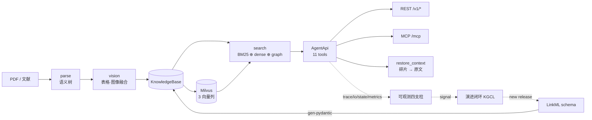

# biomed-ontology

面向阿斯利华创新药研发场景的**生物医药语义层数据基座** PoC。

为 AI agent 提供可溯源的检索能力：Ontology 语义层（谁是谁）+ 结构化事实层（发生了什么）+
文档层（在哪说的）+ 质量层（多可信），配套四支柱可观测与本体演进闭环。

**本仓库不包含 AI agent 本身** —— 只构建其消费的数据底座与工具接口。

---

## 快速开始

```bash
uv sync --extra dev --extra rdf --extra ontology --extra parse --extra service

uv run hmd kb        # 构建知识库并打印统计
uv run hmd demo      # 跑 7 个演示场景（全部自带断言，不是打印）
uv run hmd eval      # 检索消融 + 指标目标达成情况
uv run hmd serve     # 起 REST + MCP 服务
```

`make check` = ruff + 全量测试。**445 passed, 7 skipped**（7 条是 Milvus 集成测试，
无 Docker 时跳过而非失败）。

### 可选：Milvus

```bash
make milvus-up                                  # docker compose，standalone 单机版
uv run hmd index --embedder fake --recreate     # 写入切片；fake 嵌入器不下载模型
make milvus-down
```

`--embedder` 可选 `fake` / `bge-m3` / `sapbert` / `dual`。
默认 `fake` 是有意为之：CI 不应该下载 GB 级权重，
而确定性哈希向量足以验证**索引、过滤、融合**这些真正容易出错的部分。

---

## 分层架构

```
L0 Source        构建期联网拉快照 → 版本化存储（version / license / retrieved_on）
L1 术语层        Concept / Synonym / Xref(SSSOM) / Hierarchy → RDF named graph per source
L2 语义层        LinkML schema（Biolink 子集）→ OWL + SHACL + JSON Schema + Pydantic
L3 归一化        文本 → 唯一 CURIE（词典 → 规则 → 向量 → LLM 消歧）
L4 语料治理      文档标引分类 + 三模态抽取（文本/表格/图像）→ 结构化事实 + provenance
L5 检索/查询     BM25 ⊕ dense ⊕ 图通道 → RRF 融合；Milvus 三向量列；SPARQL 图查询
L6 Agent 接口    MCP + REST（11 个工具），返回体内建 provenance + trace_id + license_tier
L7 可观测        Trace(WHERE) / IO(WHAT) / State(WHY) / Metrics(WHEN)
L8 演进闭环      Signal → Candidate → Curation(KGCL) → Release → Impact → 回归守门
```



**LinkML 是唯一事实来源。** 所有 Python 数据模型由 `make gen` 从 `schema/` 生成到
`src/biomed_ontology/_generated/`，该目录不手改、不入 lint。
契约、OpenAPI、MCP 描述符全部从同一份 schema 导出 —— 手写第二份就一定会漂移。

---

## Citationware：引用优先的 RAG

检索返回的是**高匹配度碎片**。碎片能证明"有这句话"，却证明不了"在什么语境下说的" ——
而临床结论的语境（哪一组、哪个终点、哪次随访）恰恰决定它成不成立。

因此每次检索都同时给出三样东西：

| 产物 | 作用 | 入口 |
|---|---|---|
| `results` | 扁平命中，含 `page` / `section` / `license_tier` / `explain` | `search_documents` |
| `evidence_tree` | 文档 → 章节 → 碎片的聚合视图 | `search_documents` |
| 原文还原 | 拼回整节 + 面包屑 + 原始页码 | `restore_context` |

**为什么要证据树**：扁平列表里同一段落的 5 个碎片看上去像 5 条独立证据，
这种"证据量的错觉"会直接误导判断。树把它们收回一个节点。

**为什么还原要走许可**：`restore_context` 若不校验凭据，就成了一个用碎片 id 换全文的后门。
它复用 `LicenseScope.permits` 这**同一个谓词**，而不是自己再实现一份 ——
各写一份迟早出现"检索看不到但还原看得到"。

```bash
uv run hmd demo --id D7
```

```
✓ [D7] 引用优先：碎片 → 原文
   检索命中 5 条，聚成 3 篇文档：
     DOC:CTGOV.NCT02807415 碎片 2 个 → 章节 2 处：BriefSummary、Outcomes
     DOC:PMID.32821245     碎片 2 个 → 章节 2 处：Abstract、table:T1
   还原 CHK:txt.361514dd1b：A Study of Surufatinib … / BriefSummary p1-1，
        300 字碎片 → 312 字全节（截断=False）
   限长 60 字时：truncated=True，实际返回 60 字
   受限文档 DOC:PATSNAP.PS-2023-00417：无凭据还原 0 字（LICENSE_DENIED） /
        有凭据还原 354 字
```

截断会**自报**（`truncated: true`）。静默丢内容会让"还原完整原文"变成一句假话。

---

## 四支柱可观测 ↔ Citationware

两者不是两套东西：Citationware 回答"这句话从哪来"，四支柱回答"这个答案怎么得出的"。
合起来才构成一条可复核的证据链。

| 支柱 | 问题 | 落点 | 在 Citationware 中的角色 |
|---|---|---|---|
| **Trace** | WHERE | `TraceContext.span_tree()` | 哪个通道召回了这条碎片、RRF 各通道名次 |
| **I/O** | WHAT | `ToolIoRecord` | 请求与返回体逐字留档，含 `license_filtered_count` |
| **State** | WHY | `DecisionRecord` | 标题层级判定、消歧选择的候选集与理由 |
| **Metrics** | WHEN | `ArmResult` / `MetricTarget` | 引用忠实度、召回、时延随发版的走向 |

`trace_id` 随返回体回传 agent，`submit_feedback` 以它为主键 ——
**这就是 data loop 的闭合点**：一次错误结论能定位到具体哪一行别名、哪一次扩展决策。

---

## 检索评测

`uv run hmd eval --entitlements MOCK_LICENSED`

**全部 query（n=8）**

| 臂 | Recall@10 | P@5 | nDCG@10 | MRR | MAP |
|---|---|---|---|---|---|
| 纯 BM25（无本体） | 0.812 | 0.350 | 0.817 | 0.938 | 0.692 |
| 纯向量（无本体） | 0.823 | 0.325 | 0.784 | 0.938 | 0.672 |
| 本体增强混合 | **0.917** | 0.350 | 0.814 | 0.812 | 0.694 |

**分语种** —— 只报总平均会把结论抹平：

| 臂 | en Recall | en nDCG | zh Recall | zh nDCG |
|---|---|---|---|---|
| 纯 BM25 | 0.792 | 0.783 | 0.833 | 0.850 |
| 纯向量 | 0.917 | **0.815** | 0.729 | 0.753 |
| 本体增强混合 | 0.917 | 0.771 | **0.917** | **0.858** |

英文上混合臂的 nDCG **不如**纯向量（0.771 vs 0.815），中文上则明显最好。
这条结论只在分语种表里看得见，是保留分表的理由。

另有 6 个 Milvus 臂（lexical / general / biomed / 2col / 3col / ontology+milvus）。
后端不可达时它们被标记为**未运行**并在报告中列名，**绝不回落到本地后端** ——
回落会让报告里的"Milvus 三列混合"其实是本地 TF-IDF 跑的，
这种错误一旦进了采购决策文档就再也追不回来。

### 指标目标与豁免机制

`data/gold/targets.yaml` 存在的意义是**让"没达成"有地方写**。

没有豁免机制时，一条达不到的断言只有两条出路：删掉，或调低。
两条都会让对外结论慢慢和事实脱节，而且没人记得是什么时候脱的。
这里的做法是：目标照写，达不到就填 `waiver` + `waiver_owner` + `waiver_review_by`，
让"未达成"变成一条**署名的、带理由的、可复审的**记录。

| 目标 | 结果 |
|---|---|
| T1 Recall@10 相对提升 ≥ 10% | ✅ 达成 **+12.8%** |
| T2 nDCG@10 不劣化 | ❌ **−0.002，已豁免**（逐 query 归因：两条 query 的等级次序错位，非召回噪声） |
| T3 P@5 不劣化 | ✅ 达成 ±0.000 |
| T4 MRR 不劣化 | ❌ **−0.125，已豁免**（Q1/Q2 首位命中各掉一名，8 条 query 样本上 MRR 抖动极大） |
| T5 引用忠实度 = 1.000 | ✅ 达成 —— **且这条不接受豁免** |

反向绊线同样存在：**目标已达成却还挂着豁免，测试也会失败** ——
那意味着对外结论仍在引用一条过期的免责说明。
另有测试断言豁免正文中引用的数字与当前实测一致，防止理由写完就腐烂。

**T5 为什么不可豁免**：召回差只是找不到，用户知道自己没拿到答案；
引用不忠实是把一个看似有据的错误答案递出去，用户没有识别它的手段。
本体扩展天然放大这个风险 —— 扩展出来的概念很容易被顺手记成"原文说的"。

---

## 服务入口

CLI 一个命令不动，REST 与 MCP 是**并列的第二个入口**，三者共用同一个 `dispatch` ——
包裹链（契约校验 / 许可过滤 / trace 留痕）因此无法被绕过。

```bash
uv run hmd serve --port 8000
```

| 入口 | 地址 |
|---|---|
| REST | `POST /v1/{tool_name}` × 11 |
| OpenAPI | `GET /openapi.json`（从契约导出，非反射生成） |
| MCP | `POST /mcp/`（Streamable HTTP） |
| 健康 | `GET /health` |

**MCP 不接受客户端自称的凭据。** REST 侧的 `X-HMD-Entitlements` 头默认也被忽略，
仅当 `HMD_TRUST_ENTITLEMENT_HEADER=true` 时才解析。
把许可边界交给调用方自觉遵守，等于没有边界。

---

## 采购依据

`registry.procurement_slots()` 列出已建模但未启用的商业源，按优先级排序 ——
**槽位先建好，采购决策才有具体的接入成本可谈**：

| 优先级 | 源 | tier | 作用 |
|---|---|---|---|
| 1 | UMLS | TIER_2 | 跨词表聚合 + 关系 + 语义类型。注意 UMLS 内部按 SAB 分 category 0–3，接入时须逐 SAB 映射 tier |
| 2 | 智慧芽 PatSnap | TIER_3 | 全球管线 / 交易 / 专利-药物关联 |
| 2 | 医药魔方 | TIER_3 | 中国注册审评数据与中文术语 |
| 3 | DrugBank | TIER_2 | 药物别名、靶点、DDI、ATC |
| 4 | MedDRA | TIER_3 | 不良事件五级 + 官方中文。许可最严，导出闸门须逐条拦截 |

许可分层贯穿全链路：无凭据时商业源内容在**事实、检索、SPARQL、还原**四处同时不可见。
`hmd demo --id D6`（前三处）与 `--id D7`（还原）对此各有断言。

---

## 目录

| 路径 | 职责 |
|---|---|
| `schema/` | LinkML 模型定义，单一事实来源 |
| `src/biomed_ontology/registry/` | 数据源注册表 + 许可分层 |
| `src/biomed_ontology/ontology/` | 等价团构建、ID 分配、发版、RDF |
| `src/biomed_ontology/parse/` | PDF → 语义树（衍生自 knowhere，见 NOTICE） |
| `src/biomed_ontology/embed/` | BGE-M3 + SapBERT 双塔，三向量列 |
| `src/biomed_ontology/search/` | 三通道检索 + RRF + Milvus 后端 |
| `src/biomed_ontology/agentapi/` | 11 个 agent 工具 + Citationware |
| `src/biomed_ontology/observability/` | 四支柱埋点与契约校验 |
| `src/biomed_ontology/evolution/` | 信号挖掘 → KGCL → 发版守门 |
| `src/biomed_ontology/eval/` | 消融评测 + 指标目标 |
| `data/gold/` | gold set 与指标目标 |
| `tests/` | 契约与不变量测试 |

---

## 核心设计约束

- **内部 CURIE 是唯一主键**，外部 ID 一律作为 xref 挂靠（供应商中立）
- **别名必须带 scope**，检索扩展行为由 scope 驱动
- **许可分层贯穿全链路**，tier ≥ 2 内容不得进入导出物与训练语料
- **构建期可联网，运行期完全内网离线**
- **RRF 用名次而非分数融合** —— 三通道量纲不可比，归一化会引入说不清的超参
- **融合不下推到 Milvus** —— Milvus 的 RRF 分数无法还原为各通道名次，会毁掉 `explain`

---

## 许可与出处

本项目 `src/biomed_ontology/parse/` 的语义树构建算法衍生自
[Ontos-AI/knowhere](https://github.com/Ontos-AI/knowhere)（Apache License 2.0），
已按 Apache 2.0 §4(b) 标注全部修改。

**MinerU 与 PyMuPDF 两项许可义务待法务核实**，登记在 `licensing.COMPONENTS`，
`review` 为 `pending` 时启用相关后端会直接抛 `LicenseViolation` ——
义务只写进文档没人会读，写成闸门才绕不过去。

完整出处、修改说明与许可分析见 [NOTICE](NOTICE)。

语料 PDF **不随仓库分发**，由 `make corpus` 在本地各自取得。
