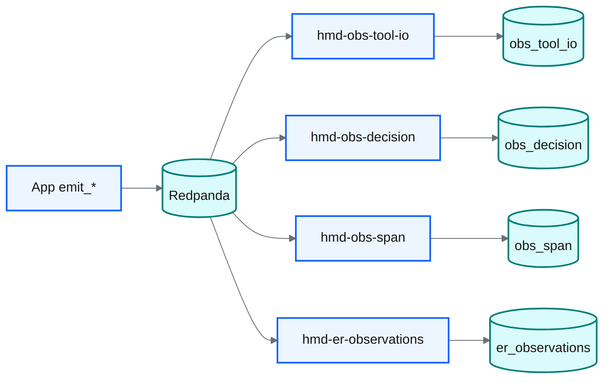
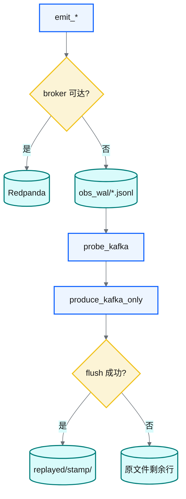
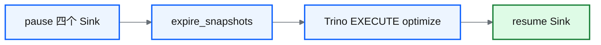
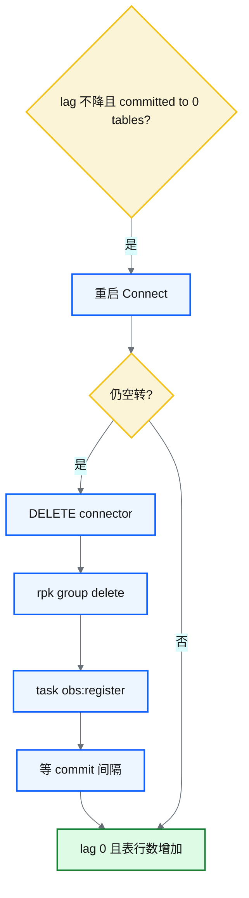

# Observability → Redpanda → Iceberg

热路径只 **Kafka-API produce**（`ObsEventProducer`）。入湖由 **Iceberg Kafka Connect Sink** 批量提交（约 15s），禁止 App 同步 `table.append`。Prefect 只跑 WAL 回放与湖维护，不替代 Sink。



| topic | 表 | connector | control topic |
|---|---|---|---|
| `hmd.obs.tool_io` | `hmd.obs_tool_io` | `hmd-obs-tool-io` | `control-iceberg-tool-io` |
| `hmd.obs.decision` | `hmd.obs_decision` | `hmd-obs-decision` | `control-iceberg-decision` |
| `hmd.obs.span` | `hmd.obs_span` | `hmd-obs-span` | `control-iceberg-span` |
| `hmd.er.observations` | `hmd.er_observations` | `hmd-er-observations` | `control-iceberg-er` |

`iceberg.control.commit.interval-ms=15000`。Decision / Span 是 WHY 投影（`subject_text`、钉 chosen 的 candidates、state/attributes 白名单），见 [pillars](../../docs/observability/pillars.md)。

## 启动

```bash
# 需已有 MinIO + iceberg-rest（foundation/lake）
# iceberg-rest 用 SQLite + WAL（见 docker-compose.lake.yml CATALOG_URI）。
# catalog 争用（SQLITE_BUSY / Table UUID mismatch）：先 pause Connect，再 docker restart iceberg-rest。
task obs:up          # Redpanda :19092 + Connect :8083（自建镜像含 Iceberg 1.9.2 插件）
task obs:register    # PUT connector configs
uv run hmd lake init # 确保四张观测表存在
```

Connect worker 镜像：`docker/obs/Dockerfile.connect`（`confluentinc/cp-kafka-connect` + [Confluent Hub Iceberg Sink 1.9.2](https://www.confluent.io/hub/iceberg/iceberg-kafka-connect)）。无现成 all-in-one 公共镜像。

App 环境变量（`Settings` / `.env`，完整列表见仓库根 `.env.example`）：

| 变量 | 默认 | 说明 |
|---|---|---|
| `HMD_OBS_EVENTS_ENABLED` | `true` | `false` 关闭 produce/WAL |
| `HMD_KAFKA_BOOTSTRAP_SERVERS` | `127.0.0.1:19092` | 默认 Redpanda；设空=仅 WAL |
| `HMD_KAFKA_OBS_TOOL_IO_TOPIC` | `hmd.obs.tool_io` | → Iceberg `hmd.obs_tool_io` |
| `HMD_KAFKA_OBS_DECISION_TOPIC` | `hmd.obs.decision` | → Iceberg `hmd.obs_decision` |
| `HMD_KAFKA_OBS_SPAN_TOPIC` | `hmd.obs.span` | → Iceberg `hmd.obs_span` |
| `HMD_KAFKA_ER_OBSERVATIONS_TOPIC` | `hmd.er.observations` | → Iceberg `hmd.er_observations` |
| `HMD_KAFKA_CONNECT_URL` | `http://127.0.0.1:8083` | Connect REST（status / pause） |
| `HMD_OBS_WAL_DIR` | `data/obs_wal` | broker 不可达时的 Jsonl WAL |
| `HMD_OBS_WAL_REPLAY_MAX_LINES` | `10000` | 单次回放行数上限 |

Producer 在 `emit_*` 结束与 `atexit` 时 `flush`，避免短 CLI 进程丢消息。

## WAL 回放

broker 不可达时 `emit_*` 写 `data/obs_wal/<topic>.jsonl`。回放只 produce 回原 topic，不直写 Iceberg。整文件 flush 成功才归档到 `replayed/<UTC-stamp>/`；中途失败则已成功行归档，剩余写回原文件。



```bash
uv run hmd lake obs-replay --dry-run
uv run hmd lake obs-replay
# 或：task obs:replay
```

Prefect deployment `obs-wal-replay`：cron `45 3 * * *` Asia/Shanghai，`active: false`。

## 写湖时 pause Sink

写文献 / 文档 Iceberg 时会 `paused_iceberg_sinks()`（可重入；Connect 未起不阻断），避免 SQLite catalog `SQLITE_BUSY`。catalog 仍是 SQLite；并行写湖必须 pause Sink。

```bash
uv run hmd lake connect-status
```

小文件 / snapshot：`hmd lake maintain`（pause Connect → expire snapshots → Trino `EXECUTE optimize`）。optimize 覆盖 `obs_tool_io` / `obs_decision` / `obs_span` / `er_observations`；失败只 warning。



Prefect deployment `lake-maintain`：周 cron `0 5 * * 0` Asia/Shanghai，`active: false`。

## 注册 Iceberg Sink connector

```bash
task obs:register
# 或：
bash docker/obs/scripts/register_connectors.sh
```

配置见 `docker/obs/connectors/*.json`（REST catalog + MinIO，与 `docker-compose.lake.yml` 一致）。compaction 走 `hmd lake maintain` 的 Trino optimize，Connect 不做。

## 冒烟

```bash
# produce
uv run python -c '
from biomed_ontology.lake import obs_events
from biomed_ontology.config import Settings
obs_events._producer = None
cfg = Settings()
obs_events.emit_er_observation(mention="connect-e2e", source="runtime_resolve", cfg=cfg)
'
# 等 commit（~15s）后扫表
uv run python -c '
from biomed_ontology.lake.catalog import ER_OBSERVATIONS_TABLE, open_catalog
t = open_catalog().load_table(ER_OBSERVATIONS_TABLE)
print("rows", t.scan().to_arrow().num_rows)
'
```

Decision / Span 经 `ObservabilityHub.commit` 投影后同样走这条总线。扫湖挖 WHY：`uv run hmd signals --from-lake --window-days 7`。首次扫可能赶在 Connect commit 之前，再等一个间隔。

## 排查：Sink 空 commit / lag 不降

任务显示 `RUNNING`、consumer group 卡在某一 offset、Connect 日志反复 `committed to 0 table(s)` 时，**重启 Connect 容器不够**——组位点还在，任务会接着空转。消息已在 Redpanda，不要用 `hmd lake obs-replay` 去「补」。



处理会从 topic 头重放。Iceberg 是 append-only，历史行会重复，`er_unmapped_raw_rows` 会涨；`er_unmapped_backlog` 按 `observation_id` 去重后的开放唯一 mention 计，重放本身不红 `slo-gate`：

```bash
curl -X DELETE http://127.0.0.1:8083/connectors/hmd-er-observations
docker exec hmd-foundation-redpanda-1 rpk group delete connect-hmd-er-observations
task obs:register
# 等 commit（~15s × 积压批次数），再看：
docker exec hmd-foundation-redpanda-1 rpk group describe connect-hmd-er-observations
uv run hmd lake connect-status
```

`TOTAL-LAG` 回到 0 且表行数增加即追上。catalog 争用仍按上文：先 pause Connect，再 `docker restart iceberg-rest`。

## 不在范围

- OpenTelemetry SDK + Collector（新鲜度看 `ontology/policies/ops_slo.yaml` / `hmd pipeline slo-gate`）
- 自研 ObsShipper / 热路径 PyIceberg append
- MetricPoint topic
