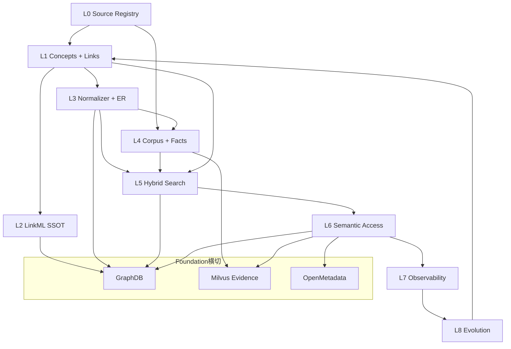

# 分层架构 L0–L8

每一层回答一个**独立问题**。混层是本仓库最常见的设计失误——例如把许可规则写进检索打分，或把模型推断写进要入库的语料 YAML。分层的价值不在「看起来专业」，而在**改一处时 blast radius 可控**。

---

## 1. 为什么存在

创新药研发里，「谁是谁」和「发生了什么」是两类问题：

| 问题 | 层 | 例子 |
|---|---|---|
| 赛沃替尼 = AZD6094 = savolitinib？ | L1 术语 + L3 归一化 | 别名、层级、外部 xref |
| 某试验 ORR / PFS 是多少？ | L4 事实 | 带出处、带许可的结构化断言 |
| 「VEGFR2 抑制剂」能否找到呋喹替尼？ | L1 链接 + L5 图通道 | 跨类型 search-around |
| 无权用户能否感知 DrugBank 切片存在？ | L0/L5/L6 许可 | 候选生成期过滤 |
| HMPL-504 对应哪个候选药？ | L3 Foundation ER | `HMD:ENT:DC:savolitinib` |

只做实体归一化是**检索索引**；加上术语层级、类型化关系、事实、质量、许可、可还原引用与企业主键，才构成 **Enterprise Biomedical World Model** 及其 Ontology Semantic Layer。这是设计决策 D12 的落地（见 [附录 · 决策索引](../appendix/decisions.md)）。

L1–L5 不是「检索管道的前几步」，而是语义层本体能力本身。L6 只是把这些能力暴露出去的 Semantic Access。

---

## 2. 设计取舍

| 决策 | 理由 | 不采用的方案 |
|---|---|---|
| 九层编号 L0–L8 | 每层单一职责，评测/许可/演进可独立演进 | 把 GraphDB/OM 硬塞进 L5 编号 |
| Foundation 横切 L2–L6 | World Model 不是「第 9 层」，而是企业 ID + 三后端投影 | 文献 KB 与 Foundation 各维护一套身份 |
| `HMD:ENT:*` 为企业主键 | Milvus `entity_ids`、API `canonical_entity`、OM 资产锚点统一 | BIOS/ChEBI 直接作主键 |
| 许可在候选生成期过滤 | 防止「先检出再裁剪」泄漏存在性 | 检索后再删无权结果 |
| 图邻接在 GraphDB、BFS 在进程内 | SPARQL 只做一跳出/入边；衰减策略不进数据库 | 整包 search-around 下沉 Milvus |
| 双面运行时 `open_dual_surface` | demo/eval/serve 同一路径，可证伪 | 各入口各自 `build_*` |

---

## 3. 设计与实现

### 3.1 九层一览

```text
L0 Source        构建期联网拉快照 → 版本化存储（version / license / retrieved_on）
L1 术语层        Concept / Synonym / Xref(SSSOM) / Hierarchy / ConceptLink
L2 语义层        LinkML（Biolink 子集 + Enterprise Ontology）→ OWL + SHACL + JSON Schema + Pydantic
L3 归一化 / ER   文本 → CURIE/ENT；Foundation：BERN2 → EntityResolver → HMD:ENT:*
L4 语料治理      文档标引 + 三模态抽取 → 结构化事实 + provenance
L5 检索/证据     BM25 ⊕ dense ⊕ 图通道 → 带权 RRF；Milvus = 五列 + Evidence Index
L6 Semantic Access  单一 hmd serve：KB 工具（ToolApi）+ Foundation Semantic Ops
L7 可观测        Trace(WHERE) / IO(WHAT) / State(WHY) / Metrics(WHEN)
L8 演进闭环      Signal → enrich/proposals → approve → apply(Git) → Release；不自动写生产图
```



### 3.2 层与源码包对照

| 层 | 包 / 路径 | 一句话 | 接手时先读 |
|---|---|---|---|
| L0 | `registry/` | 源从哪来、什么许可、是否启用 | `data/registry/sources.yaml` |
| L1 | `ontology/`、`ingest/` | 目录概念、链接、RDF 装载 | `ingest/seed.py`、`ontology/links.py` |
| L2 | `schema/` → `_generated/` | LinkML SSOT | `schema/hmd_enterprise.yaml` |
| L3 | `normalize/`、`foundation/resolve.py` | 文本到 ENT；ER 级联 | `normalize/__init__.py`、`foundation/resolve.py` |
| L4 | `parse/`、`corpus/` | PDF → 语义树 → 切片 → 事实 | `corpus/extract.py` |
| L5 | `search/`、`embed/`、`rerank/` | 混合检索 + Evidence Index | `search/__init__.py` |
| L6 | `tools/`、`service/`、`foundation/api.py` | ToolApi + Foundation Ops | `runtime.py`、`tools/api.py` |
| L7 | `observability/`、`quality/` | 四支柱与发版守门 | `observability/__init__.py` |
| L8 | `evolution/`、`foundation/evolve.py` | 信号到 KGCL | `foundation/evolve.py` |

### 3.3 运行时装配入口

```text
runtime.open_dual_surface()
├── foundation.world.load_world_model()
│   └── foundation.resolve.EntityResolver
├── pipeline.build_literature_base()          # 默认 with_graph=False
│   ├── catalog_files() → ontology/catalog/
│   ├── ingest.build_from_seed(id_mode=enterprise)
│   └── normalize.Normalizer
├── runtime.build_literature_searcher()
│   ├── pipeline.ensure_catalog_graphs()    # GRAPH 臂前置
│   └── search.HybridSearcher
│       ├── backends.milvus.MilvusBackend
│       └── ontology.neighborhood.GraphDbNeighborhood
├── tools.ToolApi.from_backends()
└── foundation.api.FoundationApi
```

`build_knowledge_base()` 是 `build_literature_base()` 的兼容别名；`legacy_seed_ids=True` 仅供单测对照 `id_mode=ledger`。

### 3.4 文献面 vs Foundation 面

| 维度 | 文献 Ontology Semantic Layer | Foundation World Model |
|---|---|---|
| 身份 | `ontology/catalog/` → `HMD:ENT:*`（BuiltConcept） | `ontology/entities/` → sync 入 GraphDB |
| 归一化 | `normalize.Normalizer`（词典级联） | `EntityResolver`（BERN2 + 词典 + Zingg + xref） |
| 关系图 | `SEED_INTERNAL` / `SEED_LINKS` 命名图 | `graph/ontology`、`graph/knowledge`、`graph/provenance` |
| 证据 | 文献 chunk + Milvus 五列 | `foundation_evidence` 集合 |
| 查询 API | `ToolApi.search` 等 8 工具 | `get_entity_context` 等 Semantic Ops |

两层共享 GraphDB 运行时与 LinkML 契约，但**查询路径不混用 YAML fallback**（Foundation 强制三后端）。

### 3.5 与 Palantir 式「操作本体」的对照

| 能力 | 本仓库 | 实现锚点 |
|---|---|---|
| 对象类型 + 属性 | `BuiltConcept` / `EnterpriseEntity` | id、双语标签、定义、tier |
| 类型化链接 | `ConceptLink` + GraphDB | `has_target` / `treats` 双向合成 |
| search-around | `ontology/links.py` | `walk_neighbors` + `RELATION_DECAY` |
| semantic ops | ToolApi + FoundationApi | 世界模型访问契约 |
| dynamic security | license tier + entitlement | `LicenseScope` 候选期过滤 |

本体值钱，是因为它是**可遍历、可索引、带治理的语义世界**。若只剩层级术语表，图通道会退化成按哈希排序的随机采样——见 [三通道与 RRF](../retrieval/hybrid.md)。

---

## 4. 不变量与失败模式

### 4.1 混层的典型症状

| 症状 | 混了哪两层 | 正确位置 |
|---|---|---|
| 检索打分里写 `if tier >= 2: score *= 0` | L5 + 许可 | `LicenseScope` 在候选生成期 |
| 语料 YAML 塞模型「摘要结论」当正文 | L4 + 模型推断 | 推断进事实层且 `PENDING` |
| Semantic Access 手写别名表 | L6 + L1 | `FoundationApi.resolve_entity` |
| eval/serve 各自再装配库 | L5/eval + L1 | `open_dual_surface()` |
| SPARQL 硬编码可见源列表 | L5 + L0 | `GraphStore` 按 entitlement 注入命名图 |
| 用 `data/seed/` 当运行时身份 SSOT | L1 策展 + 测试 | `ontology/catalog/` + `HMD:ENT:*` |

### 4.2 层间数据流纪律

- **索引期挂概念，检索期不重复 NER**：`build_literature_base` 在 chunk 上 `normalize(..., min_confidence=0.6)`。
- **`concept_ids_expanded` ≠ search-around**：前者走 `Normalizer.expand`（仅层级）；后者走 `GraphDbNeighborhood`。
- **`SEED_LINKS` 与 `SEED_INTERNAL` 分图**：谓词同名、证据强度不同，靠命名图 URI 区分。
- **Foundation `extracted` ≠ `validated`**：仅 validated 物化 `graph/knowledge` 边。

---

## 5. 如何验证

理解分层后的自检题：

1. 「查询改写」属于 L3 能力被 L5 消费，而不是 L5 自己维护别名。
2. 图通道不能整包下沉 Milvus——邻接在 GraphDB，IDF/倒排/RRF 在进程内。
3. `SEED_LINKS` 与 `SEED_INTERNAL` 分图的原因：断言强度与合规边界不同。
4. `HMD:ENT:*` 与 BuiltConcept `concept_id` 在 `id_mode=enterprise` 下是同一确定性映射。

```bash
uv run pytest tests/test_seed_build.py tests/test_search_backend.py tests/test_tools.py -q
uv run pytest tests/test_walk_neighbors.py -q
uv run hmd demo --id D7
```

相关文档：[Foundation](foundation.md)、[Pipeline](pipeline.md)、[企业身份与目录 SSOT](../ontology/seed.md)、[不变量](../invariants.md)。
