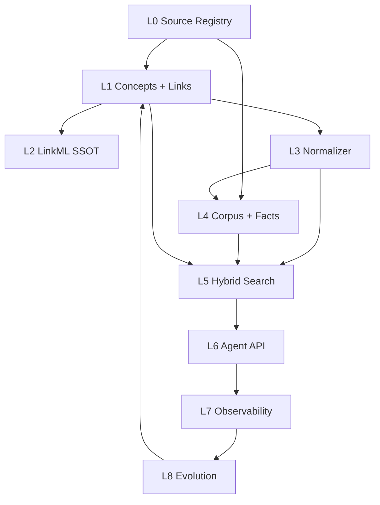

# 分层架构 L0–L8

每一层回答一个独立问题。混层是本仓库最常见的设计失误 —— 例如把许可规则写进检索打分，或把模型推断写进要入库的语料 YAML。分层的价值不在「看起来专业」，而在**改一处时 blast radius 可控**。

## 为什么要分这么细

创新药研发里，「谁是谁」和「发生了什么」是两类问题：

| 问题 | 层 | 例子 |
|---|---|---|
| 赛沃替尼 = AZD6094 = savolitinib？ | L1 术语 | 别名、层级、外部 xref |
| 某试验 ORR / PFS 是多少？ | L4 事实 | 带出处、带许可的结构化断言 |
| 「VEGFR2 抑制剂」能否找到呋喹替尼？ | L1 链接 + L5 图通道 | 跨类型 search-around |
| 无权用户能否感知 DrugBank 切片存在？ | L0/L5/L6 许可 | 候选生成期过滤 |

只做实体归一化是**检索索引**；加上事实、质量、许可与可还原引用，才叫**数据底座**。这是设计决策 D12 的落地（见 [附录 · 决策索引](../appendix/decisions.md)）。

## 九层一览

```
L0 Source        构建期联网拉快照 → 版本化存储（version / license / retrieved_on）
L1 术语层        Concept / Synonym / Xref(SSSOM) / Hierarchy / ConceptLink
L2 语义层        LinkML（Biolink 子集 + Enterprise Ontology）→ OWL + SHACL + JSON Schema + Pydantic
L3 归一化 / ER   文本 → CURIE；Foundation：BERN2 候选 → `HMD:ENT:*`
L4 语料治理      文档标引 + 三模态抽取 → 结构化事实 + provenance
L5 检索/证据     BM25 ⊕ dense ⊕ 图通道 → 带权 RRF；Milvus = 五列 + Evidence Index（必选）
L6 Agent 接口    :8000 AgentApi（11 tools）∥ :8100 Foundation Semantic Ops
L7 可观测        Trace(WHERE) / IO(WHAT) / State(WHY) / Metrics(WHEN)
L8 演进闭环      Signal → Candidate → Curation(KGCL) → Release；Foundation evolve-mine 不自动改本体
```

!!! tip "Foundation 横切"
    GraphDB / OpenMetadata / Entity Resolution 不另起一层编号，而是把 L2–L6 接到企业 World Model。
    详见 [Foundation 世界模型](foundation.md)。




## 层与源码包对照

| 层 | 包 | 一句话 | 接手时先读 |
|---|---|---|---|
| L0 | `registry/` | 源从哪来、什么许可、是否启用 | `registry/sources.yaml` |
| L1 | `ontology/`、`ingest/` | 概念、链接、发版、RDF | `ingest/seed.py`、`ontology/links.py` |
| L2 | `schema/` → `_generated/` | LinkML SSOT（含 `hmd_enterprise`） | `schema/hmd_enterprise.yaml` |
| L3 | `normalize/`、`alias/`、`foundation/resolve` | 文本到 CURIE / Enterprise ID | `foundation/resolve.py` |
| L4 | `parse/`、`corpus/` | PDF → 语义树 → 切片 → 事实 | `corpus/__init__.py` |
| L5 | `search/`、`embed/`、`rerank/`、`foundation/sync` | 混合检索 + Evidence Index | `search/__init__.py` |
| L6 | `agentapi/`、`service/`、`foundation/api` | :8000 工具 ∥ :8100 Semantic Ops | `foundation/api.py` |
| L7 | `observability/`、`quality/` | 四支柱与发版守门 | `observability/__init__.py` |
| L8 | `evolution/`、`foundation/evolve` | 信号到 KGCL（不自动改本体） | `foundation/evolve.py` |

装配入口是 `pipeline.build_knowledge_base()` —— search / API / eval / demo **共用同一份 KB**。若各自装配，`release_id` 与归一化配置会悄悄漂移，评测分数和服务库对不上号。

## 混层的典型症状（对照自查）

| 症状 | 混了哪两层 | 正确位置 |
|---|---|---|
| 检索打分里写 `if tier >= 2: score *= 0` | L5 + 许可策略 | `LicenseScope` 在候选生成期过滤 |
| 语料 YAML 里塞模型生成的「摘要结论」当正文 | L4 + 模型推断 | 推断进事实层且 `PENDING`，正文只存解析结果 |
| Agent 工具里手写一份别名表 | L6 + L1 | 只调 `Normalizer` / `expand` |
| 评测脚本自己 `build` 另一套概念 | L5/eval + L1 | 一律 `build_knowledge_base()` |
| SPARQL 模板里硬编码可见源列表 | L5 + L0 | `GraphStore` 按 entitlement 注入命名图 |

## 与 Palantir 式「操作本体」的对照

| 能力 | 本仓库 | 说明 |
|---|---|---|
| 对象类型 + 属性 | `BuiltConcept` | id / 双语标签 / 定义 / tier |
| 类型化链接 | `ConceptLink` + `LinkIndex` | `has_target` / `treats` 双向 |
| search-around | `ontology/links.py` | 带衰减、跨类型最多一跳 |
| actions / functions | AgentApi 11 工具 | 契约 + 不可绕过包裹链 |
| dynamic security | license tier + entitlement | 候选生成阶段过滤 |

本体值钱，是因为它是**可遍历、可索引、带治理的操作层**。若只剩层级术语表，图通道会退化成按哈希排序的随机采样 —— 本仓库曾经踩过，见 [三通道与 RRF](../retrieval/hybrid.md)。

## 如何验证你理解了分层

1. 指出「查询改写」属于 L3 能力被 L5 消费，而不是 L5 自己维护别名。  
2. 解释为什么图通道不能下沉到 Milvus（它依赖 `LinkIndex` + 概念倒排，向量库替不了）。  
3. 说明 `SEED_LINKS` 为何与 `SEED_INTERNAL` 分图（谓词同名、证据强度不同）。  

相关测试：`tests/test_seed_build.py`、`tests/test_search_backend.py`、`tests/test_agentapi.py`。
