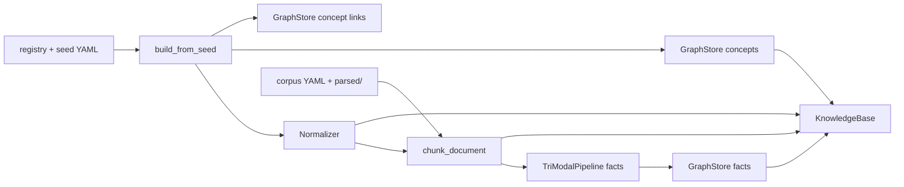

# 端到端数据流

源码：`src/biomed_ontology/pipeline.py`。

`build_knowledge_base()` 是整仓的**唯一装配入口**。检索、Agent 工具、评测、demo 都必须吃同一份 `KnowledgeBase`；各自装配会让「评测库」和「服务库」在 `release_id`、别名表、链接解析上悄悄分叉。

## 为什么存在这个模块

早期很容易写成：

- `hmd eval` 自己读 seed、自己切片  
- `hmd serve` 再装配一份  
- demo 再写第三份「演示用」概念  

三份库长得像，但任意一次种子改动都可能只进了一份。把装配收成函数，不是为了少写几行，而是为了让**可证伪性**成立：同一份代码路径上的分数，才是服务上会看到的分数。

## 装配顺序（必须按这个因果）



对应代码顺序：

1. **Registry** —— `load_registry`：源、许可、是否启用  
2. **Seed** —— `build_from_seed`：`BuiltConcept` / `BuiltSynonym`，含碰撞检测与未解析父节点/链接告警  
3. **Normalizer** —— 吃概念与同义词，构建词典 / 规则 / n-gram 索引  
4. **Graph：术语** —— `graph.load_concepts(..., source_id=SEED_INTERNAL)`  
5. **Graph：链接** —— `graph.load_concept_links(..., source_id=SEED_LINKS)`（单独命名图）  
6. **Corpus** —— `data/corpus/*.yaml` **以及** `data/corpus/parsed/*.yaml`（递归遗漏会让 `hmd parse` 产物静默不进库）  
7. **Chunk + 标引** —— `chunk_document` → 每片 `normalize(..., detect=True)` 挂 `concept_ids`  
8. **Facts** —— `TriModalPipeline().run(...)` 再写回图  

`with_corpus=False` 时在步骤 5 之后返回 —— 只测术语层时用。

## `KnowledgeBase` 里有什么

```text
KnowledgeBase
├── release_id          # 所有答案必须可复现到这个版本
├── registry            # 源与许可
├── concepts / synonyms # 构建产物（不是原始 seed dict）
├── normalizer          # L3 唯一入口
├── documents / chunks  # L4
├── labels              # 文档标引
├── facts               # 结构化事实
├── graph               # RDF named graphs
├── hub                 # ObservabilityHub
└── warnings            # 未登记歧义、未解析父节点/链接 —— 构建成功≠无告警
```

!!! warning "warnings 不是日志噪音"
    `unregistered_collisions` / `unresolved_parents` / `unresolved_links` 进了 `kb.warnings`。
    `hmd kb` 应让它们可见。静默吞掉 = 图通道少边、归一化撞车却无人知道。

## 许可边界在装配期就成立

| 内容 | `source_id` | 意图 |
|---|---|---|
| 术语节点与同义词 | `SEED_INTERNAL` | 内部术语层 |
| 种子类型化链接 | `SEED_LINKS` | 与事实层谓词同名，但证据强度不同，靠图 URI 区分 |
| 语料 / 事实 | 文档原始源 | 采购边界跟文档走 |

把链接塞进术语图看起来省事，但 SPARQL 与导出闸门就无法按「断言强度」分流。分图是合规与可解释性的前置条件，不是洁癖。

## 切片如何挂上概念

对每个 chunk：

```text
ch.concept_ids = normalize(ch.text, detect=True, min_confidence=0.6)
ch.concept_ids_expanded = expand(各 concept，沿层级)
ch.labels = 文档级 taxonomy 标签
```

注意：

- **索引期**挂概念，检索期图通道才能倒排；运行期再 NER 一次既慢又不稳。  
- `concept_ids_expanded` 服务别名/层级扩展场景；图通道的 search-around 用的是 `LinkIndex`，两者**不要合并**（见 [links](../ontology/links.md)）。  
- `min_confidence=0.6` 与检索期 `_seed_concepts` 同一阈值 —— 各写一份迟早对不上。

## 调用方应当怎么拿 KB

| 入口 | 用法 |
|---|---|
| CLI `hmd kb` / `demo` / `eval` | 内部调 `build_knowledge_base()` |
| `hmd serve` | 进程启动时装一次，注入 `AgentApi` |
| 测试 | fixture 调同一函数；不要手搓概念列表「模拟 KB」除非测的是装配本身 |
| 索引 `hmd index` | 先有 KB，再交给 `MilvusBackend` + embedder |

## 如何验证

```bash
uv run hmd kb          # 看 stats + warnings
uv run pytest tests/test_seed_build.py tests/test_eval_demo.py -q
```

读代码时从 `build_knowledge_base` 跟到 `HybridSearcher(kb)` 与 `AgentApi(kb)` —— 不应再出现第二条装配路径。
