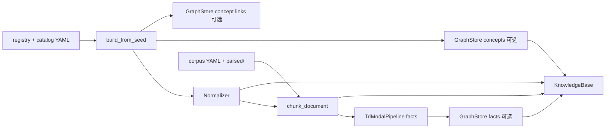

# 端到端数据流（文献装配 Pipeline）

源码：`src/biomed_ontology/pipeline.py`。

运行时双面入口是 `runtime.open_dual_surface()`（`ToolApi` 文献面 + `FoundationApi` World Model）。`build_literature_base()` 是文献 KB 的**权威装配函数**；`build_knowledge_base()` 为其兼容别名。CLI 的 `demo` / `eval` / `serve` 与 golden 经双面 harness，不再各自再写一套装配。

---

## 1. 为什么存在

早期很容易写成：

- `hmd eval` 自己读 seed、自己切片
- `hmd serve` 再装配一份
- demo 再写第三份「演示用」概念

三份库长得像，但任意一次目录改动都可能只进了一份。把装配收成单一函数，不是为了少写几行，而是为了让**可证伪性**成立：同一份代码路径上的分数，才是服务上会看到的分数。

文献面的身份权威在 `ontology/catalog/`（`HMD:ENT:*`），不经 `HMD:SUB` 铸造（见 [企业身份与目录 SSOT](../ontology/seed.md)）。

---

## 2. 设计取舍

| 决策 | 理由 |
|---|---|
| `catalog_files()` 仅 `ontology/catalog/` | 企业 ENT 目录与金路径实体对齐 |
| 默认 `id_mode=enterprise` | 确定性 `enterprise_id_for()`，无需 IdLedger |
| 默认 `with_graph=False` | 术语归一化不强制 GraphDB；GRAPH 臂按需 `ensure_catalog_graphs` |
| `SEED_INTERNAL` / `SEED_LINKS` 分图装载 | 术语节点与类型化断言证据强度不同 |
| 索引期挂概念 | 图通道依赖 chunk `concept_ids` 倒排 |
| `warnings` 不阻断构建 | PoC 先跑通，但告警必须可见 |

---

## 3. 设计与实现

### 3.1 装配顺序（因果链）



对应符号与顺序：

| 步骤 | 函数 / 符号 | 输入 | 输出 |
|---|---|---|---|
| 1 | `load_registry` | `data/registry/sources.yaml` | `SourceRegistry` |
| 2 | `catalog_files` | `ontology/catalog/*.yaml` | YAML 路径列表 |
| 3 | `load_ambiguity_registry` | `ontology/catalog/ambiguity.yaml` | 歧义表 |
| 4 | `build_from_seed` | catalog + `id_mode=enterprise` | `SeedBuildResult` |
| 5 | `Normalizer(...)` | concepts + synonyms + ambiguity | L3 唯一入口 |
| 6 | `graph.load_concepts` | `with_graph=True` 时 | `SEED_INTERNAL` 图 |
| 7 | `graph.load_concept_links` | `with_graph=True` 时 | `SEED_LINKS` 图 |
| 8 | `load_corpus` | `data/corpus/` + `parsed/` | `Document[]` |
| 9 | `chunk_document` + `normalize` | 每片 `min_confidence=0.6` | `concept_ids` |
| 10 | `TriModalPipeline.run` | documents + chunks | `ExtractedFact[]` |
| 11 | `graph.load_corpus` / `load_facts` | 按 `source_id` 分区 | 许可命名图 |

`with_corpus=False` 时在步骤 7 之后返回——只测术语层时用。

### 3.2 关键常量

| 符号 | 值 | 含义 |
|---|---|---|
| `ONTOLOGY_CATALOG` | `ontology/catalog/` | ENT 目录根 |
| `DATA_ROOT` | `data/` | 语料、registry |
| `DEFAULT_RELEASE` | `0.3.0-ent` | KB 版本戳 |
| `_CATALOG_SOURCE` | `SEED_INTERNAL` | 概念/同义词命名图 source_id |
| `_CATALOG_LINKS_SOURCE` | `SEED_LINKS` | 类型化链接命名图 source_id |

### 3.3 `KnowledgeBase` 结构

```text
KnowledgeBase
├── release_id          # 所有答案必须可复现到这个版本
├── registry            # 源与许可
├── concepts / synonyms # build_from_seed 产物（BuiltConcept）
├── normalizer          # L3 唯一入口
├── documents / chunks  # L4
├── labels              # 文档标引（TaxonomyClassifier）
├── facts               # TriModalPipeline 结构化事实
├── graph               # GraphStore（RDF named graphs）
├── hub                 # ObservabilityHub
└── warnings            # 未登记歧义、未解析父节点/链接
```

### 3.4 切片概念挂载

对每个 chunk：

```text
ch.concept_ids = normalizer.normalize(ch.text, detect=True, min_confidence=0.6)
ch.concept_ids_expanded = _expand_all(normalizer, ch.concept_ids)   # 层级 expand
ch.labels = 文档级 taxonomy 标签
```

- **索引期**挂概念，检索期图通道才能倒排
- `concept_ids_expanded` 服务别名/层级扩展；search-around 走 `GraphDbNeighborhood`，**不合并**
- `min_confidence=0.6` 与检索期 `HybridSearcher._seed_concepts` 同一阈值

### 3.5 图投影：`ensure_catalog_graphs`

```text
runtime.build_literature_searcher()
    → ensure_catalog_graphs(kb.graph, kb.concepts, kb.synonyms)
        → graph.load_concepts(source_id=SEED_INTERNAL)
        → graph.load_concept_links(source_id=SEED_LINKS)
```

GRAPH 检索臂、`hmd eval` 含 ontology 通道、集成测试均依赖此函数。GraphDB 不可达时 `RuntimeError`（禁止静默跳过图通道）。

### 3.6 调用方如何拿句柄

| 入口 | 用法 |
|---|---|
| CLI `hmd demo` / `eval` / `foundation golden` | `open_dual_surface()` |
| `hmd serve` | `build_state()` → `open_dual_surface()` |
| CLI `hmd kb` / `gate` / `index` | `build_literature_base()` 或 `build_knowledge_base()` |
| 测试 | fixture 可注入 KB；运行时路径测 `open_dual_surface` |

```text
open_dual_surface()
├── build_literature_base(with_graph=False)   # 默认
├── _require_milvus_literature_backend()
├── build_literature_searcher(ensure_graph=True)
├── ToolApi.from_backends(searcher=...)
└── FoundationApi(load_world_model())
```

---

## 4. 不变量与失败模式

| 不变量 | 说明 |
|---|---|
| `parsed/` 必须进库 | `corpus/parsed/*.yaml` 与 `corpus/*.yaml` 合并加载 |
| warnings 必须可见 | `unregistered_collisions` / `unresolved_parents` / `unresolved_links` |
| 许可分图 | 术语 `TIER_0`；语料/事实跟文档 `source_id` tier |
| 身份不经 seed 铸造 | `id_mode=enterprise` 默认；`ledger` 仅单测 |
| 链接与术语分图 | 禁止把 `SEED_LINKS` 塞进 `SEED_INTERNAL` |

| 失败模式 | 表现 | 排查 |
|---|---|---|
| 遗漏 `parsed/` | `hmd parse` 产物不进 KB | 检查 `corpus_files` glob |
| 未解析链接 | Q4 类跨类型 query 召不回 | `hmd kb` warnings |
| GraphDB 未 ensure | GRAPH 臂空或报错 | `task foundation:up` |
| 三份装配 | eval 与服务分数不一致 | 统一 `open_dual_surface` |

---

## 5. 如何验证

```bash
uv run hmd kb          # 看 stats + warnings
uv run pytest tests/test_seed_build.py tests/test_eval_demo.py -q
uv run pytest tests/test_pipeline.py -q 2>/dev/null || true
```

读代码路径：`open_dual_surface` → `build_literature_base` → `build_from_seed` → `catalog_files`。

相关：[分层架构](layers.md)、[企业身份与目录 SSOT](../ontology/seed.md)、[GraphStore](../ontology/rdf.md)、[归一化](../ontology/normalize.md)。
