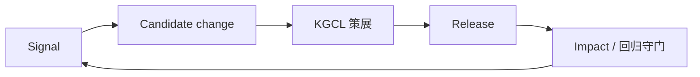

# 信号 → KGCL → 发版

源码：`src/biomed_ontology/evolution/`，CLI：`hmd signals`。

## 为什么需要演进闭环

本体不是一次性种子。线上会不断出现：

- 归一化失败 / 低置信歧义  
- 用户 `submit_feedback` 纠正  
- 评测臂回归  

没有闭环时，这些信号进个人笔记或聊天记录，下个 release 不会系统性吸收。

## 理想回路



| 阶段 | 含义 |
|---|---|
| Signal | 可机器采集的事件（失败、反馈、漂移） |
| Candidate | 提议的概念/链接/别名变更 |
| Curation | 人工用 KGCL（Knowledge Graph Change Language）描述变更 |
| Release | 新 `ontology_release_id`，KB 重建 |
| Impact | 重跑 eval / 质量守门；不达标不宣告 |

## PoC 边界

当前实现提供信号采集与 KGCL 相关脚手架，**不是**完整的生产策展工作台。接手时优先保证：

1. 反馈带 `trace_id` 可回放  
2. 发版号进每个 tool 响应  
3. 回归用同一套 `hmd eval` + targets，而不是另写「发版脚本数字」  

## 与质量层

LLM/规则生成内容以 `PENDING` 入库，未经审校不得进 agent 返回体（D5）。演进提案同样不应绕过审校状态直接变「已发布事实」。

## 如何验证

```bash
uv run hmd signals --help
uv run pytest tests/test_quality_evolution.py -q
```
