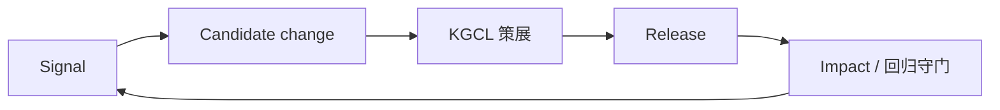
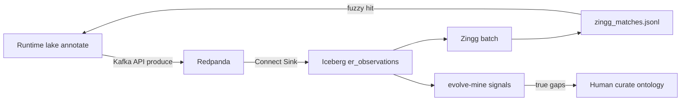

# 信号 → KGCL → 发版

源码：`src/biomed_ontology/evolution/`。CLI：`hmd signals`。  
Foundation 侧挖掘：`hmd foundation evolve-mine`（见 [Foundation · Data Loop](../architecture/foundation.md)）。

## 为什么存在

本体不是一次性种子。线上会持续出现：

- 归一化失败 / 低置信歧义；
- 用户 `submit_feedback` 纠正；
- 检索臂在 `hmd eval` 上回归；
- World Model `resolve_entity` unmapped。

没有闭环时，这些信号进入个人笔记或聊天记录，下个 release 不会系统性吸收。演进层主张：**缺口应由真实使用暴露**，miner 输入来自 P6 落下的 trace / decision / I/O / feedback，而非离线人工标注作唯一触发源。

## 设计取舍

| 取舍 | 选择 | 放弃 |
|---|---|---|
| 信号 ID | 类型 + 载荷哈希（`HMDS:…`） | 自增 ID（重复挖掘淹没队列） |
| 策展形态 | KGCL changeset（`ChangeSet` / `KgclOp`） | 直接改生产 GraphDB |
| PoC 范围 | 采集 + 候选 + KGCL 脚手架 | 完整生产策展工作台 |
| Foundation evolve | 只产出 `.kgcl` + candidates JSON | `evolve-apply` 自动写本体 |
| 质量闸门 | LLM/规则内容 `PENDING`，审校前不进 tool 返回 | 提案绕过审校变「已发布事实」 |

## 设计与实现

### 理想回路



| 阶段 | 含义 | 当前实现要点 |
|---|---|---|
| Signal | 可机器采集的事件 | `Signal` + 8 个 `SignalMiner` |
| Candidate | 提议的概念/链接/别名变更 | `generate_candidates` |
| Curation | KGCL 描述变更 | `build_changeset` |
| Release | 新 `ontology_release_id`，KB 重建 | `plan_release` |
| Impact | 重跑 eval / 质量守门 | `hmd eval`、targets |

### 信号模型

`Signal` 字段：`signal_type`、`payload`、`occurrences`、`first_seen_trace`、`example_traces`（最多 5）、`status`、`priority`（P0–P2）、`detected_in_release`、`evidence`。

优先级阈值（模块常量）：

- `occurrences >= 5` → P0；
- `>= 2` → P1；
- 否则 P2。

`MiningInput` 显式建模挖掘输入：`kb`、`hub`、`feedback`、`queries`、`clicks`；`from_runtime(kb, api)` 从 `ToolApi` 抽取。

### 八个 miner（概览）

| Miner | 触发源 |
|---|---|
| unmapped span | 归一化未映射片段 |
| low confidence | 置信度低于阈值 |
| feedback | `submit_feedback` 记录 |
| alias gap | 别名未命中 |
| co-occurrence | 共现但未链接 |
| … | 见 `evolution/__init__.py` |

同一 `signal_type|payload` 必须落到同一 `signal_id`，否则 TRIAGED / DISMISSED 状态无法延续。

### 与 ToolApi / 观测的衔接

- `submit_feedback` 以 `source_trace_id` 挂原调用 → miner 可回放候选。
- `ObservabilityHub` 提供 decision / I/O → 解释「为何产生信号」。
- 每个 tool 响应带 `ontology_release_id` → 信号标记 `detected_in_release`。

### Foundation Data Loop（一期硬边界）

```bash
uv run hmd foundation evolve-mine "unknownzyme-xyz-999"
uv run hmd foundation zingg-run --mode stub-link --observations bootstrap
```

| 做 | 不做 |
|---|---|
| `resolve_entity` unmapped / 低置信 → `.kgcl` + candidates JSON | 自动改 GraphDB ontology |
| 候选含建议别名 / suggested exactMatch | 自动策展 / `evolve-apply` |
| runtime/lake 缺口 → Redpanda → Iceberg `hmd.er_observations` | 热路径同步 PyIceberg append |
| Zingg 离线 link → `zingg_matches.jsonl`（模糊回收已有 ENT） | Zingg mint ENT / auto-apply KGCL / 查询时跑 Spark |



观测入湖见 [`docker/obs/README.md`](../../docker/obs/README.md)；Zingg 见 [`docker/zingg/README.md`](../../docker/zingg/README.md)。

### 配置（`Settings` / `.env`）

| 环境变量 | 默认 | 含义 |
|---|---|---|
| `HMD_OBS_EVENTS_ENABLED` | `true` | 关闭则不发观测事件 |
| `HMD_KAFKA_BOOTSTRAP_SERVERS` | `127.0.0.1:19092` | 默认 Redpanda；设空=WAL only |
| `HMD_KAFKA_ER_OBSERVATIONS_TOPIC` | `hmd.er.observations` | ER 缺口 topic |
| `HMD_OBS_WAL_DIR` | `data/obs_wal` | 本地 WAL |
| `HMD_ZINGG_MIN_SCORE` | `0.8` | Resolver / export 生效阈值 |
| `HMD_ZINGG_WINDOW_DAYS` | `30` | 物化扫描湖表窗口 |
| `HMD_ZINGG_MIN_OCCURRENCES` | `1` | 物化最低频次 |
| `HMD_ZINGG_OBSERVATIONS` | `all` | `lake` / `bootstrap` / `all` |
| `HMD_ZINGG_SKIP_DOCKER` | `false` | `zingg-run --mode full` 跳过 Spark 容器 |
| `HMD_EVOLVE_INCLUDE_LAKE` | `false` | `evolve-mine` 默认合并湖/WAL mention |

CLI 覆盖：`hmd foundation zingg-run --observations …`、`--min-score …`；`hmd foundation evolve-mine --include-lake`。

### 候选落地：回到策展 YAML 再 sync

KGCL / candidates **不是**生产图。人工审校后按变更类型写回 Git 策展面，再走校验与投影：

```text
.kgcl / candidates JSON
  → 人工编辑 ontology/entities|dictionary|claims|mappings|catalog（按需）
  → task ontology:validate
  → catalog：uv run hmd index --incremental（或 task ontology:refresh-literature）
  → entities/claims：uv run hmd foundation sync
  → 新 ontology_release_id 出现在 tool 响应
  → hmd eval / golden-eval 回归
```

| 候选类型（常见） | 写回位置 |
|---|---|
| 文献面概念 / 别名（检索·归一化） | `ontology/catalog/`（+ `ambiguity.yaml`） |
| 建议别名 / mention（金路径 ER） | `ontology/dictionary/` 或实体 `aliases` |
| suggested exactMatch | `ontology/entities/` 的 `exact_match_xrefs`（及 mappings 审阅表） |
| 新企业实体 | `ontology/entities/`（必要时同步补 catalog） |
| 关系断言 | `ontology/claims/`（`validated` 才进 knowledge） |
| 湖侧 extracted Claim 晋升 | 审校后写入 `ontology/claims/` 为 validated；见 [事实抽取](../ontology/extract.md) |

完整 edit→后端矩阵见 [策展资产与运行时机制](../ontology/curation-and-runtime.md)。

### 与质量层

LLM/规则生成内容以 `PENDING` 入库，未经审校不得进 tool 返回体（D5）。演进提案同样不应绕过审校状态直接变「已发布事实」。

### PoC 边界

当前实现提供信号采集与 KGCL 相关脚手架，**不是**完整的生产策展工作台。接手时优先保证：

1. 反馈带 `trace_id` 可回放；
2. 发版号进每个 tool 响应；
3. 回归用同一套 `hmd eval` + [targets](../eval/targets.md)，而不是另写「发版脚本数字」。

## 不变量与失败模式

| 不变量 | 违反后果 |
|---|---|
| 信号 ID 稳定 | 审校队列重复、状态机失效 |
| 不自动 apply KGCL 到生产 | 未审校变更上线 |
| eval 与发版同一 gold | 回归数字不可比 |
| feedback 挂 source trace | 信号无法归因到错误步骤 |

失败模式：

- **hub 不共享**：`mine_signals` 空跑。
- **跳过 Impact**：发版后静默退化。
- **把 evolve-mine 当生产修复**：只应产出候选，人工策展后 sync。

## 如何验证

```bash
uv run hmd signals --help
uv run pytest tests/test_quality_evolution.py -q
uv run hmd foundation evolve-mine "test-alias" --json
```

评测回归见 [dual-surface](../eval/dual-surface.md)；观测见 [pillars](../observability/pillars.md)。
