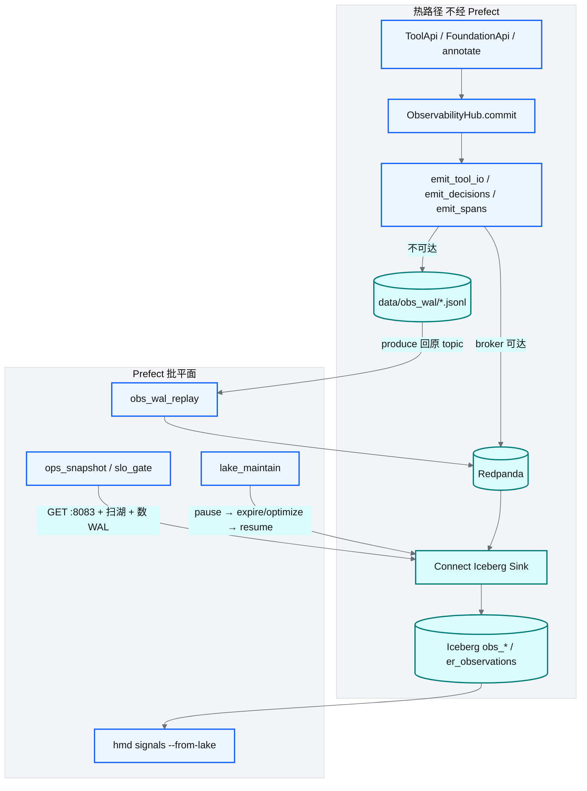
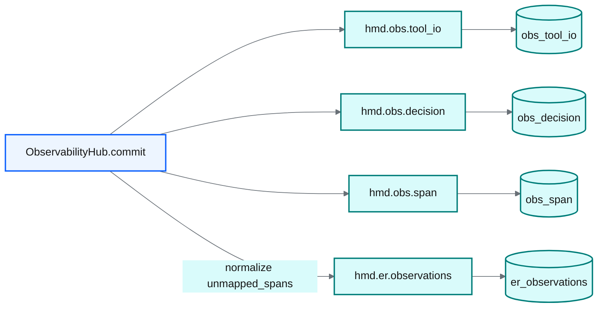
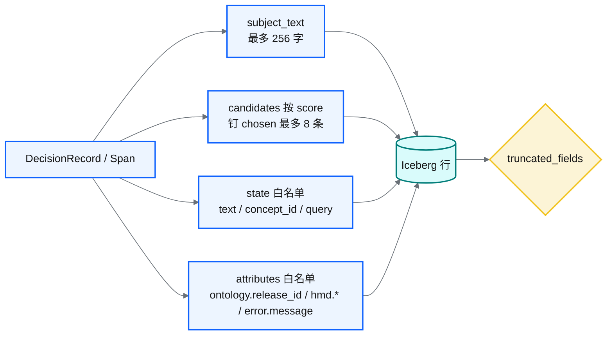
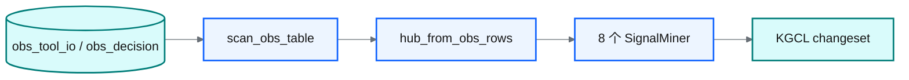

# 可观测四支柱

源码：`src/biomed_ontology/observability/`（`__init__.py`、`contracts.py`）。  
热路径入湖：`src/biomed_ontology/lake/obs_events.py`。  
消费方：归一化级联、`HybridSearcher`、`ToolApi._invoke`、演进挖掘（`evolution/`）。

## 为什么存在

语义层排障不能只靠「最终返回了什么」。典型问题：

- 为什么选了概念 A 而不是 B？
- 混合检索里 BM25 与图通道各贡献了几条？
- 许可过滤掉了多少候选？
- 某次发版后 nDCG 掉了，是模型还是本体 release 变了？

四支柱分别回答 **WHERE / WHAT / WHY / WHEN**。其中 **State（WHY）** 最容易被省掉，却最不可替代：只记结果不记候选，永远答不了「为什么没选那个」。

## 设计取舍

| 取舍 | 选择 | 放弃 |
|---|---|---|
| 后端绑定 | 采集契约 + 内存 / JSONL；入湖走 Kafka API | 业务代码直接依赖 OTel SDK |
| 属性命名 | OTel 语义 + `ontology.*` / `hmd.*` 扩展 | 各模块私有字段名 |
| 决策记录时机 | 决策点当场 `record_decision` | 函数返回后补埋点（候选已消失） |
| Explain | `SearchHit.explain` 暴露 RRF 通道名次 | 融合下推后无法反解 |
| trace 回传 | `trace_id` 随 tool 响应返回（D6） | 仅服务端日志可见 |
| 入湖形态 | WHY **投影**（完整可解析 JSON） | 按字节切开 JSON；热路径 `table.append` |

## 设计与实现

### 四个问题

| 支柱 | 问什么 | 主要类型 | 入湖 |
|---|---|---|---|
| Trace (WHERE) | 这次调用经过哪些阶段 | `Span` / `TraceContext` | `hmd.obs.span` → `obs_span` |
| I/O (WHAT) | 进出内容是什么 | `ToolIoRecord` | `hmd.obs.tool_io` → `obs_tool_io` |
| State (WHY) | 为什么选这个、落选的是谁 | `DecisionRecord` + `Candidate` | `hmd.obs.decision` → `obs_decision` |
| Metrics (WHEN) | 指标随时间与 release 怎么变 | `MetricPoint` | 仅内存 / 本地 JSONL，不开 topic |

`TraceContext` 承载一次 tool 调用的完整上下文：`ontology_release_id`、`entitlements`、span 栈、`decisions` 列表。`span()` 上下文管理器自动记录耗时与错误属性。

### `DecisionRecord` 结构

| 字段 | 含义 |
|---|---|
| `stage` | 归一化阶段 / 检索阶段等 |
| `justification` | `MappingJustificationEnum`（规则 / 词典 / 模型等） |
| `chosen` | 选中项 id |
| `candidates` | 落选候选（含 score、channel、label） |
| `state_before` / `state_after` | 级联状态机跃迁 |
| `rule_id` / `model_id` | 可归因的规则或模型 |
| `subject_text` | mention / query（入湖投影后按字符最多 256） |

写入点示例：`Normalizer` 级联、`HybridSearcher._graph_channel`、`ToolApi._invoke`。

### `ToolIoRecord`

记录每次工具调用的输入/输出 JSON、延迟、`contract_valid`、`license_filtered_count`、`max_tier_returned`、`caller_entitlements` 等，供审计与演进挖掘。normalize 输出里的 `unmapped_spans` 再 produce 到 `hmd.er.observations`。

### 与 Semantic Access 的衔接

见 [tools](../tools/tools.md)：`ToolApi._invoke` 强制起 trace、落 I/O。`submit_feedback` 以**被评价调用**的 `trace_id` 为主键，把用户纠正挂回当时的决策与候选。

### Explain 与 WHY 的用户可见面

`SearchHit.explain = RRF(bm25#3 + …)` 把通道名次暴露给调用方。若融合完全下推到无法反解的后端，检索路径上的 WHY 支柱断裂——因此混合检索保留可解释的 RRF 融合层。

### 消费正确性：`citation_fidelity`

`observability/contracts.citation_fidelity` 校验 agent 声称引用的文档是否在返回集内，且概念归因是否匹配。用于评测与质量闸门，见 [citationware](../tools/citationware.md)、[targets](../eval/targets.md) T5。

### 存储：热路径总线 + 批平面

热路径是 **App produce → Redpanda → Iceberg Kafka Connect Sink**（约 15s commit）。Prefect 只跑有界批处理：WAL 回放、湖维护、值班快照，不搬热路径。



`commit()` 失败打 `hmd.obs` warning、累加 `emit_failures`，**不向** tool / resolve / ingest 调用方抛错。顺序：`emit_tool_io` → `emit_decisions` → `emit_spans`。



| topic | 表 | connector | 内容 |
|---|---|---|---|
| `hmd.obs.tool_io` | `hmd.obs_tool_io` | `hmd-obs-tool-io` | WHAT：工具 I/O |
| `hmd.obs.decision` | `hmd.obs_decision` | `hmd-obs-decision` | WHY 投影 |
| `hmd.obs.span` | `hmd.obs_span` | `hmd-obs-span` | WHERE：name / parent / duration / status |
| `hmd.er.observations` | `hmd.er_observations` | `hmd-er-observations` | ER 缺口 |

观测表按 `event_date` identity 分区（`obs_tool_io` 为已有表，不改分区）。`iceberg.control.commit.interval-ms=15000`。请求路径**禁止** `table.append`。

broker 未配或不可达：写 `HMD_OBS_WAL_DIR`（默认 `data/obs_wal/`）。恢复后 `hmd lake obs-replay` **只 produce 回原 topic**，成功归档到 `obs_wal/replayed/<UTC-stamp>/`，不直写 Iceberg。

### WHY 投影

入湖是投影，不是内存对象转储。超预算时**整段丢掉**并记入 `truncated_fields`，保证湖里的 JSON 完整可解析。



| 字段 | 规则 |
|---|---|
| `subject_text` | mention / query，按**字符**最多 256 |
| `candidates_json` | 按 score 降序；**必留 chosen**；最多 8 条 |
| `candidates_n` | 截断前的原始条数 |
| `state_*` | 只留 `text` / `concept_id` / `query`；超 2KiB **整段丢掉** |
| `attributes_json` | 只留 `ontology.release_id`、`hmd.*`、`error.message` |
| `truncated_fields` | 逗号分隔，如 `candidates,state_after` |

miner 用 `decision_subject()` 读 mention（认纯字符串，不把 `chosen` 概念 ID 当成文本）。消歧阶段认 `LLM` / `LLM_DISAMBIGUATION` / `llm_disambiguation`，以及 `justification=LLMDisambiguation` 的 `ABSTAIN`。生产 normalize 阶段是 `LLM` / `ABSTAIN`。

### 过夜 miner 读湖

进程内 `from_runtime` 只看见当前 hub。过夜挖 WHY 走 `MiningInput.from_lake`：按 `event_date` 扫 `obs_tool_io` + `obs_decision`，`hub_from_obs_rows` 填临时 hub，再跑 8 个 miner。



```bash
uv run hmd signals --from-lake --window-days 7
```

### 值班与维护

`ops_snapshot` 含 `er_unmapped_backlog`、`obs_wal_lines`、`connect_ok`（四个 connector 均 RUNNING）。`HMD_ENV=prod` 且 Connect 不健康 → `slo-gate` 红；`rollback_lake: false`。口径：[`ops_slo.yaml`](https://github.com/zhiweio/biomed-ontology/blob/main/ontology/policies/ops_slo.yaml)。

写文献 / 文档 Iceberg 时 `paused_iceberg_sinks()`（可重入；Connect 未起不阻断）。`hmd lake maintain`：pause → expire snapshots → Trino `EXECUTE optimize`（`obs_tool_io` / `obs_decision` / `obs_span` / `er_observations`；optimize 失败只 warning）。catalog 是 SQLite；并行写湖必须 pause Sink。

Prefect：`obs-wal-replay`（cron `45 3 * * *`）、`lake-maintain`（周 `0 5 * * 0`），默认 `active: false`。

运维细节见 [docker/obs](https://github.com/zhiweio/biomed-ontology/blob/main/docker/obs/README.md)。

### 配置（`Settings` / `.env`，前缀 `HMD_`）

| 环境变量 | Settings 字段 | 默认 | 含义 |
|---|---|---|---|
| `HMD_OBS_EVENTS_ENABLED` | `obs_events_enabled` | `true` | `false` 时不 produce、不写 WAL |
| `HMD_KAFKA_BOOTSTRAP_SERVERS` | `kafka_bootstrap_servers` | `127.0.0.1:19092` | 默认 Redpanda；设空=仅 WAL |
| `HMD_KAFKA_OBS_TOOL_IO_TOPIC` | `kafka_obs_tool_io_topic` | `hmd.obs.tool_io` | 工具 I/O topic |
| `HMD_KAFKA_OBS_DECISION_TOPIC` | `kafka_obs_decision_topic` | `hmd.obs.decision` | WHY / DecisionRecord topic |
| `HMD_KAFKA_OBS_SPAN_TOPIC` | `kafka_obs_span_topic` | `hmd.obs.span` | WHERE / Span topic |
| `HMD_KAFKA_ER_OBSERVATIONS_TOPIC` | `kafka_er_observations_topic` | `hmd.er.observations` | ER 缺口事件 topic |
| `HMD_KAFKA_CONNECT_URL` | `kafka_connect_url` | `http://127.0.0.1:8083` | Connect REST（status / pause） |
| `HMD_OBS_WAL_DIR` | `obs_wal_dir` | `data/obs_wal` | broker 不可达时 Jsonl WAL |
| `HMD_OBS_WAL_REPLAY_MAX_LINES` | `obs_wal_replay_max_lines` | `10000` | 单次回放行数上限 |

本地栈：`task obs:up` → `task obs:register`（bootstrap `127.0.0.1:19092`，Connect `:8083`）。

## 不变量与失败模式

| 不变量 | 违反后果 |
|---|---|
| 决策点同步写入 | 无法回放「为什么」 |
| `trace_id` 回传客户端 | 反馈无法挂靠 |
| span 树与 release_id 绑定 | 跨版本对比失真 |
| Explain 可反解 | 检索黑盒 |
| 入湖是完整可解析的投影 | `from_lake` 解不出 candidates / state |
| 过夜挖 WHY 读湖 | 进程重启后 `from_runtime` 是空 hub |

失败模式：

- **只开 Trace 不开 Decision**：排障仍靠猜。
- **只用 `from_runtime` 过夜**：进程重启后 WHY 丢；应 `hmd signals --from-lake`。
- **契约校验失败仍记 OK**：`ToolIoRecord.contract_valid=false` 应告警。
- **观测失败让 tool 对调用方失败**：`commit()` 只记 `emit_failures`。

## 如何验证

```bash
uv run pytest tests/test_observability.py tests/test_obs_events.py tests/test_ops_p2.py -q
uv run hmd demo --compact    # 查看 span 树
uv run hmd signals --help
task obs:up
task obs:register
uv run hmd lake init         # 含 obs_tool_io / obs_decision / obs_span / er_observations
uv run hmd signals --from-lake --window-days 7
uv run hmd lake connect-status
uv run hmd lake obs-replay --dry-run
```

演进闭环见 [loop](../evolution/loop.md)；Zingg 模糊回收见 [Foundation](../architecture/foundation.md)。
