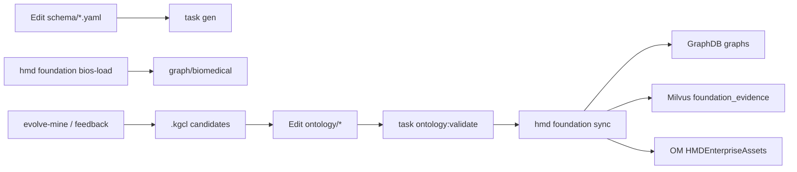

# 策展资产与运行时机制

源码入口：`ontology/`（策展实例）、`schema/`（LinkML 契约）、`src/biomed_ontology/foundation/`（ER / sync / Semantic Ops）、`src/biomed_ontology/tools/`（KB tools）。

本文是 **Ontology-as-Code 与 World Model 运行时的机制主文**：谁是 SSOT、每个目录/文件干什么、怎么改、怎么进 GraphDB / Milvus / OpenMetadata、怎么被 REST/MCP 消费、如何与 BERN2 / BIOS_v3 叠在一起。设计深文见文末相关章节——本文不替代它们，而是把运维与接线钉死。

---

## 1. 为什么存在

接手人常见三类迷路：

1. **改错面**：在 Protégé / 手写 TTL / `data/` 投影里改「真相」，Git 策展与运行时各说各话。
2. **改完不生效**：YAML 已改，但未 `validate` / `sync` / `bios-load`，Semantic Ops 仍读旧图。
3. **搞混两套身份**：文献面 `Normalizer`（catalog）与 Foundation 面 `EntityResolver`（dictionary + BERN2）混用，或把 BIOS URI 当企业主键。

没有一张「策展资产 → 写入路径 → 工具消费 → 外部系统」的地图，演进闭环（信号 → 策展 → 发版）也无法落地。

---

## 2. 设计取舍

| 取舍 | 选择 | 放弃 |
|---|---|---|
| 契约 SSOT | 仓库根目录 `schema/*.yaml` + `task gen` | 把 schema 塞进 `ontology/`；Protégé 回写 |
| 实例 SSOT | Git `ontology/**` 策展 YAML | 运行时直接改 GraphDB 当真相 |
| 查询真相 | sync 后的 GraphDB + Milvus + OM | YAML fallback 冒充 World Model |
| 公共知识 | BIOS_v3 进独立命名图，经 `skos:exactMatch` 挂靠 | BIOS URI 作企业主键 |
| NER/NEN | BERN2 出 mention + 候选外部 ID | BERN2 直出 `HMD:ENT:*` |
| 演进 | Signal → KGCL 候选 → **人工**写回 `ontology/*` | `evolve-apply` 自动改生产图 |
| 对外契约 | 具名 Semantic Ops / KB tools | 裸 SPARQL / 原始向量 API 作主契约 |

一句话：

> **BIOS provides the biomedical world. Enterprise Ontology provides the company's world.**

---

## 3. 设计与实现

### 3.1 分层 SSOT 与边界

```text
┌─────────────────────────────────────────────────────────────┐
│ schema/          LinkML 契约 SSOT（类 / 槽位 / 枚举 / tool I/O）│
├─────────────────────────────────────────────────────────────┤
│ ontology/        Git 策展实例（ENT、词典、claims、mappings…）  │
├─────────────────────────────────────────────────────────────┤
│ data/            运维内容（corpus、gold、releases、投影、缓存） │
├─────────────────────────────────────────────────────────────┤
│ GraphDB+Milvus+OM  运行时唯一查询面（禁止 YAML WM fallback）    │
└─────────────────────────────────────────────────────────────┘
```

| 层 | 目录 | 角色 | 禁止 |
|---|---|---|---|
| **Schema SSOT** | `schema/` | LinkML 唯一模式/契约 | 放在 `ontology/` 下；手写第二份枚举 |
| **Ontology 策展** | `ontology/` | `HMD:ENT:*`、Dictionary、claims、mappings、catalog | 把 `data/corpus` / `data/gold` 整仓搬进来 |
| **运维内容** | `data/` | 语料、gold、releases、evidence/assets 投影、缓存 | 当作企业身份 SSOT（`data/seed` 已删除） |
| **运行时** | GraphDB + Milvus + OM | sync 后查询只认后端 | YAML fallback |

路径约定（`src/biomed_ontology/foundation/paths.py`）：

| 常量 | 路径 |
|---|---|
| `ENTITIES_PATH` | `ontology/entities/enterprise_entities.yaml` |
| `DICTIONARY_PATH` | `ontology/dictionary/enterprise_dictionary.yaml` |
| `CLAIMS_PATH` | `ontology/claims/knowledge_claims.yaml` |
| Zingg | `ontology/mappings/zingg_matches.jsonl` |

运行投影样例仍可在 `data/foundation/`，**不是**身份权威。

---

### 3.2 `ontology/` 子目录与文件地图

```text
ontology/
├── entities/          # 企业实体金路径种子
├── dictionary/        # ER 精确词典
├── claims/            # KnowledgeClaim 策展断言
├── mappings/          # 外部 ID / NER / Zingg
├── catalog/           # 文献/检索 ENT 目录 + 歧义表
├── extract/           # 抽取配置（表格指标）
├── examples/          # Golden Path 样例包
├── owl/               # Protégé 入口说明（非 SSOT）
├── shapes/            # SHACL 入口说明（非 SSOT）
└── README.md
```

#### `entities/` — 企业世界模型实体

| 文件 | 数据 | 干什么 |
|---|---|---|
| `enterprise_entities.yaml` | Program / Target / Indication / DrugCandidate / Experiment… | **企业主键权威**：`HMD:ENT:{DC\|PRG\|TGT\|IND\|…}:slug`；aliases；`exact_match_xrefs` / `related_xrefs`；药↔靶↔适应症等结构字段 |

身份规则：主键永不复用；废弃走 `replaced_by`。外部概念（BIOS / ChEBI / HGNC）只挂 xref，不替代 ENT。

同步后落入 GraphDB `graph/ontology`。`get_entity` / `get_entity_context` 读的是这张图，不是 YAML。

#### `dictionary/` — ER Exact 层

| 文件 | 数据 | 干什么 |
|---|---|---|
| `enterprise_dictionary.yaml` | mention → `enterprise_id` + `external_ids` + aliases | BERN2 之后的**精确解析**；研发代号（如 HMPL-504）、中文商品名等「公共 NER 买不到」的表面形 |

加载进 `Bern2Client.dictionary` 与 `EntityResolver` 的别名倒排。专有名词主路径走词典，不依赖公共 BERN2 云服务。

#### `claims/` — 知识断言（Knowledge ≠ Truth）

| 文件 | 数据 | 干什么 |
|---|---|---|
| `knowledge_claims.yaml` | `claim_id`、S-P-O、`claim_status`、confidence、`evidence_ids`、span… | 策展认可的企业关系；`validated` 才物化为 knowledge 边 |

原则：图侧存 claim + W3C PROV；可引用原文在 Milvus。仅 `claim_status=validated` 且含 `object_id` 的 claim 进入 `graph/knowledge`。湖侧抽取 claim 进 `graph/provenance_extracted`，**不**随 seed sync 清空。

#### `mappings/` — 外部挂靠与 NER 类型

| 文件 | 数据 | 干什么 |
|---|---|---|
| `bios.yaml` | `enterprise_id` ↔ BIOS/HGNC/… | 审阅投影；权威 xref 仍以 entities 的 `exact_match_xrefs` 为准 |
| `chebi.yaml` | ENT ↔ ChEBI（PoC 可含 DEMO ID） | 化学实体挂靠 |
| `bern2.yaml` | BERN2 mention type → 企业 kind | 如 `drug→DrugCandidate`、`gene→Target` |
| `zingg_matches.jsonl` | mention → enterprise_id + score | 跨源模糊匹配预计算表；`score>0` 才被 Resolver 采用 |

#### `catalog/` — 文献/检索用 ENT 目录

| 文件 | 数据 | 干什么 |
|---|---|---|
| `diseases.yaml` | 疾病/适应症种子 + `parents` | 检索层级扩展（查 NSCLC 召回下位） |
| `substances.yaml` | 物质/管线种子 | 企业内部别名与范围划定；`xref_hints` 给 loader，非硬编码权威 ID |
| `targets.yaml` | 靶点种子 | 按 gene symbol 对 HGNC |
| `ambiguity.yaml` | 歧义别名 + senses + context_cues | 命中必须消歧；禁止静默单选（D3） |

文献面 `Normalizer` / KB tools（`normalize_entity`、`expand_concept`…）主要吃 catalog。身份权威仍是 `HMD:ENT:*`；金路径实体以 `entities/` 为准。详见 [企业身份与目录 SSOT](seed.md)。

#### `extract/` — 抽取配置

| 文件 | 数据 | 干什么 |
|---|---|---|
| `table_metrics.yaml` | 表头（casefold）→ `metric` + `unit` | 表格通道把 ORR / PFS / IC50 等列规范成指标名；供湖侧 / corpus 抽取，**不是** MCP 工具输入 |

#### `examples/golden_path/hmpl504/` — 验收样例

| 文件 | 干什么 |
|---|---|
| `sample_text.txt` | 离线解析用短文本 |
| `expected_context.json` | 期望 canonical / target / disease / evidence / assets |
| `README.md` | 本地 golden / resolve / MCP 说明 |

样例包用于 `ontology:validate` 与 `hmd foundation golden`；**不是**生产语料。离线 CLI 可做词典 resolve；生产 `get_entity_context` 仍要求三后端，禁止 YAML 冒充。

#### `owl/` 与 `shapes/` — 入口说明 only

| 目录 | 干什么 |
|---|---|
| `owl/README.md` | Protégé **只读**审阅入口；权威 OWL = `task gen:owl` → `schema/generated/*.owl.ttl` |
| `shapes/README.md` | SHACL 入口；权威 = `schema/generated/*.shacl.ttl` + `schema/shapes/projection.shacl.ttl` |

禁止把 Protégé 另存 TTL 检入为 SSOT。可选 `task ontology:sync-artifacts` 把生成物复制到本目录供离线分发。

---

### 3.3 `schema/` 全地图

`schema/` 在仓库**根目录**，是 LinkML 唯一契约 SSOT。改语义回这里，再 `task gen`。生成 Python 在 `src/biomed_ontology/_generated/`；OWL / JSON Schema / SHACL 另落在 `schema/generated/`。

#### 根目录 YAML

依赖大致：

```text
hmd_types
    ├── hmd_concept ──► hmd_fact ──► hmd_obs
    │                      └──► hmd_taxonomy
    ├── hmd_enterprise
    └──（hmd_tools import hmd_obs + hmd_taxonomy）
```

| 文件 | 模型核心 | 干什么 |
|---|---|---|
| `hmd_types.yaml` | 共享类型与枚举、`ConceptCurie` 等 | 被其他模块 import；枚举**只增不删改名**；跨模块共用槽位（如 `justification`）防语义漂移 |
| `hmd_concept.yaml` | Concept / Synonym / Mapping / Hierarchy / Clique | 术语层 L1：内部 CURIE 锚点、别名、SSSOM、层级、等价团 |
| `hmd_enterprise.yaml` | DrugCandidate / Target / Indication / Program / Experiment / Publication / KnowledgeClaim… | 企业研发世界模型；主键 `HMD:ENT:*` |
| `hmd_fact.yaml` | Document / DocumentSection / Chunk / Fact / Evidence / Provenance | 文档树 + 语句级事实与出处 |
| `hmd_taxonomy.yaml` | TaxonomyLabel / DocumentLabel | 文档多标签标引（进本体，不散落在分类器权重里） |
| `hmd_obs.yaml` | ToolIoRecord / DecisionRecord / Candidate / Signal / QualityMetric | Trace / IO / State / Metrics 四支柱 |
| `hmd_tools.yaml` | Normalize/Expand/Search/Restore/Facts/Feedback Request·Response | **KB 面** 8 工具的 I/O 契约；生成 JSON Schema 与 MCP 描述 |

说明：`hmd_tools.yaml` 覆盖的是文献/术语面 **8** 个 `TOOL_SPECS`。Foundation 面另有 **9** 个 `SEMANTIC_OPS`（见 §3.5）。双面合计 **17** 个具名操作；不要把「8」读成「全仓只有 8 个工具」。

#### `schema/shapes/`

| 文件 | 干什么 |
|---|---|
| `projection.shacl.ttl` | **手写**图投影约束。入库形态是 SKOS/PROV 投影，与 LinkML gen-shacl 的 closed 实例形状谓词对不上；此处只拦「SPARQL 能跑但答案静默变少」类错误（如 `skos:broader` 必须指向概念 IRI） |

#### `schema/generated/`

每个源 schema（除被 import 的 types）通常三件套：

| 后缀 | 用途 |
|---|---|
| `*.schema.json` | JSON Schema：运行时 / OpenAPI 校验 |
| `*.owl.ttl` | OWL：Protégé 只读审阅 |
| `*.shacl.ttl` | 自 LinkML 生成的 SHACL（实例形状） |

命令：`task gen`（全量）、`task gen:owl` / `task gen:shacl`。业务模块只 import `_generated/`，禁止手写第二份同名枚举。

更偏契约生成管线的说明见 [LinkML 与生成物](../architecture/linkml.md)。

---

### 3.4 更新、维护、写入 KB / World Model

#### 总览



#### 两类变更流程

| 改什么 | 改哪里 | 命令 | 效果 |
|---|---|---|---|
| **契约**（类/槽位/枚举/tool I/O） | `schema/*.yaml` | `task gen` → PR | 重生 Pydantic / JSON Schema / OWL / SHACL；**不**直接改 GraphDB |
| **实例**（实体、词典、断言、映射、catalog） | `ontology/**` | `task ontology:validate` → merge → `hmd foundation sync` | 投影进三后端 |

日常策展：

```bash
# 改 ontology/entities|dictionary|claims|mappings|catalog|extract 后
task ontology:validate
uv run hmd foundation sync
```

改 schema：

```bash
# 改 schema/*.yaml 后
task gen
uv run pytest tests/test_tools.py tests/test_service.py -q
```

`ontology:validate` 检查：目录结构、映射对齐、Golden Path 实体可达。

#### 编辑 → 后端影响矩阵

| 编辑资产 | 主要影响 | 需跑的命令 | 运行时可见于 |
|---|---|---|---|
| `entities/` | 实体标签、结构边、xref | validate → sync | `get_entity`、context；Resolver 别名/xref 索引 |
| `dictionary/` | Exact mention | validate → sync（及进程重载词典） | `resolve_entity` |
| `claims/`（validated） | knowledge 边 + seed provenance | validate → sync | `get_relationships`、context |
| `mappings/bios|chebi` | 挂靠审阅；与 entities xref 对齐 | validate；必要时 sync | BIOS bridge / xref 解析 |
| `mappings/bern2.yaml` | NER type → kind | 部署配置 / 进程重载 | Resolver type 提示 |
| `mappings/zingg_matches.jsonl` | 模糊预计算 | 文件更新后 Resolver 重载 | `resolution_method=zingg` |
| `catalog/*` | 文献概念、层级、歧义 | 文献 KB 重建 / index（非 foundation sync  alone） | `normalize_entity`、`expand_concept`、search |
| `extract/table_metrics.yaml` | 表格指标规范名 | 湖侧 ingest / 抽取流水线 | extracted claims（非 MCP 直接读） |
| `schema/*.yaml` | 契约与生成物 | `task gen` | 校验形状、MCP/OpenAPI、类型 |
| BIOS 全量/子集 | `graph/biomedical` | `hmd foundation bios-load`（需 license ACK） | context 的 `bios_bridges` |

注意：文献 catalog 进入 GraphDB 许可命名图 / 检索索引的路径，与 Foundation `sync_world_model` **不是同一条写路径**。前者见 [pipeline](../architecture/pipeline.md) / [seed](seed.md)；后者见下节。

#### `sync_world_model` 行为

实现：`src/biomed_ontology/foundation/sync.py` 的 `sync_world_model`；CLI：`uv run hmd foundation sync`。

| 目标 | 写入内容 | 清空策略 |
|---|---|---|
| GraphDB `graph/ontology` | 企业实体 TTL | **整图替换**（`clear_graph` 后 `load_turtle`） |
| GraphDB `graph/knowledge` | validated claim 关系边 | **整图替换** |
| GraphDB `graph/provenance` | seed 策展 PROV | **整图替换** |
| GraphDB `graph/provenance_extracted` | 湖侧抽取 claim | **保留**（sync 不清） |
| Milvus `foundation_evidence` | 证据索引行 | upsert |
| OpenMetadata `HMDEnterpriseAssets` | ELN/LIMS 等 glossary terms | upsert |

BIOS **不**在这次 sync 里灌入，另走：

```bash
export HMD_BIOS_LICENSE_ACK=poc   # 或合规认可的 ACK
uv run hmd foundation bios-load   # → graph/biomedical
```

#### GraphDB 命名图（Foundation 固定图）

约定：`src/biomed_ontology/foundation/graphs.py`。与 KB 许可命名图（`graph/{tier}/{source}`）共存于同一 Repository。

| 常量 | URI 后缀 | 内容 |
|---|---|---|
| `GRAPH_BIOMEDICAL` | `graph/biomedical` | BIOS_v3 |
| `GRAPH_ONTOLOGY` | `graph/ontology` | Enterprise Ontology TBox + 实体 + mappings |
| `GRAPH_KNOWLEDGE` | `graph/knowledge` | validated 企业关系边 |
| `GRAPH_PROVENANCE` | `graph/provenance` | seed / validated PROV |
| `GRAPH_PROVENANCE_EXTRACTED` | `graph/provenance_extracted` | 湖侧 extracted |
| `GRAPH_INFERENCE` | `graph/inference` | 推导关系（可选物化） |

#### 演进：从信号回到策展 YAML

```text
线上使用（unmapped / 低置信 / submit_feedback / eval 回归）
  → Signal（hmd signals / ObservabilityHub）
  → hmd foundation evolve-mine → .kgcl + candidates JSON
  → 人工审校，写回 ontology/entities|dictionary|claims|mappings
  → task ontology:validate → hmd foundation sync
  → 新 ontology_release_id → hmd eval 回归
```

PoC **硬边界**：产出候选，**不**自动改 GraphDB ontology，**无**无人审校的 `evolve-apply`。详见 [信号 → KGCL → 发版](../evolution/loop.md)。

联调最短路径：

```bash
export HMD_BIOS_LICENSE_ACK=poc
task foundation:up
uv run hmd foundation bios-load
uv run hmd foundation sync
uv run hmd foundation resolve "HMPL-504"
uv run hmd foundation golden --candidate HMPL-504
uv run hmd serve --mcp
```

---

### 3.5 资产如何被使用 ↔ REST / MCP

`hmd serve`（可选 `--mcp`，挂载 `/mcp`）经 `open_dual_surface()` 装配双面，共享同一进程内的 `ToolApi` + `FoundationApi`。清单：`GET /v1/ops`。

契约：KB 面 ← `schema/hmd_tools.yaml` + `TOOL_SPECS`；Foundation 面 ← `SEMANTIC_OPS`（`src/biomed_ontology/foundation/api.py`）。

#### A. KB Semantic Tools（8）— 文献 / 术语面

REST：`POST /v1/{tool}` · MCP：同名 tool

| Tool | 主要吃哪些资产 | 后端侧重 |
|---|---|---|
| `normalize_entity` | catalog 概念+别名、`ambiguity.yaml`、Normalizer 级联 | 文献 KB |
| `resolve_alias` | 同上；单别名精确，不做文档级 NER | 文献 KB |
| `expand_concept` | catalog 层级 / synonyms | 文献 KB / 图邻域 |
| `get_concept` | 概念详情、映射、许可 tier | 文献 KB |
| `get_facts` | 事实层（抽取 + 策展） | 事实存储 |
| `search_documents` | Milvus 文献索引 + 本体改写 | Milvus |
| `restore_context` | 文档语义树（Citationware） | 解析产物 |
| `submit_feedback` | 回写 → evolution miner（挂 `source_trace_id`） | ObservabilityHub |

文献面归一化级联见 [归一化级联](normalize.md)——与 Foundation `EntityResolver` **不是同一条链**。

#### B. Foundation Semantic Ops（9）— 企业世界模型面

REST：`POST /v1/{op}` · MCP：同名

| Op | 后端 | 用到的策展 / 运行时资产 |
|---|---|---|
| `resolve_entity` | Resolver（本地）；可调 BERN2 | dictionary、entities aliases、zingg、mappings、BERN2 候选 |
| `get_entity` | GraphDB `graph/ontology` | sync 后的 entities |
| `get_relationships` | GraphDB knowledge + provenance | claims（默认 validated） |
| `find_related_entities` | GraphDB | 实体边 + claims |
| `search_evidence` | Milvus `foundation_evidence` | evidence 投影 |
| `get_entity_evidence` | Milvus | 按 `enterprise_id` 过滤证据 |
| `search_assets` | OpenMetadata Glossary | assets 投影 |
| `get_entity_assets` | OpenMetadata | 按实体关联资产 |
| `get_entity_context` | GraphDB + Milvus + OM + biomedical | 上表聚合；**禁止 YAML fallback** |

诊断：`GET /v1/golden_path?candidate=HMPL-504` 与 CLI `hmd foundation golden`——**仅 REST/CLI**，不进 MCP 主工具表。

#### 策展文件 → 工具矩阵

| 策展 / 配置资产 | 直接消费者（工具或流水线） |
|---|---|
| `entities/enterprise_entities.yaml` | sync → `get_entity` / context / related；Resolver 索引 |
| `dictionary/enterprise_dictionary.yaml` | `resolve_entity`；BERN2 词典扫描 |
| `claims/knowledge_claims.yaml` | sync → `get_relationships` / context |
| `mappings/bios.yaml` 等 | xref 对齐；context BIOS bridge（经 entities xref + biomedical 图） |
| `mappings/bern2.yaml` | ER type 映射 |
| `mappings/zingg_matches.jsonl` | `resolve_entity`（zingg） |
| `catalog/*` + `ambiguity.yaml` | `normalize_entity` / `expand_concept` / search 改写 |
| `extract/table_metrics.yaml` | 湖侧表格抽取 → extracted claims |
| `examples/golden_path/*` | validate + `golden_path` |
| `schema/hmd_tools.yaml` | KB 8 工具契约校验与 MCP 描述 |
| `schema/hmd_enterprise.yaml` | 企业模型形状；sync 序列化依据 |

调用链要点（KB）：分配 `trace_id` → 契约校验 → handler → 许可过滤 → `ToolIoRecord`。返回体带 `ontology_release_id`，供 feedback 与演进挂接。

Foundation：`resolve_entity` **只用**词典/Resolver 做 ER，不把 seed YAML 当 WM 查询回落；`get_entity_context` 任一必需后端不可达 → `BackendUnavailableError`。

路由与凭据细节见 [Semantic Access](../tools/tools.md)、[serve](../tools/serve.md)。

---

### 3.6 BERN2 + EntityResolver + BIOS_v3

#### 角色钉死

| 组件 | 是 | 不是 |
|---|---|---|
| **BERN2** | Recognition + 候选外部 ID（NER/NEN） | 企业主键、通用 Entity Resolution |
| **EntityResolver** | 文本/mention → `HMD:ENT:*` | 「BERN2 直出 BIOS URI」 |
| **BIOS_v3** | 公共生物医学世界（External Concept） | 企业主键 owner |
| **Enterprise Ontology** | 公司世界（`HMD:ENT:*`） | BIOS 子集 |
| **GraphDB** | World Model 运行时（多命名图） | 仅 PoC 玩具存储 |

#### 三层 ID

```text
① Enterprise Entity   HMD:ENT:{DC|TGT|IND|…}:slug   ← 对外语义锚点 / 主键
② External Concept    BIOS:… / CHEBI:… / HGNC:…     ← skos:exactMatch 挂靠
③ Evidence            pubmed:… | patent:… | eln:… | ev:…
```

Milvus `entity_ids`、API `canonical_entity`、OM 资产关联：**优先 Enterprise ID**。

#### Entity Resolution 解析链

实现：`src/biomed_ontology/foundation/resolve.py`。

```text
Text
  → BERN2.annotate（mention + 候选标准 ID）     # resolve_text
  → 对每个 mention：resolve_mention（有命中即停）
       1. enterprise_id     输入已是 HMD:ENT:*
       2. xref              ResolutionIndex.by_external
       3. dictionary        实体 aliases + 倒排
       4. zingg             zingg_matches.jsonl（score>0）
       5. bern2_dictionary  Bern2Client.dictionary.lookup
       6. bern2_candidate / unmapped
  → HMD:ENT:* + external_ids[] + bios_concepts[] + method + confidence
```

| `resolution_method` | 含义 |
|---|---|
| `enterprise_id` | 输入即企业 ID |
| `xref` | 外部标准 ID 命中实体 xref |
| `dictionary` | 词典 / 别名精确 |
| `zingg` | 预计算模糊表 |
| `bern2_candidate` | BERN2 仅出外部 ID，尚未映射企业实体 |
| `unmapped` | 未解析 |

`resolve_text`：先 `bern2.annotate`；若无 mention（短查询），整句再 `resolve_mention` 一次。

失败策略：

| 场景 | 行为 |
|---|---|
| BERN2 不可达 | `resolve` 可降级词典/xref；**湖侧 ingest 硬失败**（必接 BERN2） |
| 歧义多义 | 返回 alternatives / 低置信；禁止静默单选 |
| 内部代号 | 走 `enterprise_dictionary`，不外泄到公共 BERN2 云 API |

#### GraphDB 上两层世界如何叠

```text
graph/biomedical   ← BIOS_v3（bios-load）
graph/ontology     ← 企业实体 + skos:exactMatch → BIOS:/HGNC:/…（sync）
graph/knowledge    ← 企业 validated 关系
graph/provenance*  ← claim 元数据（seed vs extracted 分图）
```

`get_entity_context`（`src/biomed_ontology/foundation/api.py`）：

1. `get_entity` + `get_relationships` + `find_related_entities`（ontology / knowledge）
2. 汇总根实体与一跳的 `exact_match_xrefs` / external_ids
3. `fetch_bios_concepts` 查 `GRAPH_BIOMEDICAL`
4. 把 BIOS 桥挂到 targets / diseases / drugs 的 `bios` 字段
5. 并行拉 Milvus 证据与 OM 资产（根实体 + 一跳 scope）

backends 字段会标明：`graphdb` / `milvus` / `openmetadata` / `graphdb_biomedical`（或 empty）。

#### 金路径端到端（HMPL-504）

```text
"HMPL-504 inhibits MET signaling in NSCLC."
  → 词典/BERN2 → HMD:ENT:DC:savolitinib / TGT:MET / IND:nsclc
  → GraphDB ontology/knowledge → 药-靶-病
  → GraphDB biomedical → BIOS 概念桥
  → Milvus → 可引用 span
  → OM → ELN/LIMS
  → get_entity_context / golden_path
```

期望形状见 `ontology/examples/golden_path/hmpl504/` 与 [Golden Path](golden-path.md)。

#### 双身份面对照（易混点）

| 面 | 入口 | 主要数据 | 对外工具 |
|---|---|---|---|
| 文献 / 术语 | `Normalizer` | `ontology/catalog` + ambiguity | `normalize_entity`、`expand_concept`… |
| 企业 / Foundation | `EntityResolver` | `entities` + `dictionary` + BERN2 + zingg | `resolve_entity`、`get_entity_context`… |

两者最终都锚到企业身份空间，但级联阶段、埋点字段与后端要求不同——不要用 catalog 假装 Foundation sync 已完成。

---

## 4. 不变量与失败模式

| 不变量 | 违反后果 |
|---|---|
| LinkML 唯一 schema SSOT | Protégé / 手写 TTL 与生成物流转分叉 |
| validate 先于 sync | 坏映射 / 断金路径入图 |
| 查询禁止 YAML WM fallback | 联调未起时「看起来能用」、生产撒谎 |
| Knowledge ≠ Truth | extracted 当 validated → knowledge 图垃圾边 |
| sync 不清 `provenance_extracted` | 湖侧 claim 丢失 |
| BIOS 需 license ACK | 合规风险 |
| 演进不自动 apply | 未审校变更上线 |
| 企业词典不进公共 BERN2 | 内部代号外泄 |
| `TOOL_SPECS` ↔ `hmd_tools.yaml`；工具计数与手册一致 | MCP/OpenAPI 漂移 |

常见失败：

| 模式 | 处理 |
|---|---|
| GraphDB unreachable | sync / `get_entity` 抛错 → `task foundation:up` |
| `foundation_evidence` 不存在 | 先 `hmd foundation sync` |
| BIOS 空图 | `bios-load`；golden-eval 查 biomedical 非空 |
| 只改 YAML 不 sync | Semantic Ops 仍旧 |
| 在 `ontology/owl` 改「真相」 | 无效；回 `schema/` + `task gen` |
| 把 `data/foundation` 当 ENT SSOT | 改 `ontology/entities` 等策展面 |

---

## 5. 如何验证

```bash
# 契约
task gen

# 策展
task ontology:validate

# 运行时投影（需联调栈）
export HMD_BIOS_LICENSE_ACK=poc
task foundation:up
uv run hmd foundation bios-load
uv run hmd foundation sync

# ER / 金路径
uv run hmd foundation resolve "HMPL-504"
uv run hmd foundation golden --candidate HMPL-504 --compact
uv run hmd foundation evolve-mine "test-alias" --json

# 服务面
uv run hmd serve --mcp
# GET /v1/ops 应列出 kb_tools(8) + foundation_ops(9)

# 测试子集
uv run pytest tests/test_ontology_validate.py tests/test_clique.py \
  tests/test_foundation_world_model.py tests/test_tools.py \
  tests/test_service.py tests/test_claim_status_sync.py -q
```

手册构建（断链）：

```bash
task docs
```

---

## 相关章节

| 主题 | 文档 |
|---|---|
| World Model 总设计 | [Foundation](../architecture/foundation.md) |
| Protégé / LinkML / SHACL 职责 | [Toolchain](toolchain.md) |
| 目录 SSOT 与 seed 构建 | [企业身份与目录 SSOT](seed.md) |
| 文献归一化级联 | [归一化级联](normalize.md) |
| 命名图与许可 | [GraphStore 与许可命名图](rdf.md) |
| 金路径验收 | [Golden Path](golden-path.md) |
| LinkML 生成管线 | [LinkML 与生成物](../architecture/linkml.md) |
| 17 工具能力群 | [Semantic Access](../tools/tools.md) |
| REST/MCP 路由 | [serve](../tools/serve.md) |
| 信号与 KGCL | [演进闭环](../evolution/loop.md) |
| 物理目录树 | [目录地图](../appendix/tree.md) |
| 仓内 README | 仓库根下 `ontology/README.md` |
