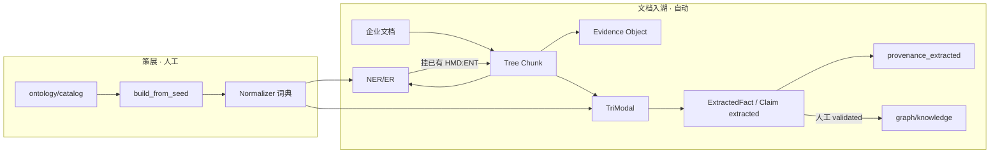

# 事实抽取（TriModal）与接地

源码：`src/biomed_ontology/corpus/extract.py`（`TriModalPipeline`、`_ground`）、`corpus/candidates.py`、`corpus/extractors/llm_text.py`、`lake/claim_bridge.py`、`lake/steps.py`（`write_claims`）。

文档入湖把正文切成 Evidence，再抽 **(S, P, O) 候选事实**；两端实体必须落到已有 `HMD:ENT:*`。文档**不发明** Ontology 概念节点。

相关：[Document Pipeline](../architecture/document-pipeline.md) · [归一化](normalize.md) · [目录 SSOT](seed.md) · [策展与运行时](curation-and-runtime.md) · [演进闭环](../evolution/loop.md)

---

## 1. 为什么存在

研发文档是证据与候选知识的来源，不是世界模型本身。若把「每篇 PDF 里出现的新词」自动 mint 成 ontology class，会得到不可治理的爆炸图。

本层回答三件事：

1. **怎么从 Tree Chunk 抽出可审校的三元组**（TriModal）
2. **字符串如何强制挂到企业概念**（`_ground` / Normalizer）
3. **候选事实落在哪、如何审校后写回 catalog / claims 并发布**

一句话分工：

| 东西 | 是什么 | 从哪来 | 干什么 |
|------|--------|--------|--------|
| Ontology 概念 | `HMD:ENT:DC:savolitinib` 等身份 | **`ontology/catalog/`（及金路径 `entities/`）人工策展** | 世界里「谁是谁」 |
| Tree Chunk / Evidence | 带章节路径的原文碎片 | **文档解析切树** | 「证据在哪、原文怎么说」 |
| Fact / Claim | `(药, inhibits, 靶点)` 等三元组 | **TriModal 从 chunk 抽** | 候选知识；`validated` 后才进企业认可图 |



---

## 2. 设计取舍

| 决策 | 理由 | 拒绝的方案 |
|---|---|---|
| 先 MentionPair 再 LLM 选谓词 | 限制幻觉与非法类型组合 | 让模型自由发明实体 ID |
| `_ground` 失败则丢弃事实 | 未归一化三元组进不了图 | 用表面字符串当图节点 |
| `extracted` ≠ `validated` | 抽取垃圾不污染 World Model | ingest 自动物化 knowledge 边 |
| 概念只来自 catalog/entities | 身份可 PR、可 release | 文档自动 mint 新概念 |
| TriModal 核心不硬绑 BIOS | 企业主键是 `HMD:ENT:*` | BIOS URI 当地接目标 |
| BERN2 作上游 NER，非 RE 引擎 | 职责分离 | BERN2 直出关系边 |

---

## 3. 设计与实现

### 3.1 TriModal 路由

「三模态」= 按 chunk 的 `modality` 路由抽取器，结果再 `merge`：

| 模态 | 抽取器 | 算法要点 |
|---|---|---|
| TEXT | `LlmTextRelationExtractor`（`text-llm-v1`，主） | MentionPair 候选 + 受限 JSON LLM |
| TEXT | `RuleTextRelationExtractor`（旁路） | 中英正则；LLM 不可用或 `HMD_EXTRACT_RULE_BOOST` 时开启 |
| TABLE | `TableExtractor` | 表头映射 `ontology/extract/table_metrics.yaml` → 数值事实 |
| IMAGE | `ImageExtractor` | 弱通道 / 占位 |

装配：`default_extractors()`；入口：`TriModalPipeline.run(docs, chunks, normalizer=…)`。

### 3.2 文本主路径算法

```text
chunk
  → mentions_from_chunk
       优先 chunk.entity_ids（入湖 annotate_bern2 + ER 已写）
       否则 Normalizer.detect（min_confidence≈0.6）
  → build_mention_pairs（同句 + 类型兼容矩阵，截断 max_pairs）
  → 按句调 LLM：只允许受限谓词集合
  → 过滤 negated / uncertain / none / 低置信
  → subject/object → 候选已有 entity_id，或 _ground
  → ExtractedFact（review_status=PENDING）
  → merge：同 signature 合并证据；跨文档小幅加置信（封顶 0.97）
```

类型兼容矩阵（剪枝非法谓词，`COMPATIBLE_PREDICATES`）：

| (S 类型, O 类型) | 允许谓词 |
|---|---|
| drug → target | `inhibits`, `has_target` |
| drug → disease | `treats`, `in_clinical_trial_for` |
| target → drug | `biomarker_for` |
| drug → ae | `has_adverse_event` |

LLM 系统约束：返回 JSON `relations[]`；`predicate` 必须属于上述集合或 `none`；`quote` 须为句内原文子串；**禁止发明实体 ID**。

规则旁路：句级正则抓 `(S) inhibits/treats… (O)`；否定句跳过；主语省略时承继本句已接地主语；两端走 `_ground`。

表格：首列 `_ground` 为 subject；命中指标列则产出带 `object_value` / `object_unit` / `qualifiers` 的事实。

### 3.3 `_ground` 详细设计

实现：`corpus/extract.py` 的 `_ground`。

| 步骤 | 行为 |
|---|---|
| 清洗 | 去首尾空白与常见标点 ` \t\n,;:()[]` |
| 空串 | 返回 `None` → 调用方丢弃该事实 |
| 第一轮 | 整串当 **mention**：`normalizer.normalize(..., min_confidence=0.6)`（词典→规则→向量→消歧） |
| 第二轮 | 失败则 **detect**：在串内扫 span 再匹配（兼容带修饰短语） |
| 成功 | 返回 `concept_id`（`HMD:ENT:*`） |
| 失败 | `None`；要求 S、O 均非空且不等 → **整条事实不进图** |

LLM 路径会先查候选对里的 `id_by_surface`；命中则**跳过** `_ground`。

不变量：**没有内部 CURIE 的三元组不许进知识候选**——防止 BIOS URI / 自由文本当主键污染图。

### 3.4 产出落点

| 阶段 | 落点 | 状态 |
|---|---|---|
| 内存 | `list[ExtractedFact]` | `review_status=PENDING` |
| `facts_to_claims` | `KnowledgeClaim` | **强制 `claim_status=extracted`** |
| 湖表 | Iceberg `knowledge_claims` | extracted |
| GraphDB | `graph/provenance_extracted` | 溯源候选，**不是**正式知识边 |
| Evidence | Milvus / Iceberg（Tree Chunk） | 事实经 `evidence_ids` 回指 chunk |

**不会**由抽取自动写入：`graph/knowledge`、`ontology/catalog/`、`ontology/claims/`（validated）。

入湖接线：`lake/steps.write_claims` → `TriModalPipeline` → `facts_to_claims` → Iceberg + `append_extracted_claims`。

### 3.5 审校与写回发布

两类审校对象分开：

#### A. 事实（Claim）→ 企业知识边

```text
extracted Claim（湖 / provenance_extracted）
  → 人工确认「企业认可这条关系」
  → 写入 ontology/claims/（claim_status=validated）
  → task ontology:validate
  → hmd foundation sync
  → graph/knowledge 整图替换投影
```

PoC **没有**「一键 validate 湖里全部 claim」的无人审校通道；knowledge 边只认策展 YAML 里的 validated。

#### B. 概念缺口（unmapped / 新别名）→ catalog / entities

文档抽不出新概念节点；挂不上的词变成信号（见 [演进闭环](../evolution/loop.md)）：

```text
unmapped / 低置信 / feedback / evolve-mine
  → .kgcl + candidates JSON（仅提案）
  → 人工写回 Git：
       · 文献检索要认的概念/别名 → ontology/catalog/*.yaml（+ ambiguity.yaml）
       · 金路径企业实体/别名     → ontology/entities/ + dictionary/
       · 正式关系                 → ontology/claims/（validated）
  → task ontology:validate
  → catalog 变更：`uv run hmd index --incremental`（或 `task ontology:refresh-literature`）
  → entities/claims：hmd foundation sync
  → 新 ontology_release_id → hmd eval 回归
```

文献 index **增量路径**（catalog 变更后推荐）：

```text
task ontology:validate
  → hmd index --incremental
       catalog fingerprint 未变 → no-op
       已变 → Iceberg 装载 Tree Chunk（不重切）
            → Normalizer retag → 仅脏 chunk 写 Iceberg/Milvus
            → 标签未变则保向量（encode=False）；标签变则重嵌脏行
  → 新文档：hmd index --doc-id DOC_…
  → 换 embedder / schema / release：hmd index --recreate（全量）
```

硬边界：`evolve-mine` 只出候选，**无**无人审校的 `evolve-apply` 自动改本体。

catalog 贡献示例（示意）：

```yaml
# ontology/catalog/substances.yaml
- key: savolitinib
  preferred_label_en: savolitinib
  aliases:
    - { raw: HMPL-504, lang: en, scope: exact }
```

### 3.6 TriModal 与 BERN2 / BIOS

| 依赖 | TriModal **核心算法** | 生产入湖路径 |
|---|---|---|
| **BERN2** | **不硬依赖**。抽取器吃 `entity_ids` 或 Normalizer detect | `annotate_bern2` 先写 `entity_ids`；文档管线把 BERN2 当 ingest 硬依赖 |
| **BIOS_v3** | **不需要**。接地只认 `HMD:ENT:*`（catalog / Normalizer） | BIOS 在 `graph/biomedical`，给 context bridge，不参与 `_ground` |

更直白：

- TriModal **需要**的是已接地的企业实体（`entity_ids` 或 Normalizer）。
- BERN2 是上游 NER/候选（+ EntityResolver），帮填 `entity_ids`，**不是** RE 引擎。
- BIOS 是外部世界投影，**不是**抽取字典。

离线无 BERN2：规则 + Normalizer detect 仍可抽（覆盖较差）。无 catalog：`_ground` 几乎全失败，事实进不了图。

---

## 4. 不变量与失败模式

| 不变量 | 违反后果 |
|---|---|
| 文档不 mint 概念 | 爆炸图、身份不可策展 |
| S/O 必须 `_ground` 到 `HMD:ENT:*` | 表面字符串进图 |
| extracted ≠ validated | knowledge 边垃圾化 |
| LLM 不得发明实体 ID | 与 catalog 分裂的幽灵节点 |
| 谓词受类型矩阵约束 | 非法边（如 disease→inhibits→drug） |
| evolve 不自动 apply | 未审校变更上线 |

| 失败模式 | 表现 / 处理 |
|---|---|
| mention 挂不上 | unmapped 信号；无 Fact |
| LLM 无 API key | `NullChatProvider`；走规则旁路 |
| 否定句 | 规则跳过；LLM 见 `negated=true` 丢弃 |
| BERN2 碎片 span（如 `HMPL`） | 可能多一条 UNMAPPED 候选；主别名仍靠词典 |

---

## 5. 如何验证

```bash
uv run pytest tests/ -k extract -q
# 单文档入湖（需 BERN2 / 湖基建）
export HMD_BERN2_URL=http://localhost:8888
uv run hmd lake ingest-doc --help
# 金标关系抽（若配置了 extraction suite）
uv run hmd eval --suite extraction --compact 2>/dev/null || true
```

相关：[Document Pipeline](../architecture/document-pipeline.md)、[Normalizer](normalize.md)、[seed / catalog](seed.md)、[策展](curation-and-runtime.md)、[演进](../evolution/loop.md)。
