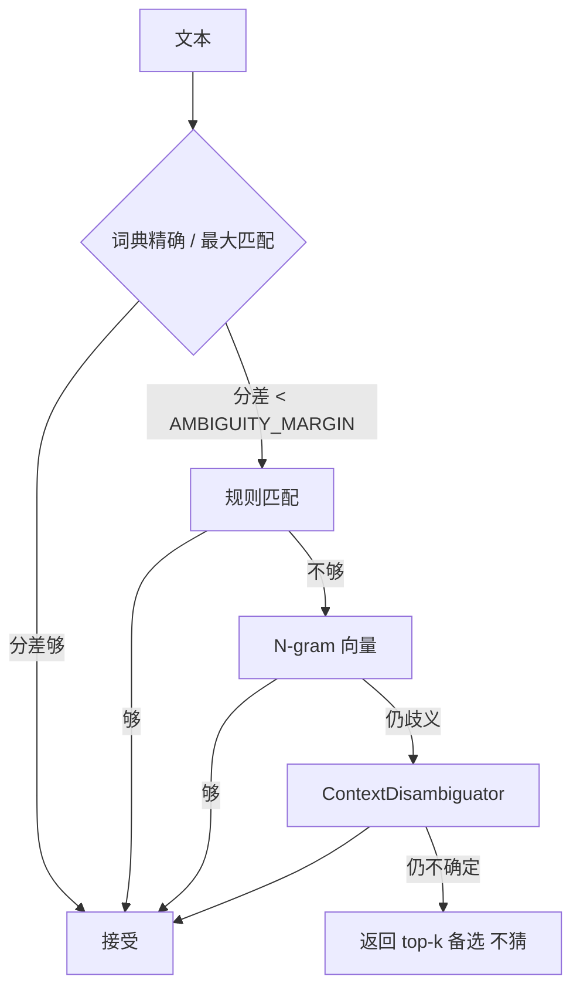

# 归一化级联

源码：`src/biomed_ontology/normalize/`（入口 `Normalizer`）。

## 为什么存在

检索、事实抽取、Semantic tools 都要把自由文本变成**唯一内部 CURIE**。若各处各写一套字符串匹配：

- 同一别名在检索命中 A、在事实里挂到 B  
- 排障时看不到「卡在级联哪一级」  

所以 L3 是唯一入口：词典 → 规则 → 向量 → 上下文消歧，且**埋点与业务同一次写完**（中间候选在返回后就消失，后补埋点拿不到落选原因）。

## 级联怎么走



关键常量：

| 常量 | 值 | 含义 |
|---|---|---|
| `AMBIGUITY_MARGIN` | 0.08 | 候选分差小于此值 =「分不开」，触发下一级。更低时排名由别名长度等随机性主导 |
| 检索期 `min_confidence` | 0.6 | `_seed_concepts` 与切片挂概念共用 |

!!! tip "D3：不确定就不猜"
    消歧未确定时返回 top-k + 置信度（`alternatives`），而不是硬挑第一名。
    Agent 的 `normalize_entity` 把备选暴露出去，让上游决定要不要追问。

## Scope 如何约束行为（D2）

别名带 `SynonymScopeEnum`。典型坑：**把 BROAD 当等价**。

- 查「PI3K」不应直接判定为 `PIK3CD`（BROAD 别名不参与精确归一，见 `matchers.py`）  
- `expand()` 的权重来自 `SCOPE_WEIGHTS` × 本体距离  

把 related/broad 灌进精确归一 = 精确率崩盘；把它们完全扔掉 = 召回上不去。Scope 是必填字段，不是可选注释。

## 与检索的两个消费点

| 消费方 | 调用 | 用途 |
|---|---|---|
| 图通道 / 改写 | `normalize(query, detect=True)` → seed 概念 | 查询理解 |
| 改写词表 | `expand(cid, max_depth=1, min_weight=0.35)` | 别名喂给 BM25/DENSE |
| 切片挂载 | 装配期对 `ch.text` 同样 normalize | 概念倒排 |

`Normalizer._children` **只有层级、只向下**，服务 `descendants` / `expand`。  
`LinkIndex` 是层级 + 跨类型、双向，服务 search-around。合并二者会让「下位别名扩展」带上竞品药名 —— 精确率灾难。

## 埋点长什么样

每次归一化在 `TraceContext` 上留下：命中阶段、`MappingJustification`、候选列表。排障问题「为什么没选那个」必须能从 trace 回答，而不是复盘人肉猜。

## 如何验证

```bash
uv run pytest tests/test_normalize*.py -q 2>/dev/null || uv run pytest tests/ -k normalize -q
uv run hmd demo   # 若干场景覆盖归一化断言
```

改词典或 scope 权重后，至少重跑含歧义别名的用例，并扫一眼 gold 里依赖「认到正确概念」的图像/跨类型 query。
