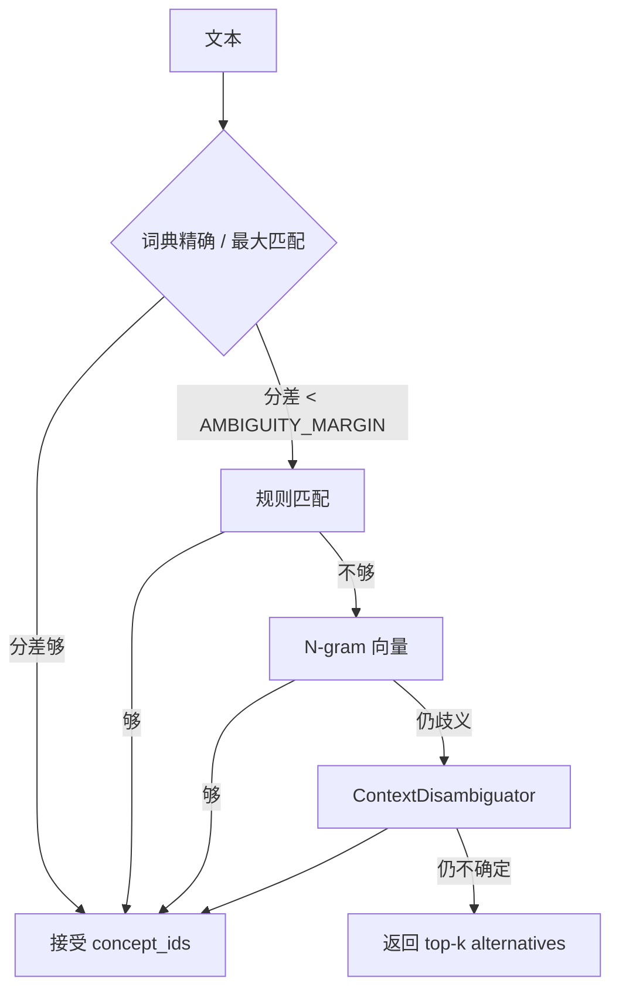

# 归一化级联

源码：`src/biomed_ontology/identity.py`（`IdentityService`）、`src/biomed_ontology/normalize/`（入口 `Normalizer`）。

L3 把自由文本变成**唯一内部概念 ID**（`HMD:ENT:*`）。双面共用 `IdentityService`：文献面走目录 `Normalizer`，Foundation 面在同一目录上叠加 `EntityResolver`（BERN2 + 词典 + Zingg）。本文档聚焦目录级联。

---

## 1. 为什么存在

检索、事实抽取、Semantic tools 都要把文本映射到目录概念。若各处各写一套字符串匹配：

- 同一别名在检索命中 A、在事实里挂到 B
- 排障看不到「卡在级联哪一级」
- 评测与服务分数不可比

因此 L3 是**唯一入口**：词典 → 规则 → 向量 → 上下文消歧，且埋点与业务同一次写完（中间候选在返回后消失，后补埋点拿不到落选原因）。

---

## 2. 设计取舍

| 决策 | 理由 |
|---|---|
| 级联而非单模型 | 可解释、可消融、可埋点 |
| `AMBIGUITY_MARGIN` 触发下一级 | 分差过小 = 分不开，不硬猜 |
| `min_confidence=0.6` 统一阈值 | 索引挂概念与检索 `_seed_concepts` 一致 |
| Scope 约束 BROAD（D2） | 「PI3K」≠ `PIK3CD` |
| D3 不确定返回 top-k | `alternatives`，不强行第一名 |
| `expand` 与 search-around 分离 | 层级别名 vs 跨类型图遍历 |

---

## 3. 设计与实现

### 3.1 级联流程



### 3.2 关键常量

| 常量 | 值 | 含义 |
|---|---|---|
| `AMBIGUITY_MARGIN` | 0.08 | 候选分差小于此值 → 下一级 |
| 检索/索引 `min_confidence` | 0.6 | `pipeline` chunk 挂载与 `HybridSearcher._seed_concepts` |
| `expand` `min_weight` | 0.35 | 查询改写术语入选门槛 |
| `expand` `max_depth` | 1 | 改写只扩一层层级 |

模块分工：

| 模块 | 路径 | 职责 |
|---|---|---|
| `Normalizer` | `normalize/__init__.py` | 门面、expand、concept 查找 |
| 词典匹配 | `normalize/matchers.py` | 精确 / 最大匹配、scope 过滤 |
| 规则 | `normalize/rules.py` | 模式规则 |
| 向量 | `normalize/vector.py` | n-gram 相似 |
| 消歧 | `normalize/disambiguate.py` | `ContextDisambiguator` |

### 3.3 输入与索引构建

装配期（`build_literature_base`）：

```text
build_from_seed() → concepts + synonyms
    → Normalizer(
         concepts=built.concepts,
         synonyms=built.synonyms,
         ambiguity_index=ambiguity.norm_index(),
         release_id=release_id,
       )
```

词典**仅**来自 `ontology/catalog/`（经 `catalog_files()` → `build_from_seed`）。`ambiguity_index` 来自 `ontology/catalog/ambiguity.yaml`。未登记碰撞由 `build_from_seed` 写入 `kb.warnings`。

### 3.4 为什么词典只用 catalog，不用 BERN2 / BIOS_v3

Normalizer 的职责是「文本 → **唯一企业概念 ID**」。身份 SSOT 必须是本仓可 PR、可 release 的策展面，而不是公共服务或公共大图。

| | BERN2 | BIOS_v3 | `ontology/catalog/` |
|---|---|---|---|
| 角色 | NER + 公共 NEN **候选** | 公共生物医学世界（`graph/biomedical`） | 企业关心的概念子集 + 内部别名 |
| 典型输出 | MeSH/NCBI… / `CUI-less` | BIOS URI | `HMD:ENT:*` |
| 稳定性 | 模型/服务可变 | 外部全量图 | Git 策展 |
| 企业代号（如 HMPL-504） | 常碎片化 / CUI-less | 通常无内部代号 | 别名精确命中 |

若 Normalizer 直接吃 BERN2：身份随公共服务漂移，企业主键失控。  
若把 BIOS 当词典：召回爆炸、歧义失控，且违反「企业 ID 才是主键」。BIOS 经 `skos:exactMatch` **挂靠**，不替代 catalog。

公开覆盖不靠扩大 Normalizer：无 `HMD:ENT:*` 时由检索侧 **PublicLexicalExpand**（BERN2→BIOS 名→BM25/DENSE）与 Foundation **`lookup_bios_concept`** 承接；向量级可经 `VectorIndex` Protocol 注入（默认仍为 n-gram）。

事实抽取侧的 `_ground` 也只调用 `IdentityService.normalize`（见 [事实抽取](extract.md)）。Foundation 面短查询 / 金路径 ER 走 `IdentityService.resolve_text`（同一目录 + 词典 + BERN2 + Zingg）。两套**算法**不同，**身份空间**相同——见 [IdentityService](identity.md)。

### 3.5 Scope 如何约束行为（D2）

别名带 `SynonymScopeEnum`：

| Scope | 精确归一 | expand |
|---|---|---|
| EXACT / NARROW | 参与 | 参与（加权） |
| RELATED | 一般不参与精确 | 低权 expand |
| BROAD | **不参与**精确归一 | 谨慎 expand |

`SCOPE_WEIGHTS` × 本体距离决定 `expand()` 权重。把 BROAD 灌进精确归一 → 精确率崩盘；完全扔掉 → 召回上不去。

### 3.6 与检索的两个消费点

| 消费方 | 调用 | 用途 |
|---|---|---|
| 图通道 / 种子概念 | `normalize(query, detect=True, min_confidence=0.6)` | 查询理解 |
| 查询改写 | `expand(cid, max_depth=1, min_weight=0.35)` | 别名喂 BM25/DENSE |
| 切片挂载 | 装配期 `normalize(ch.text, detect=True)` | `chunk.concept_ids` 倒排 |

`HybridSearcher._rewrite_queries` 对 expand 结果按 `normalize_alias` **去重**，避免 `AZD-6094` / `AZD6094` 给 BM25 投多票。

### 3.7 与 `Normalizer._children` vs `GraphDbNeighborhood`

| | `_children` / `expand` | `GraphDbNeighborhood` |
|---|---|---|
| 边 | 仅层级（narrower） | 层级 + `has_target` / `treats` |
| 方向 | 向下 | 双向（查询侧合成） |
| 用途 | 查询改写、descendants | search-around 图通道 |
| 合并？ | **禁止** | 合并会带进竞品药名 |

`concept_ids_expanded`（装配期 `_expand_all`）只走层级 expand，**不**替代图通道。

### 3.8 埋点

每次归一化在 `TraceContext` 上记录：命中阶段、`MappingJustificationEnum`、候选列表。`tools/api.py` 的 `normalize_entity` 把 `alternatives` 暴露给 Agent。

决策记录示例 stage：`NORMALIZE`、`GRAPH_RETRIEVAL`（检索侧）。

### 3.9 与 Foundation ER 的边界

| 场景 | 组件 |
|---|---|
| 文献 chunk / 检索 query / `_ground` | `IdentityService.normalize` → `BuiltConcept`（catalog） |
| 企业实体 / 代号 HMPL-504 | `IdentityService.resolve_text` → `EnterpriseEntity` |
| `get_entity_context` | Foundation 读 GraphDB，返回 Context Pack |

目录 `HMD:ENT:*` 与 Foundation 实体 ID 格式一致。索引与 ER 倒排是两套结构，由同一个 `IdentityService` 持有。

---

## 4. 不变量与失败模式

| 不变量 | 说明 |
|---|---|
| L3 唯一入口 | 禁止 Semantic Access 手写别名表 |
| 词典仅 catalog | 禁止把 BERN2/BIOS 当 Normalizer 身份源 |
| 阈值 0.6 全局一致 | pipeline 与 searcher 各写一份迟早漂移 |
| BROAD 不进精确归一 | D2 |
| 不确定不猜 | D3 |
| expand ≠ search-around | 见 [links](links.md) |
| 变体只用于索引侧 | 改写侧必须 normalize_alias 去重 |

| 失败模式 | 表现 |
|---|---|
| 歧义未登记 | 随机落义项，eval 归一化臂掉分 |
| scope 填错 | PI3K 命中错误激酶 |
| 合并 expand + 图邻居 | 图通道精确率灾难 |
| 无 trace | 排障只能猜 |

---

## 5. 如何验证

```bash
uv run pytest tests/test_normalize*.py -q 2>/dev/null || uv run pytest tests/ -k normalize -q
uv run hmd demo
uv run hmd eval --entitlements MOCK_LICENSED --compact
```

改词典或 scope 权重后，重跑含歧义别名的用例，并扫 gold 里依赖「认到正确概念」的图像/跨类型 query。

相关：[企业身份与目录 SSOT](seed.md)、[事实抽取 / `_ground`](extract.md)、[links / search-around](links.md)、[查询改写 vs 图通道](../retrieval/ontology-paths.md)、[Pipeline](../architecture/pipeline.md)。
