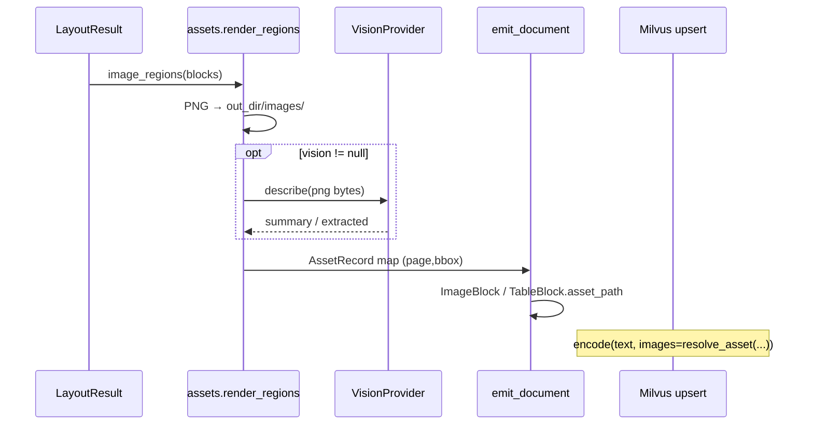

# 图块资产：渲染、路径与视觉管线

源码：`src/biomed_ontology/parse/assets.py` · `src/biomed_ontology/parse/__init__.py`（`describe_assets`）  
消费方：`src/biomed_ontology/search/backends/milvus.py`（`resolve_asset`）· `src/biomed_ontology/embed/`（图像列）

相关文档：[layout.md](layout.md) · [figure-type.md](figure-type.md) · [../retrieval/embedders.md](../retrieval/embedders.md) · [../retrieval/milvus.md](../retrieval/milvus.md)

---

## 1. 为什么存在

科研图表常由 PDF 矢量指令绘制，文件内并不存在一张可「抽取」的嵌入位图。若只保存 caption 文本，多模态检索与审计还原都会退化为「读字幕猜图」——字幕未提到的视觉信息永久丢失，且指标上无法察觉像素列是否真正看过图。

资产模块的职责是：

1. **按 bbox 渲染页面区域**为 PNG，供 BiomedCLIP / Qwen3-VL 等列编码；  
2. **统一、可验证的相对路径**写入切片与 Milvus `asset_path`；  
3. **可选 VLM 摘要**增强文本检索，但与渲染解耦（无 VLM 也要落盘像素）。

---

## 2. 设计取舍

| 决策 | 理由 |
|------|------|
| 渲染而非抽取嵌入图 | 矢量图、组合图只有「页面区域」对人眼一致 |
| 路径由 `doc_id` + 内容哈希规则生成 | 禁止用文档正文拼接路径（路径穿越） |
| `asset_dir_name(doc_id)` 单点定义 | `DOC:PMC…` → `DOC_PMC…`，读写必须同一函数 |
| `resolve_asset(root, doc_id, rel_path)` 单点拼接 | 漏 `doc_id` 曾导致无声退化为「只编码 caption」 |
| 渲染与 VLM 描述分离 | `NullVisionProvider` 下仍渲染；视觉列依赖像素存在 |
| PyMuPDF 渲染走法务闸门 | 侧门绕过 layout 后端也会触发 AGPL 检查 |
| 无 bbox 不渲染整页 | 整页 pixmap 会把正文当图，污染视觉空间 |
| Office/纯图像无 PDF 页 | `render_regions` 返回空；依赖后端已导出资产（Docling `images/docling_*.png`、MinerU `img_path`） |
| `asset_lookup_key` | 有 bbox 用 `(page, bbox)`；无 bbox 用 `(page, ('__path__', asset_path))`，避免同页多图碰撞 |
| 缺像素记 `asset.missing_pixels` | 禁止静默把 IMAGE 行当成「看过图」 |

默认渲染 DPI：144（`zoom = dpi/72`）。PDF 科研图多为矢量，渲染区域才是视觉模型该看的内容；与开启 Docling `generate_picture_images`（页光栅+裁切）同构，故不双开。

---

## 3. 设计与实现

### 3.1 符号

| 符号 | 职责 |
|------|------|
| `RenderedAsset` | `rel_path`, `page`, `bbox`, `data` |
| `AssetRecord` | `rel_path` + 可选 `vision`（`summary`, `extracted`） |
| `asset_dir_name(doc_id)` | 资产根目录名 |
| `resolve_asset(root, doc_id, rel_path)` | → 绝对路径或 `None` |
| `safe_asset_name(stem, suffix)` | 文件名白名单消毒 |
| `render_regions(pdf, regions, out_dir)` | PDF 区域 → PNG 列表 |
| `image_regions(blocks)` | 从 `LayoutBlock` 收集 `(page, bbox)` |
| `describe_assets(pdf, layout, out_dir, vision)` | 渲染 + 可选 VLM |

### 3.2 目录布局

```text
data/assets/
  DOC_PMC12133497/          ← asset_dir_name(doc_id)
    images/p0002_r000.png     ← rel_path 写入 chunk / Milvus
    tables/docling_0001.md    ← 版面后端侧车（非 render_regions）
```

切片字段：

- `asset_path` — 相对 `data/assets/<doc_dir>/`  
- `text` — caption + `vision_summary`（图像切片）  
- `modality` — `IMAGE` / `TABLE`  

Milvus 索引时：`MilvusBackend._asset(rel, doc_id)` → embedder `images[]`。

### 3.3 数据流



`describe_assets` 像素优先级：① `render_regions`（PDF 族）；② `load_backend_asset(block.asset_path)`（Office/MinerU 侧车）。随后可选 VLM。提示词（固定）：要求报告可读数值与单位，服务检索而非闲聊。

`emit` 写 `ImageBlock.asset_path` 时：物化结果优先，否则回退 `LayoutBlock.asset_path`。

### 3.4 与 figure_type 的衔接

图型分类读取 `resolve_asset` 得到的本地路径（见 [figure-type.md](figure-type.md)）。  
`asset_path` 为空时：视觉 embedder 退化为纯文本；`figure_type` 仅能靠 caption 规则兜底。

---

## 4. 不变量与失败模式

**不变量**

1. 凡 `chunk.asset_path` 非空，`resolve_asset` 在索引时必须能解析到现有文件，否则该列不得假装编码过像素。  
2. 相对路径不得含 `..` 或未消毒字符；`safe_asset_name` 压掉连续点号。  
3. 同一 `(page, bbox)` 键在 `describe_assets` 输出中唯一对应一个 `AssetRecord`。  
4. `asset_root=None` 时 `resolve_asset` 返回 `None`（CI fake 路径可跑通，但视觉列为文本退化）。

**失败模式**

| 现象 | 原因 |
|------|------|
| 视觉列「有分无图」 | `resolve_asset` 漏 `doc_id` 或 `asset_root` 未配置 |
| 图块全空 | 块无 bbox；或非 PDF 族却未走 MinerU 资产导出 |
| VLM 有 warning | `vision.rejected` 写入 trace；`extracted` 形状非法被丢弃 |
| AGPL 阻断 | 未 cleared 即渲染 PDF |
| 路径穿越尝试 | 远程 MinerU 返回 `../` — 测试要求拒绝 |

---

## 5. 如何验证

```bash
uv run pytest tests/test_parse_vision.py -q
uv run pytest tests/test_embed.py -k visual -q
uv run pytest tests/test_milvus_license.py -q   # asset_path 字段与过滤
```

关键用例名：

- `test_asset_dir_name_strips_the_curie_separator`
- `test_asset_resolution_needs_the_doc_id`
- `test_every_chunk_claiming_an_asset_can_actually_read_it`
- `test_asset_names_cannot_escape_the_directory`
- `test_null_provider_keeps_the_pipeline_running_offline`
- `test_remote_image_path_cannot_escape_the_asset_directory`（MinerU）
