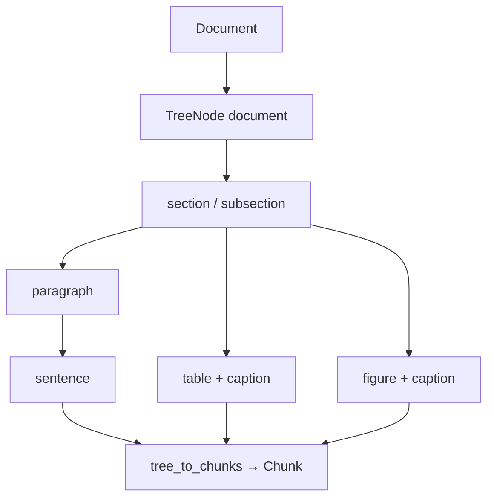

# 切片与 Tree Chunk：Evidence Object

源码：`src/biomed_ontology/corpus/tree.py`（Tree Chunk）· `src/biomed_ontology/corpus/__init__.py`（`chunk_document`）  
模型：`Chunk` dataclass · LinkML `hmd_fact.Chunk`

相关文档：[layout.md](layout.md) · [../retrieval/milvus.md](../retrieval/milvus.md) · [../architecture/document-pipeline.md](../architecture/document-pipeline.md)

---

## 1. 为什么存在

检索与 Citationware 的原子单位是**带 provenance 的证据碎片**，不是「任意长度的文本袋」。研究员核验「ORR 42.9%」时需要 section 路径、页码、bbox，以及能回溯到父章节的 `section_id`。

本仓库提供两条切片路径：

1. **Tree Chunk 引擎**（`build_document_tree` → `tree_to_chunks`）— 正式 Evidence Object，含 `parent_id` / `node_kind` / `section_path`；入湖与 Milvus 索引的主路径。  
2. **扁平 `chunk_document`** — 按 section 句子边界切分，用于简单装配与回归；字段子集可与树路径对齐。

二者共享稳定 `chunk_id` 策略（SHA-1 种子，禁止内置 `hash()`）。

---

## 2. 设计取舍

| 决策 | 理由 |
|------|------|
| 树：document → section → paragraph → sentence (+ table/figure/caption) | 还原章节时按 `sort_order` 重组，不依赖字典序 |
| 默认索引叶：sentence / table / figure / caption | paragraph 过粗；document 根不入索引 |
| 不跨 section 滑窗（扁平路径） | 避免 Methods 剂量与 Results 疗效落入同片 |
| 长表按行切分 + 重复表头 | 单片无法表达几十行表；后半无列名不可用 |
| 包装纸 section 过滤（References 等） | 高频低 IDF 模板句污染 BM25；在入库前删除而非检索期打补丁 |
| `concept_ids` vs `concept_ids_expanded` 分列 | 精确过滤 vs 子树召回，互不污染 |
| `same_as_chunk_id` | 跨节重复正文指向属主，避免 RRF 池重复占位 |
| Milvus VARCHAR 字节预算 | 表切片 `_TABLE_MAX_BYTES=6000`，防整批 upsert 失败 |

---

## 3. 设计与实现

### 3.1 流水线位置

```text
parse_document → Document (+ sections_meta)
  → build_document_tree(doc, skeleton?)
  → iter_evidence_nodes → tree_to_chunks
  → 归一化 → concept_ids / concept_ids_expanded
  → 可选 figure_type（IMAGE）
  → MilvusBackend.upsert(chunk_to_row(...))
```

手写语料 `data/corpus/pipeline.yaml` 是解析器的 schema 回归基准（`emit_document.to_yaml_obj()` 同构）。

### 3.2 TreeNode / Chunk 字段

| 字段 | Tree Chunk | 扁平 chunk_document |
|------|------------|---------------------|
| `chunk_id` | `TN:…` → `CHK:…` 替换 | `CHK:{kind}.{sha1}` |
| `section_path` | 完整祖先链 | `section` 名 |
| `parent_id` | 树父节点 | 常空 |
| `node_kind` | sentence/table/… | 常空 |
| `modality` | TEXT/TABLE/IMAGE | 同左 |
| `bbox` / `page` | 来自图块 | 表/图有，正文有 page |
| `asset_path` | 图块像素 | 同左 |
| `figure_type` | 索引前打上 | 默认空 |

LinkML 还要求：`degraded[]` 透传解析能力缺口；`labels[]` 标引分类。

### 3.3 扁平切片算法（`chunk_document`）

```text
对每个 section（非 boilerplate）:
  _split_section(text, max_chars=600)
    按中英句号边界累加，超长按句切断

对每个 table:
  _split_table → 多片，header 每片重复
  chunk_id 种子：首片 table_id，续片 table_id#n

对每个 image:
  单片：caption + vision_summary
  modality=IMAGE, asset_path 来自 ImageBlock
```

Boilerplate 检测：section 路径**末段**匹配 `References|Acknowledgments|…`（避免父路径误杀）。

### 3.4 树构建要点

- 有 `SectionSkeleton` 时按 `section_path` 挂 section/subsection 节点。  
- 正文 `_attach_text`：paragraph → sentence 两层。  
- 表/图按 `page` 挂到最近 section（`_pick_section_for_page`）。  
- `dedupe_same_as`（`parse/nodes.py`）在 emit 阶段处理重复正文。



---

## 4. 不变量与失败模式

**不变量**

1. 同一 `doc_id` + 稳定种子 → 跨进程相同 `chunk_id`（重建索引不漂移引用）。  
2. 跳过 boilerplate 时全文 `offset` 仍推进，避免后续正文 ID 整体平移。  
3. 图像切片：`asset_path` 与 `modality=IMAGE` 一致；`figure_type=""` 表示未分类，不是「非图」。  
4. `concept_ids` 为直接命中；`concept_ids_expanded` 含子孙扩展，仅供召回与图通道倒排。

**失败模式**

| 现象 | 原因 |
|------|------|
| 索引后 chunk_id 对不上 | 改了切片算法未 `--recreate` |
| 图块无视觉信号 | 有 `asset_path` 但文件未渲染或 resolve 失败 |
| 表被截断异常 | 单行超字节预算 — 调 `max_chars` 或预清洗 |
| 树与扁平计数差很多 | 树按句切，扁平按 600 字 — 预期行为 |
| `same_as` 环 | dedupe 只指向首现 owner |

---

## 5. 如何验证

```bash
uv run pytest tests/test_tree_chunk.py tests/test_corpus.py -q
uv run pytest tests/test_parse.py -k "dedupe or emitted_yaml" -q
uv run hmd kb    # 观察 chunks 计数与 warnings
```

关键用例名：

- `test_build_tree_sentence_parent_chain`
- `test_tree_to_chunks_evidence_fields`
- `test_iter_evidence_nodes_excludes_document_root`
- `test_duplicate_text_points_at_owner_instead_of_being_deleted`
- `test_emitted_yaml_matches_handwritten_corpus_schema`
