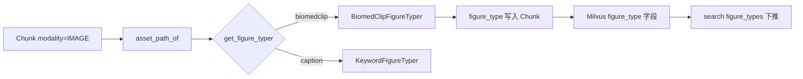

# 图型标量：检索意图下的粗粒度分类

源码：`src/biomed_ontology/parse/figure_type.py`  
写入：`Chunk.figure_type` → `ChunkMeta` → Milvus `figure_type` 标量  
消费：`HybridSearcher.search(figure_types=…)` · Milvus `_filter`

相关文档：[assets.md](assets.md) · [../retrieval/filters.md](../retrieval/filters.md) · [../retrieval/milvus.md](../retrieval/milvus.md)

---

## 1. 为什么存在

`modalities=[IMAGE]` 只保证返回的是图，不保证是**那一类**图。实测查询「chest CT scan showing a pulmonary nodule」在模态过滤后首位仍可能是信号强度柱状图——caption 里的词主导图文向量距离，图型是检索意图下的布尔条件，应与 `modality` 一样落成可下推标量，而不是混入相似度分数。

`figure_type` 使「我要看那张 CT」成为与许可、标签同级的硬过滤，见 [filters.md](../retrieval/filters.md)。

---

## 2. 设计取舍

| 决策 | 理由 |
|------|------|
| 粗粒度枚举（8+OTHER） | 对齐检索 query 能表达的意图，不做放射科细分类 |
| BiomedCLIP 零样本为主 | 训练集 PMC-15M 与 PMC OA 语料分布重合 |
| caption 关键词兜底 | 无 GPU/权重时链路仍可跑；空字段比假高分更糟 |
| `source` 字段区分 biomedclip/caption | 两类置信度不可比，报表需可分解 |
| 低置信 / OTHER 时 caption 可覆盖 | 「Figure 2. CT scan」强于 0.31 的 RADIOLOGY |
| 与 `BiomedVisualEmbedder` 共享权重 | 一次加载 800MB，索引与分类各用其需 |
| 文本切片 `figure_type=""` | 未分类 ≠ 不是图；过滤图型时不应误伤 TEXT |

**FIGURE_TYPES**

| 值 | 覆盖 |
|----|------|
| `RADIOLOGY` | CT / MRI / X-ray / PET |
| `MICROSCOPY` | H&E / IHC / 荧光镜检 |
| `GROSS_PATHOLOGY` | 切除标本大体照（与镜检分立） |
| `CHART` | KM 曲线 / 柱状图 / 森林图等 |
| `GEL_BLOT` | Western blot / 凝胶 |
| `DIAGRAM` | CONSORT / 通路 / 流程图 |
| `TABLE_IMAGE` | 渲染成图的表 |
| `OTHER` | 未识别或实验室设备照等 |
| `""` | 未运行分类器 |

---

## 3. 设计与实现

### 3.1 符号

| 符号 | 职责 |
|------|------|
| `get_figure_typer(name)` | `caption`（默认）/ `biomedclip` |
| `KeywordFigureTyper` | 仅 caption 规则 |
| `BiomedClipFigureTyper` | 零样本 + `_settle` 与 caption 仲裁 |
| `type_from_caption(text)` | 规则表 `_CAPTION_RULES` |
| `FigureTyping` | `figure_type`, `score`, `source` |
| `asset_caption(chunk)` / `asset_path_of(chunk, root)` | CLI 索引辅助 |

配置：索引/CLI 阶段选择 typer；默认 `caption`（与 `get_embedder` 默认 `fake` 同哲学）。

### 3.2 BiomedCLIP 判定流程

```text
对每个有本地路径的图像批次:
  图像 → encode_image
  文本提示集 _PROMPTS（每类多条）→ encode_text（预计算）
  softmax(100 * image @ text^T) → 按类取 max 概率
  → FigureTyping(kind, score, "biomedclip")

_settle(typing, caption):
  if score >= min_score(0.35) and kind != OTHER → 采用零样本
  else fallback = type_from_caption(caption)
  if fallback.kind != OTHER → 采用 caption
  else → 保留零样本结果
```

关键词规则按**专名优先**排序（如 `CT` 先于泛词 `figure`）。

### 3.3 数据流



索引后过滤表达式：`figure_type in ["RADIOLOGY", ...]`（与 `modality in ["IMAGE"]` 可叠加）。

### 3.4 与检索的契约

- Milvus 下推为主；`HybridSearcher` 在融合后对 `figure_types` 再做进程内兜底（防 Protocol 实现遗漏）。  
- 须在 **top_k 截断前**过滤，否则候选池已被无关图型占满。  
- 空 `figure_type` 的切片：**不会**被 `figure_types=[RADIOLOGY]` 命中——表示缺分类，不是缺图。

---

## 4. 不变量与失败模式

**不变量**

1. `classify(images, captions)` 两列表长度必须一致，否则立即 `ValueError`。  
2. `confident` 定义为 `kind != OTHER and score >= 0.5`（报表用，与 `_settle` 阈值可不同）。  
3. caption 规则命中分数固定 `0.5`（二值事实，不与零样本概率混排）。  
4. 文本切片不写入图型（保持空串）。

**失败模式**

| 现象 | 原因 |
|------|------|
| 全部 figure_type 为空 | 未跑分类；或图像无 `asset_path` 且 caption 无关键词 |
| CT 查成 CHART | 仅靠向量；应开 biomedclip 或改进 caption |
| 大体标本判成 MICROSCOPY | 需 `GROSS_PATHOLOGY` 独立提示（已分立） |
| Table 图判 OTHER | caption 以 Table 开头 — caption 规则应赢 |
| 过滤后零结果 | 库内未分类图占多数 — 补跑分类而非放宽许可 |

---

## 5. 如何验证

```bash
uv run pytest tests/test_figure_type.py -q
uv run pytest tests/test_milvus_license.py -k figure_type -q
uv run pytest tests/test_search_backend.py::test_milvus_figure_type_narrows_filter -q
```

关键用例名：

- `test_caption_rules_cover_the_common_figure_captions`
- `test_gross_specimen_is_not_filed_as_microscopy`
- `test_text_chunks_get_no_figure_type_at_all`
- `test_source_is_recorded_so_the_two_kinds_of_label_stay_distinguishable`
- `test_figure_type_narrows_further_than_modality_alone`
- `test_default_typer_needs_no_model_weights`
