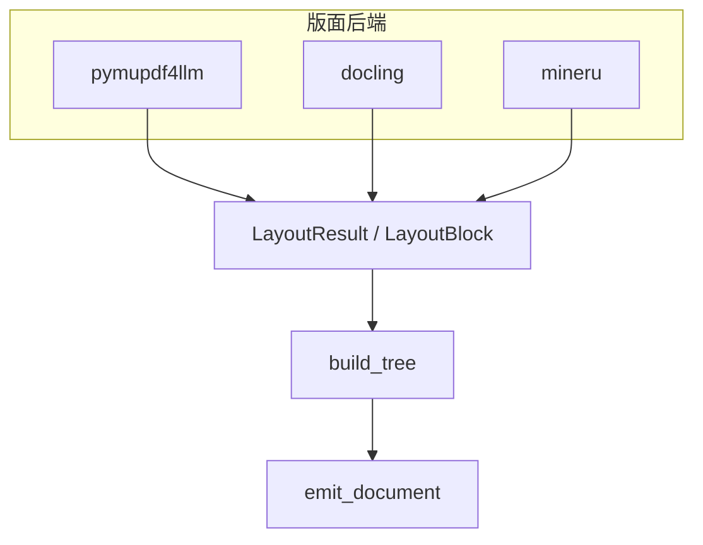

# 版面提取：统一中间表示与三后端

源码：`src/biomed_ontology/parse/layout/`  
协议：`base.py` · 实现：`pymupdf4llm.py` · `docling.py` · `mineru.py`  
注册：`registry.py`

相关文档：[router.md](router.md) · [assets.md](assets.md) · [chunks.md](chunks.md)

---

## 1. 为什么存在

Citationware 要求每个文本碎片能指回 PDF 上的**页码与 bbox**，而不只是「某篇文档里的一段话」。纯 Markdown 管线（只消费 `full.md`）会丢掉空间 provenance，无法满足药物研发场景下的原文核验。

版面层 therefore 产出 **Markdown 文本 + 逐块 provenance** 的中间表示 `LayoutBlock` / `LayoutResult`，后续标题合票、语义树、资产渲染与切片全部消费同一结构。跨后端差异被压缩到 `degraded` 声明，而不是不同的树算法。

---

## 2. 设计取舍

| 决策 | 理由 |
|------|------|
| `LayoutBlock` 而非后端原生对象 | `build_tree` 与 `assign_blocks` 只认统一 IR，后端可替换 |
| `degraded: tuple[Capability]` 枚举 | 可断言、可聚合统计；避免自由文本「质量一般」 |
| bbox 缺失 = 空元组 | 不伪造整页坐标；无 bbox 的图块跳过像素渲染 |
| 表导出为侧车 Markdown/HTML | 大表不挤进块内 `text`；`asset_path` 指向 `tables/*.md` 等 |
| Docling 关 `torch.compile` | 避免 MPS/少 SM GPU 上 dynamo 噪声；与解析结果无关 |
| PDF 不开 `generate_picture_images` | 像素由 `render_regions` 按 bbox 渲染；与 Docling 页裁切同构，避免双轨 |
| Office picture/chart 落盘 | Docling `PictureItem.get_image` → `images/docling_*.png`；chart 可选 LibreOffice |
| MinerU 本地/HTTP 双传输 | 内网可离线；云 API 需 key 与法务确认 |
| 页码 1-based 原始页 | 分片偏移由后端内部消化，下游永远看到读者页码 |

**Capability 语义**

| 值 | 含义 |
|----|------|
| `bbox` | 块级坐标不可靠或缺失 |
| `formula` | 公式未转为可检索 LaTeX |
| `ocr` | 页面文本不可直接抽取 |
| `table_structure` | 表结构降级（如仅 Markdown 无单元格级） |
| `reading_order` | 多栏/复杂版式顺序不确定 |

---

## 3. 设计与实现

### 3.1 核心类型

| 类型 | 字段要点 |
|------|----------|
| `BlockKind` | `text` · `heading` · `table` · `image` · `formula` |
| `LayoutBlock` | `kind`, `text`, `page`, `bbox`, `level?`, `asset_path?`, `backend_meta` |
| `LayoutResult` | `blocks`, `assets_dir`, `page_count`, `backend`, `degraded` |
| `LayoutBackend` | `supports(path)`, `extract(path, out_dir, ctx)` |

### 3.2 三后端能力矩阵

| 后端 | 典型输入 | 强项 | 常见 degraded |
|------|----------|------|----------------|
| `pymupdf4llm` | 简单 PDF | 低延迟、嵌入 TOC、真实 bbox | `formula`, `ocr`（扫描页） |
| `docling` | 结构化 PDF、Office | 版式检测、Office 原生 | `table_structure`, `formula`, `bbox`（弱项页） |
| `mineru` | 扫描 PDF、图像 | OCR、复杂版式 | `reading_order`（偶发） |

Office 后缀：`.docx` / `.pptx` / `.xlsx`（Router 默认 docling）。  
图像：`.png` / `.jpg` / `.jpeg`（Router 默认 mineru）。

Docling 对 `picture`/`chart`：caption 剥离 `Image not available` 占位注释；若 item 上已有 PIL（Office 嵌入图 / 已渲染 chart）则写入 `asset_path`。PDF 图块通常无 PIL，由下游 bbox 渲染补齐。`HMD_DOCLING_RENDER_CHART_IMAGES`（默认 true）控制 Office 原生 chart 位图；无 LibreOffice 时不硬失败。

### 3.3 提取数据流

```text
path + out_dir
  → LayoutBackend.extract
      → 遍历文档元素（iterate_items / content_list / pymupdf4llm）
      → 映射 label → BlockKind
      → 表：写侧车文件 + asset_path
      → 标题：补 Markdown `#` 前缀（level 1–6）
      → LayoutResult(blocks, assets_dir, page_count, backend, degraded)
  → build_tree(layout)   # 与后端无关
```



### 3.4 配置与法务

`get_layout_backend(name, config)` 是唯一启用后端的入口：

- `assert_component_cleared(backend)` — AGPL（PyMuPDF 系）、云 MinerU 等  
- MinerU 参数：`mineru_transport`, `mineru_base_url`, `mineru_engine`, `mineru_parse_method`, …  
- 限额：`parse_max_pages`, `parse_max_bytes` 在各后端构造函数注入  

`layout_backend=auto` **不是**后端名；须先经 [router.md](router.md) 解析为具体名称。

### 3.5 与下游的边界

- **不做**章节层级判定 — 交给 `outline.py` + `skeleton.py`  
- **不做** VLM 描述 — 交给 `describe_assets`（[assets.md](assets.md)）  
- **不做**切片 — 交给 `corpus/tree.py` 或 `chunk_document`（[chunks.md](chunks.md)）  

`backend_meta` 仅供排查，下游逻辑不得依赖。

---

## 4. 不变量与失败模式

**不变量**

1. 所有后端输出的 `page` 为 1-based 原始文档页码。  
2. `supports(path)` 为 false 时 Router 记 `unsupported` 并尝试链上下一个。  
3. `degraded` 为排序后的唯一元组，写入语料 `parse.degraded` 与切片透传字段。  
4. 同一 `layout.blocks` 输入，`build_tree` 产出与后端标签无关的树形（差异仅在块内容与 degraded）。

**失败模式**

| 现象 | 原因 |
|------|------|
| 空 `blocks` + fallback | 扫描件走了快路径；或源文件损坏 |
| 大量 `bbox` degraded | Markdown-only 响应、或无 provenance 的后端路径 |
| Docling 超限 | 文件大于 `max_bytes` / 页数超 `max_pages` |
| MinerU HTTP 失败 | 服务未起、key 缺失、超时（`mineru_timeout_s`） |
| `table_structure` 常驻 | Docling 表导出策略；表仍可用侧车 Markdown 检索 |
| 组件未 cleared | 未接受许可即启用后端 |

---

## 5. 如何验证

```bash
uv run pytest tests/test_parse_layout.py tests/test_parse_docling.py -q
uv run pytest tests/test_parse_pymupdf4llm.py tests/test_parse_mineru.py -q
uv run pytest tests/test_parse.py -k "tree_shape or degraded" -q
```

关键用例名：

- `test_missing_bbox_is_empty_not_fabricated`
- `test_page_numbers_are_one_based_original_pages`
- `test_degraded_capabilities_are_carried_on_the_result`
- `test_docling_maps_items_to_layout_blocks`
- `test_content_list_gives_pages_and_bboxes`（MinerU）
- `test_tree_shape_is_backend_independent`
- `test_degraded_capabilities_survive_into_the_emitted_document`
