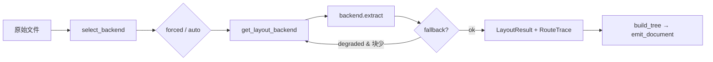

# Document Router：版面后端选择与降级

源码：`src/biomed_ontology/parse/router.py`  
注册表：`src/biomed_ontology/parse/layout/registry.py`  
配置：`src/biomed_ontology/config.py`（`layout_backend`、`layout_fallback`、`parse_*` 限额）

相关文档：[layout.md](layout.md) · [assets.md](assets.md) · [../architecture/document-pipeline.md](../architecture/document-pipeline.md)

---

## 1. 为什么存在

生物医学 PDF 的形态差异极大：纯文本期刊稿、扫描件、多栏排版、Office 附件、单页截图。没有任何单一版面引擎能在质量、延迟、许可与依赖之间同时占优。

Document Router 在**第一次接触字节**时决定用哪个版面后端，并在配置允许时沿降级链重试。它的输出不是最终语料，而是统一的 `LayoutResult`（见 [layout.md](layout.md)），供后续标题合票、语义树与切片共用。

Router 还承担**审计责任**：每次路由写入 `RouteTrace` 与 `TraceContext.record_decision(stage="parse.route")`，使「这篇文档为何走 MinerU 而不是 Docling」在事后可查。

---

## 2. 设计取舍

| 选项 | 取舍 |
|------|------|
| `auto` vs 强制后端 | `HMD_LAYOUT_BACKEND=auto` 时由 `select_backend` 探测；显式名称跳过探测，用于复现与 A/B |
| 三后端矩阵 vs 万能引擎 | 快路径（`pymupdf4llm`）、结构化路径（`docling`）、 OCR/扫描路径（`mineru`）分工，而不是一个「什么都试」的黑盒 |
| 能力降级 vs 静默补全 | 命中 `FALLBACK_TRIGGERS` 且块数过少时可选换后端；缺失能力记入 `degraded`，不伪造 bbox/OCR |
| 法务闸门集中在 registry | `get_layout_backend` 是唯一 import 后端的入口，`assert_component_cleared` 在此统一执行 |
| 废弃 `pymupdf` 别名 | 旧名直接报错并指向 `pymupdf4llm`，避免两套实现并存 |

**降级触发条件**（`FALLBACK_TRIGGERS` ∩ `degraded` 非空，且 `len(blocks) < 8`）：

- `ocr` — 文本不可抽取，需要 OCR 类后端  
- `formula` — 公式 LaTeX 缺失  
- `table_structure` — 表结构不可靠  
- `reading_order` — 阅读顺序混乱  

块数阈值避免「已有足够正文、仅缺公式」时无谓换引擎。

---

## 3. 设计与实现

### 3.1 符号与配置

| 符号 | 职责 |
|------|------|
| `select_backend(path, forced?)` | 仅决策，不 IO |
| `route_and_extract(path, out_dir, ctx)` | 决策 + 提取 + trace |
| `RouteDecision` | `backend`, `reason`, `confidence`, `probe` |
| `RouteTrace` | `requested`, `chosen`, `attempts[]` |
| `get_layout_backend(name)` | 按名实例化后端（`auto` 禁止直调） |

环境 / 配置项：

| 键 | 默认 | 含义 |
|----|------|------|
| `HMD_LAYOUT_BACKEND` | `auto` | `pymupdf4llm` / `docling` / `mineru` / `auto` |
| `HMD_LAYOUT_FALLBACK` | `false` | 是否在降级链上重试 |
| `HMD_PARSE_MAX_PAGES` | 400 | 各后端页数上限 |
| `HMD_PARSE_MAX_BYTES` | 64MiB | 单文件字节上限 |
| `HMD_PARSE_FAST_MAX_*` | 见 config | `auto` 判定「简单 PDF」的阈值 |

### 3.2 `auto` 路由规则

```text
后缀判断
  .docx / .pptx / .xlsx  → docling（office_main）
  .png / .jpg / .jpeg     → mineru（image_ocr）
  其他非 PDF              → UnsupportedFormat

PDF / XPS / EPUB
  probe_pdf()
    text_extractable == false     → mineru（low_text_extractable）
    页数/图/表/多栏均在快路径阈值内 → pymupdf4llm（simple_pdf）
    否则                          → docling（structured_pdf）
```

`probe_pdf` 输出进入 `RouteDecision.probe`，供 trace 与人工排查。

### 3.3 降级链

```text
PDF 族：primary → 其余两后端（顺序 pymupdf4llm → docling → mineru）

Office：
  .xlsx     → 仅 docling
  .docx/.pptx → docling → mineru

图像：mineru ↔ docling（primary 优先）
```

`layout_fallback=false` 时，首次 `extract` 抛错即向上传播，不吞异常。

### 3.4 数据流



入口：`parse_document`（`src/biomed_ontology/parse/__init__.py`）调用 `route_and_extract`，资产目录默认为 `data/assets/<doc_id 安全名>/`。

---

## 4. 不变量与失败模式

**不变量**

1. `auto` 不得绕过 Router 直调 `get_layout_backend("auto")` — 必须报错。  
2. 每次成功提取的 `LayoutResult.backend` 与 `RouteTrace.chosen` 一致。  
3. `merged_degraded` 在链式尝试间累积，最终写入结果与 YAML `parse.degraded`。  
4. 跨后端的树结构由 `build_tree` 保证一致；Router 只影响 `blocks` 与 `degraded`。

**失败模式**

| 现象 | 原因 | 处置 |
|------|------|------|
| `UnsupportedFormat` | 后缀不在支持矩阵 | 换格式或强制可支持后缀 |
| `未知版面后端` | 配置拼写错误 | 修正 `HMD_LAYOUT_BACKEND` |
| `pymupdf 已废弃` | 旧配置 | 改为 `pymupdf4llm` |
| 链末 `RuntimeError` | 全部后端失败或不支持 | 查 `attempts`；开 fallback 或换源文件 |
| 组件未 cleared | AGPL/云 MinerU 等 | `accept_uncleared_components` 或换后端 |
| 超限 | `parse_max_pages/bytes` | 拆分文档或调高限额（谨慎） |

---

## 5. 如何验证

```bash
# 路由决策与降级链
uv run pytest tests/test_parse_router.py -q

# registry 法务闸门、auto 禁止直调、pymupdf 别名拒绝
uv run pytest tests/test_parse_layout.py -q

# 端到端：树形状与后端无关
uv run pytest tests/test_parse.py::test_tree_shape_is_backend_independent -q

# 真实 PDF 快路径
uv run pytest tests/test_parse_pymupdf4llm.py -q
```

关键用例名：

- `test_office_routes_to_docling`
- `test_fallback_chain_on_error` / `test_fallback_off_rethrows`
- `test_forced_pymupdf_is_rejected`
- `test_auto_must_go_through_router`
- `test_tree_shape_is_backend_independent`
