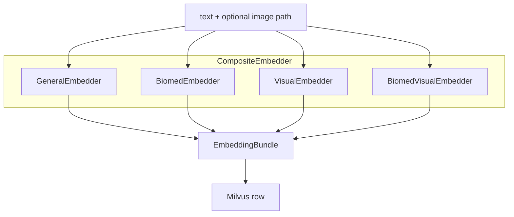

# 向量化：五列 Embedder 与组合

源码：`src/biomed_ontology/embed/__init__.py`  
消费：`MilvusBackend.upsert` / `retrieve` · `parse.figure_type`（BiomedCLIP 共享加载）

相关文档：[milvus.md](milvus.md) · [../parse/assets.md](../parse/assets.md) · [../eval/arms.md](../eval/arms.md)

---

## 1. 为什么存在

单一嵌入空间无法同时满足：

- 精确术语与跨语言通用语义（BGE-M3 稠密 + 稀疏）  
- 生物医药实体对齐（SapBERT，英文强）  
- 图表、影像等**非正文**证据（两条视觉列）

五列写入同一 Milvus 行，由 `CompositeEmbedder` 合并 `EmbeddingBundle`；缺列不补零，避免「未计算」与「零向量」混淆。

`FakeEmbedder` 是 CI 一等公民：确定性哈希向量，验证管线接线（过滤、分列检索、许可）而非语义质量。对外报数路径禁止 fake（`REAL_EMBEDDERS` 守门）。

---

## 2. 设计取舍

| 列 | 模型 | 强项 | 弱项 |
|----|------|------|------|
| `dense_general` | BGE-M3 1024d | 通用语义、中英 | 极专术语 |
| `sparse_lexical` | BGE-M3 稀疏 | 精确词面、BM25 通道 | 无语义泛化 |
| `dense_biomed` | SapBERT 768d | 药名/靶点对齐 | 中文弱，需分语种报表 |
| `dense_visual` | Qwen3-VL 2048d | 图内文字、图表结构 | 真实影像非主场 |
| `dense_visual_bio` | BiomedCLIP 512d | PMC 风格影像/病理 | 文本上下文 256 token |

| 决策 | 理由 |
|------|------|
| 两条视觉列并存 | 问「KM 曲线」与「CT 结节」最优列不同；净值用 `5col−4col` 记账 |
| BGE-M3 一次出稠密+稀疏 | 检索侧一次 `encode` 喂多列 |
| SapBERT 取 [CLS] | mean pooling 会 silently 换模型 |
| Qwen 用官方脚本 last-token 池化 | 自写易错成 mean/CLS |
| BiomedCLIP 文本列也出向量 | 否则该列只能召回图，成静默模态过滤 |
| `resolve_model` 本地优先 | 内网手工放权重 |
| 集合 description 盖戳 embedder 名 | 防错模型空间 |

---

## 3. 设计与实现

### 3.1 Embedder 类型

| 名称 | 类 | 产出列 |
|------|-----|--------|
| `fake` | `FakeEmbedder` | 五列哈希（可配置维） |
| `bge-m3` | `GeneralEmbedder` | `dense_general`, `sparse_lexical` |
| `sapbert` | `BiomedEmbedder` | `dense_biomed` |
| `qwen3-vl` | `VisualEmbedder` | `dense_visual` |
| `biomedclip` | `BiomedVisualEmbedder` | `dense_visual_bio` |
| `dual` | Composite | bge-m3 + sapbert |
| `multimodal` | Composite | + qwen3-vl |
| `multimodal-bio` | Composite | + biomedclip（**默认五列**） |

`get_embedder(name, device?)` — 唯一工厂；`device` 默认 `best_device()`（CUDA > MPS > CPU）。

### 3.2 encode 契约

```text
encode(texts: list[str], images: list[str|None] | None)
  → list[EmbeddingBundle]  # dict: 字段名 → 向量或稀疏 dict

images[i] 对应 texts[i] 的像素路径（绝对路径，由 resolve_asset 提供）
无图：视觉列走文本塔或哈希文本分支
```

`MilvusBackend.upsert`：

```text
bundles = embedder.encode(texts, images=[_asset(row) for row in rows])
payload = {**row, **bundle}
```

### 3.3 检索侧多查询

`retrieve` 对 `lexical_text` 与 `dense_texts` 去重后一次 `encode`，再按列 `search`。BGE-M3 稀疏与稠密同源，避免双倍前向。

### 3.4 权重与镜像

`_MIRRORS` 登记 HF → ModelScope / Gitee；`modelscope: None` 表示该站无 PyTorch 权重（SapBERT）。

`load_biomedclip` 单独处理：

- 本地 `open_clip_config.json` 为 marker  
- 文本塔 config 必须 `resolve_model` 到本地  
- 法务 `assert_component_cleared("biomedclip")`  

与 `BiomedClipFigureTyper` 共享权重（见 [figure-type.md](../parse/figure-type.md)）。

### 3.5 数据流



### 3.6 REAL_EMBEDDERS

可用于 `hmd eval` 报数的名称：`bge-m3`, `sapbert`, `dual`, `qwen3-vl`, `biomedclip`, `multimodal`, `multimodal-bio`。  
使用 `fake` 索引需 `--allow-fake`。

---

## 4. 不变量与失败模式

**不变量**

1. `CompositeEmbedder` 合并时不补零列。  
2. `FakeEmbedder` 同文本跨进程同向量；含 image path 时视觉哈希可分。  
3. 建表列集 = probe encode 实际键 ∩ `DEFAULT_DIMS`。  
4. 稀疏列维度接口与 Milvus `SPARSE_FLOAT_VECTOR` 一致。  
5. BiomedCLIP 维数由实测前向得出，非读静态属性。

**失败模式**

| 现象 | 原因 |
|------|------|
| upsert 全失败 | schema 含 embedder 未产出的列 |
| 检索列不存在 | 用 4 列建表却搜第 5 列 — `vector_fields()` 应用库内列 |
| 语义随机 | fake 嵌入器用于报数 |
| SapBERT 中文差 | 预期；见 README 分语种表 |
| 视觉列无差异 | image 未传入 — 查 asset_path / resolve_asset |
| Gitee 半拉子目录 | clone 中断 — `test_interrupted_gitee_clone_leaves_no_half_model` |
| git-lfs 未装 | 权重是指针文件 |

---

## 5. 如何验证

```bash
uv run pytest tests/test_embed.py -q
uv run pytest tests/test_milvus_license.py -k vector -q
uv run hmd index --recreate    # 真模型集成
```

关键用例名：

- `test_fake_embedder_is_deterministic_across_calls`
- `test_all_three_columns_are_produced_in_one_pass`
- `test_sparse_vector_keeps_exact_terms_distinct`
- `test_every_real_embedder_default_is_registered`
- `test_each_vector_column_is_independently_queryable`
- `test_sapbert_delta_discloses_which_embedder_produced_it`
