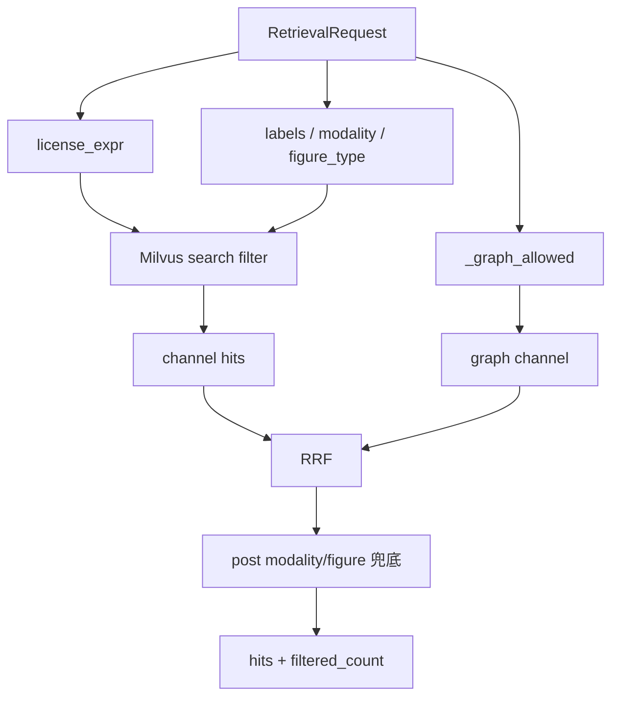

# 检索过滤：许可、标签与模态

源码：`src/biomed_ontology/search/backends/base.py`（`LicenseScope`、`RetrievalRequest`）  
Milvus 下推：`src/biomed_ontology/search/backends/milvus.py`（`_filter`、`_license_expr`）  
图通道：`src/biomed_ontology/search/__init__.py`（`_graph_allowed`）

相关文档：[hybrid.md](hybrid.md) · [milvus.md](milvus.md) · [../licensing/tiers.md](../licensing/tiers.md)

---

## 1. 为什么存在

检索过滤解决三类不同问题：

1. **合规** — 调用方无权看到的来源与密级，在候选生成阶段就不应进入结果集；统计量也不能泄漏「被挡条数」之外的信息。  
2. **语料意图** — 标引 `labels`（taxonomy 多标签）缩小主题范围。  
3. **模态与图型** — 「只要图」「只要 CT」是布尔条件；靠调相似度权重需要不可解释的跨模态偏置。

三类过滤共享同一 `RetrievalRequest`，在 Milvus 侧尽量**标量下推**；图通道在进程内复用等价谓词，避免旁路。

---

## 2. 设计取舍

| 决策 | 理由 |
|------|------|
| 过滤 vs 后裁剪 | 后裁剪让 `filtered_count` 与命中数无法解释无权场景 |
| `LicenseScope` 后端无关 | Python `permits` 与 `milvus_expr` 相邻定义，防漂移 |
| `partition_key=source_id` | 物理隔离采购边界 |
| 模态/图型下推 | 先 filter 再 `limit`；库外筛会砍薄混排候选 |
| 图通道 `_graph_allowed` | 倒排不经 Milvus，必须自滤 |
| `figure_type==""` 语义 | 未分类；`figure_types=[RADIOLOGY]` 不会命中 |
| labels `ARRAY_CONTAINS_ANY` | 多标签 OR 语义 |

---

## 3. 设计与实现

### 3.1 LicenseScope

```text
permits(license_rank, source_id):
  if license_rank > max_rank: return false
  if license_rank <= open_rank: return true
  return source_id in entitled_sources
```

| 字段 | 含义 |
|------|------|
| `max_rank` | 调用方 `max_tier` 上限 |
| `open_rank` | 公开档（TIER_1）及以下无需 entitlement |
| `entitled_sources` | 凭据覆盖的来源 ID 集合 |

Milvus 表达式（示意）：

```text
license_rank <= {max_rank}
and (license_rank <= {open_rank} or source_id in ["src_a", ...])
```

`known_sources` 与 registry 求交后再拼入 `in [...]`，拒绝表达式注入。

`filtered_count` = 全库计数 − 带 expr 计数（仅许可 expr 部分用于解释「被挡多少」）。

### 3.2 RetrievalRequest 过滤字段

| 字段 | 空值 | 行为 |
|------|------|------|
| `labels` | `()` | 不限标签 |
| `modalities` | `()` | 不限模态 |
| `figure_types` | `()` | 不限图型 |
| `scope` | 必填 | 许可 |

Milvus `_filter` 拼接：

```text
expr = license_expr
  [and ARRAY_CONTAINS_ANY(labels, [...])]
  [and modality in ["IMAGE", ...]]
  [and figure_type in ["RADIOLOGY", ...]]
```

标签/模态/图型值经 `_plain` 白名单（字母数字与 `_-`）。

### 3.3 图通道对齐

`_graph_allowed` 遍历内存 `ChunkMeta`：

```text
permits(license_rank, source_id)
and (not labels or labels ∩ wanted)
and (not modalities or modality in wanted)
and (not figure_types or figure_type in wanted)
```

与 Milvus 不同路径，同一谓词语义。

### 3.4 HybridSearcher 二次闸门

Milvus 返回后，若请求含 `modalities` / `figure_types`，融合列表在截断 `top_k` **前**再滤（兜底非 Milvus 的 `SearchBackend` 实现）。

### 3.5 数据流



### 3.6 ChunkMeta 来源

`HybridSearcher._chunk_meta`：文档缺失时 `license_rank` 取最高密级（宁可挡也不默认放行）。

---

## 4. 不变量与失败模式

**不变量**

1. 无权调用方永远不应在结果中看到 `license_rank > open_rank` 且未 entitled 的切片。  
2. `filtered_count` 必须回传；0 命中时需能区分「库内无」与「全被挡」。  
3. 图通道与 Milvus 在相同 request 下许可集合一致。  
4. `restore_section` 使用与检索相同的 filter 谓词。  
5. 恶意 `source_id` / `doc_id` 不得拼入 expr（抛 `ValueError`）。

**失败模式**

| 现象 | 原因 |
|------|------|
| 付费源「泄露」 | expr 与 permits 漂移 — 跑 milvus_license 测试 |
| 图结果未过滤模态 | `_graph_allowed` 遗漏字段 |
| CT 查询返回柱状图 | 只设 `modalities` 未设 `figure_types` |
| 有图但 figure 过滤零结果 | 库内 `figure_type` 全空 — 跑分类 |
| filtered_count 误导 | 把 labels 算进挡掉计数 — 实现仅许可 expr 差分 |

---

## 5. 如何验证

```bash
uv run pytest tests/test_milvus_license.py tests/test_search_backend.py -q
uv run pytest tests/test_tools.py -k filter -q
uv run pytest tests/test_citation.py -k filtered -q
```

关键用例名：

- `test_open_tiers_need_no_entitlement`
- `test_paid_tier_requires_matching_source_entitlement`
- `test_expression_matches_the_python_predicate`
- `test_expression_injection_is_rejected_not_escaped`
- `test_modality_filter_is_pushed_down_alongside_the_license_predicate`
- `test_figure_type_filter_does_not_displace_the_license_predicate`
- `test_modality_filter_passes_the_contract_and_narrows_to_that_modality`
- `test_gate_reports_filtered_count_rather_than_silently_dropping`
