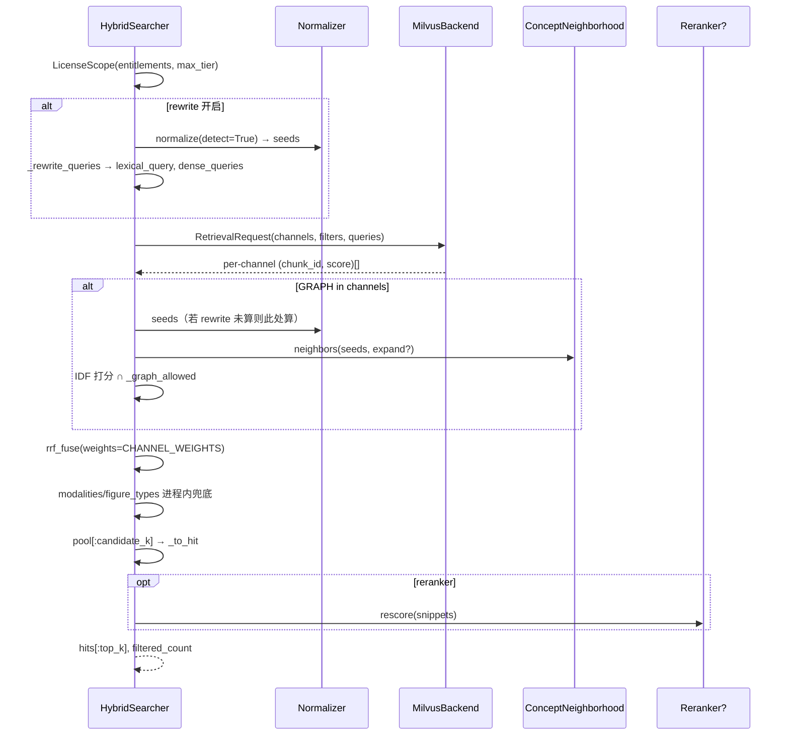

# 三通道混合检索与带权 RRF

源码：`src/biomed_ontology/search/__init__.py`（`HybridSearcher`、`rrf_fuse`）  
后端：`src/biomed_ontology/search/backends/milvus.py`（唯一 Evidence Index 实现）

相关文档：[milvus.md](milvus.md) · [ontology-paths.md](ontology-paths.md) · [filters.md](filters.md) · [rerank.md](rerank.md) · [embedders.md](embedders.md) · [../eval/arms.md](../eval/arms.md)

---

## 1. 为什么存在

文献证据检索需要同时覆盖：

- **字面术语**（基因符号、适应症写法、注册号样式）  
- **语义改写**（同义表述、跨语言 paraphrase）  
- **本体关系可达**（「肺癌」应召回挂「肺腺癌」概念的切片，即便正文未出现原 query 词）

BM25（`sparse_lexical`）与稠密向量列误差高度相关——都基于 chunk 文本相似度。第三条 **GRAPH** 通道在概念图空间打分，误差来源正交，融合后才有可测增量。评测因此必须把图通道、查询改写、`expand` 拆成独立臂（见 [arms.md](../eval/arms.md)）。

词法与向量召回下沉 Milvus；图通道与 RRF 在进程内完成。无 Milvus 时失败，不静默回落。

---

## 2. 设计取舍

| 决策 | 理由 |
|------|------|
| 三通道 BM25 + DENSE + GRAPH | 正交误差；双通道叠加以噪声为主 |
| RRF 按名次融合 | 三分数量纲不可比（BM25 无上界、余弦 [0,1]、图通道 IDF 加权） |
| `CHANNEL_WEIGHTS[GRAPH]=0.5` | 图候选粗粒度；等权会让「挂了概念」的切片与 BM25 精排第 3 名同贡献 |
| 许可在候选生成期过滤 | 返回前裁剪会泄漏「存在但被挡」的统计 |
| `expand` 与 `rewrite` 分离 | 消融需区分「图邻居」与「查询串扩展」 |
| `rewrite` 默认跟随 `expand` | 常见配置一次打开；显式 `rewrite=False` 可只开图通道 |
| `candidate_k` 独立于 `top_k` | 精排只能重排池内已有项 |
| 融合不下推 Milvus | 库内 RRFRanker 无法反解各通道名次 → `explain` 作废 |

**`expand` vs `rewrite`**

| 开关 | 影响 |
|------|------|
| `expand=True` | 图通道：`neighborhood.neighbors` 扩展查询概念向量 |
| `rewrite=True` | 词法/向量：`_rewrite_queries` 追加本体别名 |
| `rewrite=None` | 等同 `expand` |
| `rewrite=False, expand=True` | 仅图扩展，不改 Milvus 查询串 |

---

## 3. 设计与实现

### 3.1 通道定义

| 通道 | 枚举 | 实现位置 | 候选来源 |
|------|------|----------|----------|
| BM25 | `RetrievalChannelEnum.BM25` | Milvus `sparse_lexical` | 稀疏内积 |
| DENSE | `RetrievalChannelEnum.DENSE` | Milvus `dense_*` 多列 | 余弦；`merge_best` 跨列/跨查询 |
| GRAPH | `RetrievalChannelEnum.GRAPH` | `HybridSearcher._graph_channel` | 概念倒排 + IDF 余弦 |
| FUSED | `RetrievalChannelEnum.FUSED` | `rrf_fuse` 输出 | 非独立召回 |

### 3.2 `search()` 数据流



### 3.3 查询改写（`rewrite`）

```text
seeds = normalize(query, detect=True, min_confidence=0.6).concept_ids
对每个 seed: normalizer.expand(max_depth=1, min_weight=0.35)
  → 按 normalize_alias 去重，保留最高权重写法
去掉已在 query 中出现的词（避免重复抬高 BM25 词频）
取 top max_terms=8

lexical: query + " " + 扩展词（单串拼接）
dense:   (query, rewritten) 两串分别编码，merge_best 取 max
```

词法受益于追加同义词；稠密若拼成一句会产生**查询漂移**，故多串取 max。

### 3.4 图通道打分（概要）

详见 [ontology-paths.md](ontology-paths.md)。

- 查询向量：seeds 权重 1.0 + `expand` 时邻居按关系衰减（`max_hops=2`）  
- 文档侧：切片 `concept_ids` 集合  
- 分数：Σ (query_weight × IDF²) / chunk 概念模长  
- IDF：`log(N/df)`，下界 0.1  

`CHANNEL_WEIGHTS` 仅显式降低 GRAPH；BM25/DENSE 默认 1.0。

### 3.5 RRF

```text
score(chunk) += weight[channel] / (k + rank)    # 默认 k=60
```

返回 `(chunk_id, fused_score, channel_ranks)`；`SearchHit.explain` 形如 `RRF(bm25#2 + dense#1 + graph#5)`。

### 3.6 主要 API 参数

| 参数 | 默认 | 说明 |
|------|------|------|
| `top_k` | 10 | 返回条数 |
| `candidate_k` | `top_k` | 融合池深度；开精排应 `> top_k` |
| `channels` | 三通道全开 | 可消融单通道 |
| `vector_fields` | 空=集合内全部列 | 稠密列消融 |
| `expand` / `rewrite` | True / None | 见上表 |
| `modalities` / `figure_types` | 空=不限 | 见 [filters.md](filters.md) |
| `reranker` | None | 见 [rerank.md](rerank.md) |

索引期：`HybridSearcher` 构造时扫描 `kb.chunks` 建 `_by_concept`、`_concept_idf`、`_concept_norm`。

---

## 4. 不变量与失败模式

**不变量**

1. `backend` 必填（Milvus）；`None` 立即 `ValueError`。  
2. `seeds is None` vs `seeds == []`：`None` 表示尚未归一化；`[]` 表示归一化无概念。图通道在 `rewrite=False` 时仍会对 `None` 单独 `_seed_concepts`。  
3. 图通道过滤与 Milvus 使用同一 `LicenseScope.permits`（`_graph_allowed`）。  
4. `filtered_count` 自后端返回，无权调用方区分「无资料」与「被挡」。  
5. 开精排时 `rank_before_rerank` 保留融合名次。

**失败模式**

| 现象 | 原因 |
|------|------|
| 图通道恒为空 | query 未映射到概念；或 expand 关且种子无倒排 |
| BM25 臂报错 | 集合无 `sparse_lexical` — 需 BGE-M3 索引 |
| 改写无效果 | seeds 空；或扩展词已在 query 中 |
| 精排无提升 | `candidate_k == top_k` 池太浅 |
| 通道名实不符 | 用了 fake embedder 却未 `--allow-fake` |
| Milvus 不可达 | 臂标 unavailable；**不**回落本地词法 |

---

## 5. 如何验证

```bash
task milvus:up
uv run hmd index --recreate
uv run hmd eval --entitlements MOCK_LICENSED
uv run pytest tests/test_tools.py tests/test_eval_demo.py tests/test_milvus_license.py -q
```

关键用例名：

- `test_rrf_rewards_agreement_across_channels`
- `test_ontology_hybrid_improves_recall_over_bm25`
- `test_expansion_does_not_trade_ranking_for_recall`
- `test_modality_filter_passes_the_contract_and_narrows_to_that_modality`
- `test_channels_are_independently_selectable`
- `test_filter_is_load_bearing`
- `test_readme_does_not_promise_a_milvus_fallback`
