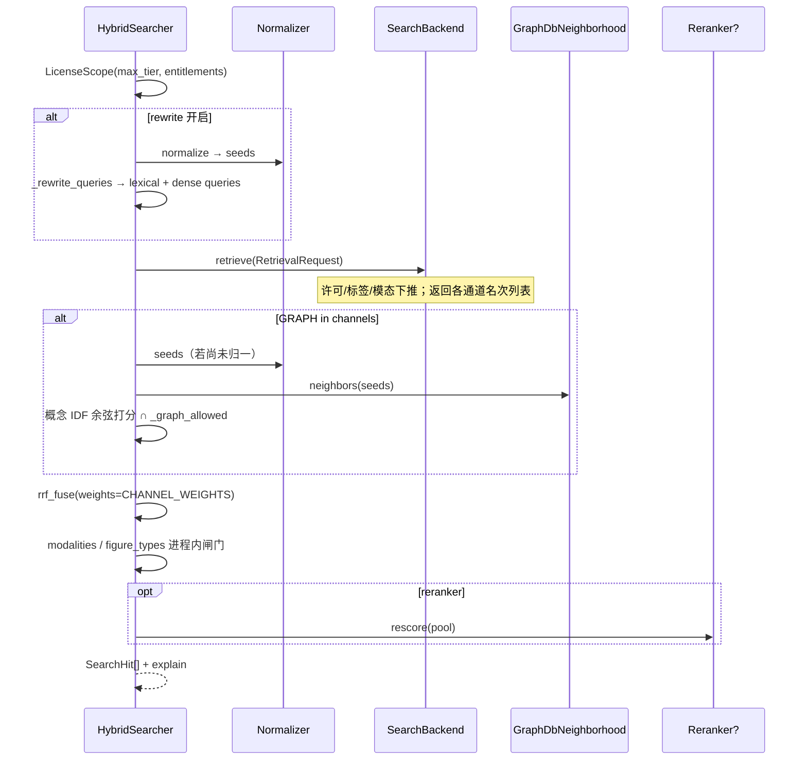

# 三通道与带权 RRF

源码：`src/biomed_ontology/search/__init__.py`（`HybridSearcher`、`rrf_fuse`）。

## 为什么要三条通道

| 通道 | 找什么 | 误差来源 |
|---|---|---|
| BM25 | 字面词匹配 | 词表、分词、别名写法 |
| DENSE | 嵌入空间近邻 | 模型与域偏移 |
| GRAPH | 经由概念关系可达的切片 | 本体覆盖、链接质量、IDF |

BM25 与向量都基于 **chunk 文本相似度**，误差高度相关；只叠这两条，提升往往落在噪声范围内。图通道误差来源不同，融合后才可能有真正增量 —— 这也是为什么评测必须把「图 / search-around / 改写」拆成独立臂（见 [ARMS](../eval/arms.md)）。

## 一次 `search()` 走读



要点：

1. **许可在候选生成期介入**（`LicenseScope`），不是返回前裁剪 —— 后者会让命中数泄漏无权数据存在性。  
2. **`expand` 与 `rewrite` 是两个开关** —— 合成一个时，消融无法归因。`rewrite` 默认跟随 `expand`。  
3. **`seeds is None` vs `[]`** —— `None` = 还没归一化；`[]` = 归一过但一个概念也没有。混用会让图通道在「不开改写」时被整条跳过。  
4. **`candidate_k`** —— 精排只能重排池子里已有的东西；开精排时必须 `candidate_k > top_k`。

## RRF：用名次，不用分数

三通道量纲不可比：BM25 无上界、余弦在 \[0,1\]、图通道是衰减后的概念得分。强行归一化分数会引入说不清的超参；名次天然可比。

\[
\mathrm{score}(d) = \sum_c w_c \cdot \frac{1}{k + \mathrm{rank}_c(d)}
\]

默认 \(k=60\)（经典 RRF）。`rrf_fuse` 同时返回 `channel_ranks`，供 explain 使用。

### 权重：名次可比 ≠ 可信度相同

`CHANNEL_WEIGHTS` 里 **GRAPH 先验固定 0.5**，其余默认 1.0。

理由（代码注释原意）：图通道候选来自「挂了某个概念」这一条件，比词法/向量的相似度排序粗。等权融合时，图通道第 3 名与 BM25 第 3 名对总分贡献相同 —— 但后者是从全库按相关性挑的，前者可能只是恰好提到「肺癌」。

!!! warning "0.5 不是调出来的"
    在同一份小 gold 上搜权重再报数 = 过拟合。真要定这个值需要独立开发集。
    权重扫描曲线若存在，只作诊断附录，不得写进「达成」结论。

## Explain：WHY 支柱的载体

`_to_hit` 生成：

```text
explain = "RRF(bm25#3 + dense#1 + graph#7)"
```

开精排后再追加 `→ rerank 0.87`，并保留 `rank_before_rerank`。  
没有名次还原，可观测的 WHY 支柱就是空的 —— 这也是**融合不下推 Milvus** 的根本原因（见 [Milvus](milvus.md)）。

## 事故课：哈希并列

旧图通道只有三档分值（1.0 / 0.8 / 0.64）取 max：

- 几百个切片同分  
- 次级键是 `chunk_id`（SHA-1 前缀）  
- 进入 RRF 的前 30 名 = **按哈希抽的随机样本**，却带着与 BM25 相同的融合权重  

症状：MRR 可能略升，P@5 / nDCG 下降。  
修复必须三处同时做：

1. search-around（类型化链接，不只层级）  
2. 概念 IDF（区分「肺癌」与「肾病综合征」）  
3. 文档模长归一（区分「讲这个主题」与「顺带提一句」）  

只做 IDF：同一倒排表内部仍然全部并列，哈希排序原地复活。

## 后端边界

| 职责 | 位置 |
|---|---|
| 词法 / 向量召回 | `MilvusBackend`（`sparse_lexical` + dense_*） |
| 图通道 | `HybridSearcher`（Normalizer + GraphDB 邻域 + 概念倒排） |
| RRF 融合 | 进程内 `rrf_fuse` |
| 精排 | 可选 `Reranker`，在融合之后 |

## 无静默回落

Milvus / 精排臂不可达 → 标记「未运行」，**绝不**用本地后端或 `NullReranker` 顶替后仍写「Milvus… / +精排」。回落会让报表撒谎。见 [设计不变量](../invariants.md)。

## 如何验证

```bash
uv run pytest tests/test_search_backend.py -q
uv run hmd eval --entitlements MOCK_LICENSED
```

改 `CHANNEL_WEIGHTS` 或图打分后，看消融阶梯 ①→③ 与配对 bootstrap（[显著性](../eval/significance.md)），不要只看总平均。
