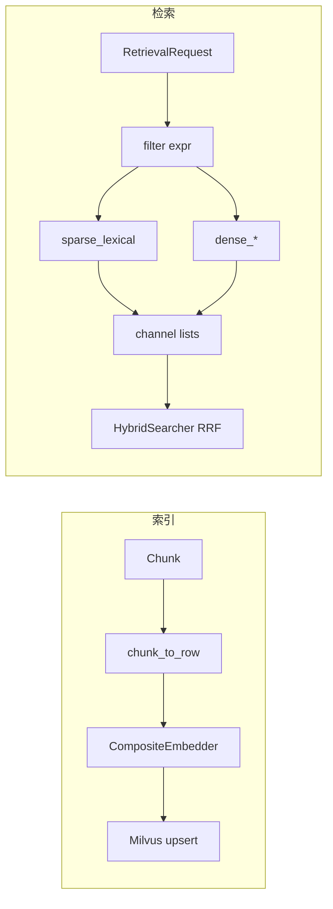

# Milvus Evidence Index：五列向量与标量下推

源码：`src/biomed_ontology/search/backends/milvus.py`  
协议：`src/biomed_ontology/search/backends/base.py`  
编排：`docker/milvus-standalone.yml`（`PROXY_MAXVECTORFIELDNUM=6`）  
配置：`search_backend=milvus`（唯一选项）、`milvus_uri`、`milvus_collection`

相关文档：[hybrid.md](hybrid.md) · [embedders.md](embedders.md) · [filters.md](filters.md) · [../architecture/foundation.md](../architecture/foundation.md)

---

## 1. 为什么存在

Evidence Index 是产品级检索底座，承担：

1. **文献混合检索** — `hmd index` / `hmd eval` / 服务 API 的三通道候选生成（BM25 + 多列稠密）；  
2. **Foundation 证据定位** — 与 Iceberg/Graph 双写的 `foundation_evidence` 集合（Enterprise ID 维度，见 foundation 文档）。

**无本地词法回退**。Milvus 不可达时评测臂标「未运行」，禁止用内存实现冒充 Milvus 列名。`search_backend` 类型字面量仅含 `milvus`。

索引文本经 `chunk_to_row(..., label_terms=HybridSearcher.concept_label_terms)` 注入概念 preferred label，与稀疏列跨别名命中及查询改写对齐。

---

## 2. 设计取舍

| 决策 | 理由 |
|------|------|
| 五列向量（1 稀疏 + 4 稠密） | 通用语义、生医实体、两条视觉列各司其职；见 [embedders.md](embedders.md) |
| 多稠密列映射同一 DENSE 通道 | RRF 按通道融合；列级消融靠 `vector_fields` |
| `merge_best` 跨列/跨查询 | 取 max 奖励「某一路特别匹配」，不求和平庸分 |
| 融合留在 `HybridSearcher` | Milvus RRFRanker 无法反解名次 → `explain` 断裂 |
| `partition_key_field=source_id` | 采购边界即物理边界 |
| `license_rank` + expr 双保险 | 即使 expr 写错，付费分区不可无凭据触碰 |
| 集合 `description=embedder=…;release=…` | 防 A 模型写入 B 模型检索，并与 corpus `release_id` 强绑定 |
| 标量 `release_id` | 检索 filter / upsert 门禁；错配须 `hmd index --recreate` |
| upsert 默认 `flush=True` | Bounded consistency 下不 flush 表现为「检索空」 |
| 仅建 embedder 实际产出的列 | 多建空列会导致整批 upsert 失败 |

---

## 3. 设计与实现

### 3.1 五列模型

| 字段 | 检索通道 | Embedder 来源 | 索引度量 |
|------|----------|---------------|----------|
| `sparse_lexical` | BM25 | BGE-M3 稀疏 | IP |
| `dense_general` | DENSE | BGE-M3 稠密 1024d | COSINE HNSW |
| `dense_biomed` | DENSE | SapBERT 768d | COSINE HNSW |
| `dense_visual` | DENSE | Qwen3-VL 2048d | COSINE HNSW |
| `dense_visual_bio` | DENSE | BiomedCLIP 512d | COSINE HNSW |

通道映射常量 `_CHANNEL`：稀疏列独占 BM25；四稠密列共享 DENSE。

默认维度见 `DEFAULT_DIMS`；建表前用 `embedder.encode(["probe"])` 探测实际产出列。

### 3.2 标量字段（非向量）

| 字段 | 类型 | 用途 |
|------|------|------|
| `chunk_id` | PK VARCHAR | 主键 |
| `doc_id` | VARCHAR | 文档归属 |
| `source_id` | VARCHAR **partition key** | 许可来源 / 物理分区 |
| `license_rank` | INT8 | 许可层级 |
| `section_id` / `section_path` | VARCHAR | Citationware 章节还原 |
| `sort_order` / `page` | INT | 排序与溯源 |
| `modality` | VARCHAR | TEXT/IMAGE/TABLE 过滤 |
| `figure_type` | VARCHAR | 图型过滤；`""`=未分类 |
| `asset_path` | VARCHAR | 视觉列读像素 |
| `degraded` | VARCHAR | 解析能力缺口透传 |
| `labels` | ARRAY | 标引多标签 |
| `concept_ids_expanded` | ARRAY | 扩展概念过滤（可选） |
| `text` | VARCHAR(8192) | 嵌入输入 + 展示 |

### 3.3 `retrieve()` 数据流

```text
available ← vector_fields()  # 以库为准
fields ← request.vector_fields or available

lexical_text ← request.lexical_text()
dense_texts ← request.dense_texts()
bundles ← embedder.encode(unique(lexical, *dense))  # 一次前向

for field in fields:
  channel ← _CHANNEL[field]
  if BM25 and field != sparse_lexical: skip
  queries ← (lexical,) or dense_texts
  for each query:
    vector ← bundle[field]
    hits ← client.search(anns_field=field, filter=expr, limit=top_k*3)
    channels[channel] ← merge_best(...)

return BackendResult(channels, filtered_count)
```

过滤表达式 `_filter` = 许可 expr + labels + modalities + figure_types（见 [filters.md](filters.md)）。

### 3.4 写入路径

```text
chunk_to_row(chunk, ChunkMeta, label_terms) → row dict
MilvusBackend.upsert(rows):
  bundles ← embedder.encode(texts, images=resolve_asset(...))
  payload ← row + bundle
  client.upsert + flush
```

`ensure_collection`：可选 `drop_existing`；索引参数 HNSW `M=16, efConstruction=200`；稀疏 `SPARSE_INVERTED_INDEX`。

### 3.5 章节还原

`restore_section(doc_id, section_id, request)` — query 带同一许可 expr，按 `sort_order` 排序，供 Citationware 拉全节。

### 3.6 运维要点

- 向量列数超默认 4 需调高 `PROXY_MAXVECTORFIELDNUM`（建议 6），`task milvus:down && task milvus:up`  
- 失败提示 `_explain_vector_field_cap` — **不要**删列绕过  
- `stamped_embedder()` / `stamped_release()` 读集合描述；`require_release(kb.release_id)` 硬失败防孤儿索引  
- `fake` embedder 需 CLI `--allow-fake` 留痕  
- `hmd index` dual-write：Milvus + Iceberg `evidence_chunks`（同 Tree Chunk、同 `release_id`）  
 



---

## 4. 不变量与失败模式

**不变量**

1. BM25 通道**必须**有 `sparse_lexical` 列，否则 `RuntimeError` 明示 `hmd index --recreate`。  
2. `LicenseScope.milvus_expr` 与 Python `permits` 逐字等价（测试守卫）。  
3. `entitled_sources` 与 registry 求交后才拼 expr，防注入。  
4. `doc_id`/`section_id` 还原前走 `_safe_ident` 形状校验。  
5. 图通道许可**不**在 Milvus 内实现，而在 `HybridSearcher._graph_allowed` 用同一谓词。

**失败模式**

| 现象 | 原因 |
|------|------|
| 建表 vector field 上限 | 未调 `PROXY_MAXVECTORFIELDNUM` |
| 检索全空刚写入 | 未 flush；或 filter 过严 |
| 分数正常但语义乱 | embedder 与集合 description 不一致 |
| BM25 硬失败 | 集合无稀疏列或 embedder 未产出 sparse |
| 视觉列像文本 | `resolve_asset` 失败 — 查 asset_path 与 doc_id |
| filtered_count 恒 0 | 库空或 expr 与数据 license 不匹配 |

---

## 5. 如何验证

```bash
task milvus:up
uv run hmd index --recreate
uv run hmd eval --entitlements MOCK_LICENSED
uv run pytest tests/test_search_backend.py tests/test_milvus_license.py tests/test_embed.py -q
```

关键用例名：

- `test_bm25_channel_searches_sparse_lexical_only`
- `test_missing_sparse_lexical_hard_fails_for_bm25`
- `test_each_vector_column_is_independently_queryable`
- `test_expression_matches_the_python_predicate`
- `test_filter_is_load_bearing`
- `test_section_restore_respects_the_same_predicate`
- `test_defaults_prefer_milvus_evidence_index`
- `test_readme_does_not_promise_a_milvus_fallback`
