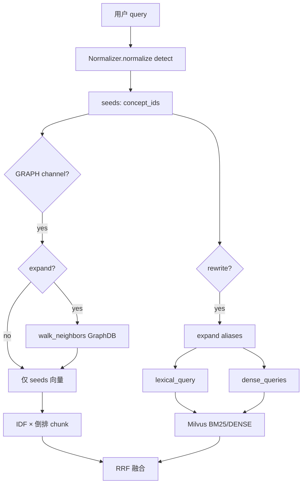

# 本体双路径：查询改写与图通道

源码：`src/biomed_ontology/search/__init__.py`（`_rewrite_queries`、`_graph_channel`）  
邻域：`src/biomed_ontology/ontology/neighborhood.py`（`ConceptNeighborhood`）  
遍历：`src/biomed_ontology/ontology/links.py`（`walk_neighbors`）  
扩展：`src/biomed_ontology/normalize/__init__.py`（`Normalizer.expand`）

相关文档：[hybrid.md](hybrid.md) · [../ontology/links.md](../ontology/links.md) · [../ontology/normalize.md](../ontology/normalize.md)

---

## 1. 为什么存在

本体参与检索若只有「沿图找邻居」一条路径，对 BM25/向量通道的 query 毫无影响，消融时 `expand` 开与不开总分差异可忽略。生物医学检索需要本体在**两个正交位置**同时起作用：

1. **查询改写（rewrite）** — 把种子概念的别名喂回词法与稠密通道，让「非 small cell lung cancer」能命中写「NSCLC」的段落。  
2. **图通道（GRAPH）** — 在概念 IDF 加权空间做 search-around，召回仅通过类型化链接与查询概念相关的切片，而不依赖正文用词重合。

两条路径共用同一套 `Normalizer` 与 GraphDB 邻接，但开关独立（`rewrite` vs `expand`），以便评测归因。

---

## 2. 设计取舍

| 决策 | 理由 |
|------|------|
| 改写与图扩展分离 | `rewrite=False, expand=True` 可测纯图增量 |
| 改写深度 `max_depth=1` | 更深会把泛化词稀释进 query |
| `min_weight=0.35` 扩展阈值 | 压住 broad/related 噪声 |
| 图遍历 `max_hops=2` | 平衡召回与主题漂移 |
| 类型化边 + SKOS broader/narrower | 企业 search-around 边权威在 GraphDB |
| 概念 IDF + 文档模长 | 防高频概念（如「肿瘤」）淹没稀有邻居 |
| IDF 下界 0.1 | 全库挂载概念 IDF→0 会断开路径 |
| `NullNeighborhood` | 仅索引写行、不需 GRAPH 时使用 |

---

## 3. 设计与实现

### 3.1 路径对照

| 维度 | 查询改写 `rewrite` | 图通道 `expand` + GRAPH |
|------|-------------------|-------------------------|
| 触发 | BM25/DENSE ∈ channels 且 `rewrite` 真 | GRAPH ∈ channels |
| 输入 | `normalize(query, detect=True)` → seeds | 同 seeds（或 rewrite 已算则复用） |
| 本体操作 | `expand(cid, depth=1)` 取别名 | `neighborhood.neighbors(seeds, hops=2)` |
| 输出 | 改写 query 串 → Milvus | `(chunk_id, score)[]` → RRF |
| 关断效果 | 词法/向量只吃原 query | 图通道仍可用 seeds，但不扩展邻居 |

### 3.2 查询改写细节

```text
seeds ← normalize(detect=True, min_confidence=0.6).concept_ids

for cid in seeds:
  for exp in expand(cid, max_depth=1, min_weight=0.35):
    key = normalize_alias(exp.term)
    保留权重更高的 (weight, surface_form)

去掉 surface_form 已出现在 query 中的项
terms ← top 8 by weight

lexical_query = query + " " + join(terms)   # 可 None（无新词）
dense_queries = (query, lexical_query)     # 去重后各编码，merge_best
```

约束：

- 同义词多种写法只计一次（`normalize_alias`）  
- 原 query 必须始终在 dense 集合内  
- 无 seeds 时不改写（`lexical_query=None`, `dense_queries=()`）

### 3.3 图通道：walk_neighbors

**邻接来源** — `GraphDbNeighborhood.adjacency_many`：

```text
SPARQL VALUES ?s { seed IRIs }
UNION:
  ?s skos:broader ?o  → predicate "broader"
  ?o skos:broader ?s  → "narrower"
  ?s hmd:{fwd} ?o     → 企业正向谓词
  ?o hmd:{fwd} ?s     → 逆向谓词（INVERSE_PREDICATES）
```

`walk_neighbors` 在进程内 BFS，按谓词类型衰减权重，过滤 `min_weight`。

**打分**（`_graph_channel`）：

```text
query_vec[seed] = 1.0
if expand:
  for neighbor in neighbors(seeds, max_hops=2):
    query_vec[neighbor.id] = max(existing, neighbor.weight)

for cid, qw in query_vec.items():
  gain = qw * IDF(cid)^2
  for chunk_id in inverted_index[cid]:
    if chunk_id in allowed:
      score[chunk_id] += gain

score[chunk_id] /= concept_norm[chunk_id]
```

`allowed` = `_graph_allowed`：与 Milvus 相同的许可、labels、modality、figure_type。

决策写入 `TraceContext`：`stage=GRAPH_RETRIEVAL`，top 候选带 `graph:{predicate}:{concept}` 通道标签。

### 3.4 数据流总览



### 3.5 索引侧概念字段

| 字段 | 用途 |
|------|------|
| `Chunk.concept_ids` | 精确过滤、图通道文档向量 |
| `Chunk.concept_ids_expanded` | Milvus 标量（子树扩展召回） |
| `chunk_to_row(..., label_terms)` | 稀疏列注入 preferred label，与改写互补 |

图通道读的是**直接命中** `concept_ids` 倒排；扩展集合主要用于标量过滤与入库一致性。

---

## 4. 不变量与失败模式

**不变量**

1. GraphDB 不可用时，运行时装配应使 GRAPH 臂标 unavailable，而非静默空结果冒充成功。  
2. `expand` 关闭时图通道仍执行，但 `query_vec` 仅含 seeds。  
3. `rewrite` 关闭时不得向 `RetrievalRequest` 传递 `lexical_query`/`dense_queries`。  
4. 邻居权重合并取 `max`，避免多路径重复累加同一概念。  
5. LLM 消歧选中的概念若不在候选集，检索层不得返回未索引概念（归一化层约束）。

**失败模式**

| 现象 | 原因 |
|------|------|
| 改写无效 | seeds 空；扩展词已在 query；`min_weight` 过高 |
| 图通道爆炸 | 高频概念未 IDF 降权（应用 `_concept_idf`） |
| 图通道旁路许可 | `_graph_allowed` 未与 `LicenseScope` 同步 — 属 bug |
| 邻居为空 | GraphDB 未同步链接；或 `NullNeighborhood` |
| 评测 expand 无差异 | 只开了改写或只开了 BM25 — 臂配置检查 |

---

## 5. 如何验证

```bash
uv run pytest tests/test_normalize.py tests/test_alias.py -q
uv run pytest tests/test_eval_demo.py -k "ontology or expansion" -q
uv run pytest tests/test_graphstore_graphdb.py -q
uv run hmd eval --entitlements MOCK_LICENSED
```

关键用例名：

- `test_exact_expands_at_full_weight` / `test_narrow_expands_downweighted`
- `test_ontology_hybrid_improves_recall_over_bm25`
- `test_expansion_does_not_trade_ranking_for_recall`
- `test_ontology_sensitive_probes_are_reported`
- `test_rewrite_hides_tier3_without_entitlement`（GraphDB 许可，非检索但同源）
