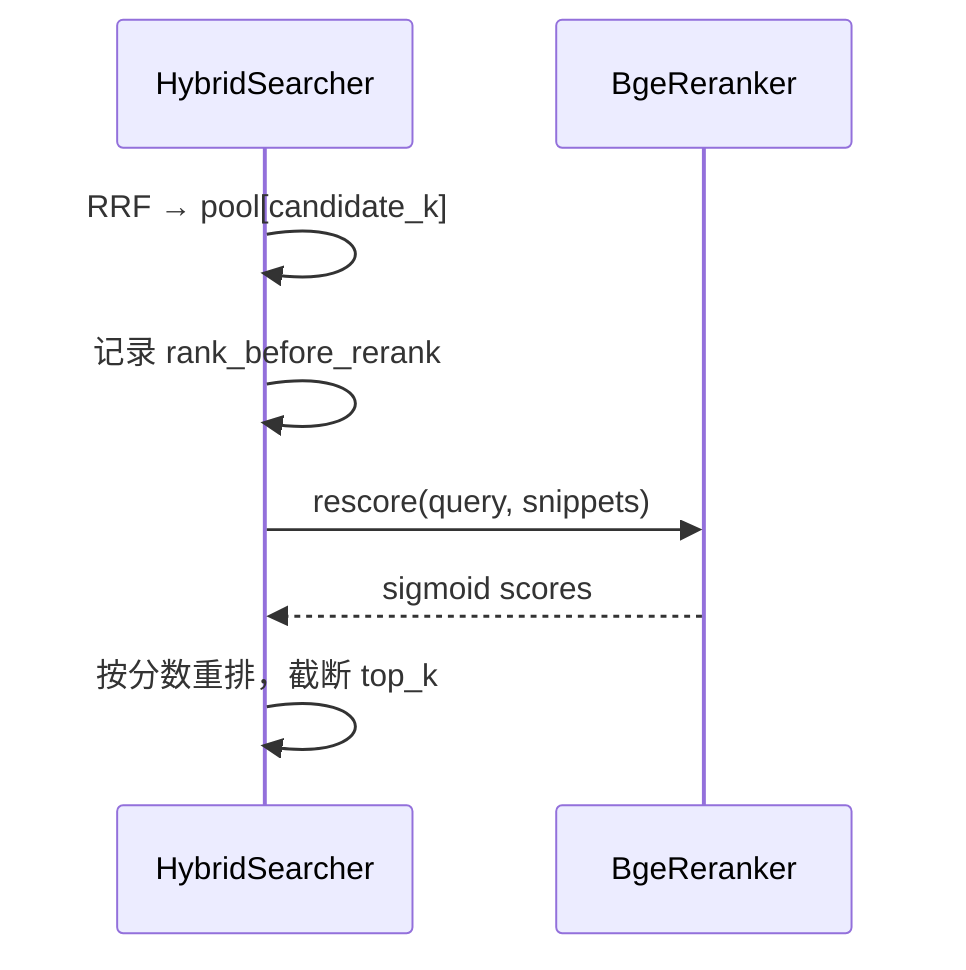

# 交叉编码器精排

源码：`src/biomed_ontology/rerank/__init__.py`  
调用：`HybridSearcher._rerank`（`src/biomed_ontology/search/__init__.py`）

相关文档：[hybrid.md](hybrid.md) · [../eval/arms.md](../eval/arms.md)

---

## 1. 为什么存在

RRF 用各通道**名次**融合，名次表达「排第几」，不表达「有多相关」。当 BM25、稠密、图通道各自的中位候选进入融合池时，RRF 缺乏细粒度依据决定谁应更靠前。

交叉编码器将 query 与 passage **拼成一条序列**联合编码，每个 query token 可 attend 每个 passage token，能判断「是否直接回答」而非「是否谈同一主题」。代价是无法预计算，因此**只运行在融合后的候选池**上（`candidate_k` 条），不对全库扫描。

---

## 2. 设计取舍

| 决策 | 理由 |
|------|------|
| Protocol + `get_reranker` | 与 `embed/` 同形态；可插拔 |
| 默认 `NullReranker` | 未配置时显式状态，非隐式 `if None` |
| `BgeReranker` v2-m3 | 与 BGE-M3 同底座，跨中英；568M 适合 PoC 规模 |
| 不用 FlagReranker | transformers 5.x 删除 `prepare_for_model` 导致崩溃 |
| `truncation="only_second"` | 保留完整 query，截断 passage 尾部 |
| sigmoid 压分 | 原始 logit 跨 query 不可比，报表需要 [0,1] |
| `rank_before_rerank` 保留 | 审计精排位移；同分退回融合名次 |
| 精排臂禁止 null 回退 | 评测臂名含 rerank 则必须真模型 |

---

## 3. 设计与实现

### 3.1 接口

| 符号 | 说明 |
|------|------|
| `Reranker` Protocol | `name`, `rescore(query, passages) -> list[float]` |
| `NullReranker` | 递减序列 `1.0 - i/n`，避免全零退化为 chunk_id 排序 |
| `BgeReranker` | `BAAI/bge-reranker-v2-m3`，batch 默认 16，`max_length=512` |
| `REAL_RERANKERS` | 对外报数允许的名称；不含 `null` |
| `get_reranker(name, device?)` | `null` / `bge-reranker-v2-m3` |

权重解析走 `embed.resolve_model` 镜像链（HF → ModelScope → Gitee）。

### 3.2 在 HybridSearcher 中的位置

```text
fused ← rrf_fuse(channel_results)
pool ← [SearchHit ...][:candidate_k]

if reranker:
  for rank, hit in enumerate(pool, 1):
    hit.rank_before_rerank = rank
  scores ← reranker.rescore(query, [hit.snippet for hit in pool])
  hit.rerank_score = score
  hit.explain += " → rerank {score}"
  sort by (-rerank_score, rank_before_rerank)

return pool[:top_k]
```

**前置条件**：`candidate_k > top_k`，否则精排无重排空间。

snippet 来源：`chunk.text[:300]`（与融合阶段一致）。

### 3.3 数据流



### 3.4 CLI / 评测

- 服务与 `hmd eval` 通过参数选择 reranker 名  
- `test_rerank_arms_refuse_to_fall_back_to_a_null_reranker` 守卫臂配置  
- fp16 仅在非 CPU 设备启用  

---

## 4. 不变量与失败模式

**不变量**

1. `rescore` 返回长度与 `passages` 一致（`zip strict`）。  
2. `reranker=None` 时零额外前向，池顺序即 RRF 顺序。  
3. 精排同分以 `rank_before_rerank` 为次级键，不以 `chunk_id` 哈希序。  
4. `NullReranker` 分数严格递减，维持稳定序。  
5. 报数路径不得使用 `null` 冒充精排臂。

**失败模式**

| 现象 | 原因 |
|------|------|
| 精排无效果 | `candidate_k == top_k` |
| OOM | passage 过长 — 已截断 only_second；可减 batch |
| 分数全接近 | snippet 过短或 query 与正文语言不匹配 |
| 加载失败 | 权重未缓存 — 检查 `resolve_model` |
| 臂名有 rerank 但无提升 | 池太浅或 gold 不敏感 — 评测设计问题 |

---

## 5. 如何验证

```bash
uv run pytest tests/test_eval_demo.py::test_rerank_arms_refuse_to_fall_back_to_a_null_reranker -q
uv run hmd eval --entitlements MOCK_LICENSED   # 含精排臂时
```

关键用例名：

- `test_rerank_arms_refuse_to_fall_back_to_a_null_reranker`
- `test_retrieval_arms_are_all_evaluated`（臂覆盖）

手动：对比同一 query 的 `explain` 中 `rank_before_rerank` 与最终顺序。
