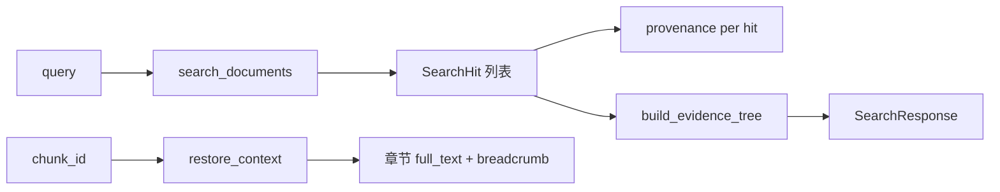

# Citationware：证据树与引用还原

源码：`src/biomed_ontology/tools/citation.py`（设计决策 D6）。  
契约字段：`SearchResponse.evidence_tree`、`SearchHit.provenance`；`RestoreRequest` / `RestoreResponse`（LinkML）。

## 为什么存在

检索返回的是**高匹配度碎片**。碎片能证明「有这句话」，却证明不了「在什么语境下说的」——而药物研发结论的语境（哪一组、哪个终点、哪次随访）恰恰决定它成不成立。

扁平命中列表还有第二个陷阱：同一章节的五个碎片看起来像五条独立证据，实际上可能全出自同一段，造成**证据量的错觉**。Citationware 负责两件事：

1. **`evidence_tree`**：把扁平命中聚合成 **文档 → 章节 → 碎片** 的层次视图。
2. **`restore_context`**：从单个 `chunk_id` 走回**章节级原文**（面包屑、页码、兄弟章节路径）。

每条 `SearchHit` 还带 **`provenance`**（`doc_id`、`section`、`page`、通道等），使「这条命中从哪来」在返回体上可核对，而不只靠事后还原。

### 为什么引用忠实度是硬约束

评测里 `citation_fidelity` 不是可调的质量指标，而是**合规底线**（T5：`at_least 1.0`，**不接受豁免**）。低于 1.0 意味着系统在**造引用**——把扩展出来的概念记成「原文说的」——这比召回低严重得多。本体扩展天然放大这一风险，因此 Literature 子套件对每条命中回查语料真值。

## 设计取舍

| 取舍 | 选择 | 放弃 |
|---|---|---|
| 还原粒度 | 默认 `SECTION`（一节内全部切片同序拼接） | 只返回命中碎片本身 |
| 可选范围 | `DOCUMENT` / `SIBLINGS` / `SECTION` | 无界全文（受 `max_chars` 约束） |
| 许可 | 与检索共用 `LicenseScope.permits` 谓词 | 还原成为「用 chunk_id 换受限全文」的后门 |
| 证据聚合 | 检索响应内嵌 `evidence_tree` | 强制二次调用才能看到结构 |
| 截断 | `truncated=true` 如实报告 | 静默截断冒充「完整原文」 |
| 排序 | 按页 → `char_start` → `chunk_id` | 字典序（段落会乱） |

## 设计与实现

### 数据流



### `build_evidence_tree`

输入：`KnowledgeBase` + 检索 `hits` 列表。

聚合逻辑：

- 按 `doc_id` 分组，记录 `title`、`license_tier`、`chunk_count`、`best_score`。
- 每文档下按 `section` 分组，收集 `pages` 集合与各 `chunk` 的 `chunk_id`、`page`、`score`、`retrieval_channel`、`snippet`。
- 文档按 `best_score` 降序；章节按 `page_start` 升序。

目的：让调用方一眼看出「几条命中是否同源」，避免把同段重复计数为多条证据。

### `restore_context`

正文权威源是 **`ChunkStore`**（生产默认 Iceberg `evidence_chunks`；单测用 `MemoryChunkStore`），不扫进程内 `kb.chunks`。`hmd index` 对 Tree Chunk **dual-write** Milvus + Iceberg，并以同一 `release_id` 强绑定。

参数：

| 参数 | 含义 |
|---|---|
| `chunk_id` | 锚定碎片 |
| `store` | `ChunkStore`（`get_section_chunks` / `get_document_chunks` 一次范围查询） |
| `restore_scope` | `SECTION`（默认）/ `SIBLINGS`（同父章节下的兄弟节）/ `DOCUMENT` |
| `max_chars` | 拼接上限（默认 8000） |
| `permits` | 由 `ToolApi` 注入的 `LicenseScope.permits` |

返回 `RestoredContext`：`doc_id`、`section_path`、`breadcrumb`（`标题 / 章节路径`）、`full_text`、`page_start`/`page_end`、`sibling_paths`、`restored_chunk_ids`、`truncated`、`license_tier`。

`ToolApi.restore_context` 将 `KeyError` → `NOT_FOUND`，`PermissionError` → `LICENSE_DENIED`。

### 与 `provenance` 的关系

| 概念 | 层级 | 用途 |
|---|---|---|
| `SearchHit.provenance` | 单条命中 | 排障、排序解释、通道归因 |
| `evidence_tree` | 一次查询的聚合视图 | 去重证据量错觉、UI 树形展示 |
| `restore_context` | 按需深读 | 研究员核对原文语境 |

三者共同支撑「可溯源引用」：先看到结构化证据，再按需还原整节，且全程同一许可谓词。

### 与评测 `citation_fidelity` 的关系

`observability/contracts.citation_fidelity` 校验：声称引用的 `doc_id` 是否在返回集内，且声称的概念是否真出现在该文档的命中概念集合中。Literature ARMS 在每条 query 上计算该值；`RetrievalEval.as_table()` 对 < 1.0 的臂单独告警。

## 不变量与失败模式

| 不变量 | 违反后果 |
|---|---|
| 还原许可 ⊆ 检索许可 | 越权读受限全文（P0） |
| 未知 `chunk_id` 硬失败 | 静默空文冒充还原 |
| 超长文本 `truncated=true` | 下游误以为拿到完整章节 |
| 一节多切片全部纳入 gold 索引 | 见 [gold](../eval/gold.md)；键覆盖不全会导致召回「莫名偏低」 |
| T5 `citation_fidelity ≥ 1.0` | 发版门禁失败 |

失败模式：

- **`LICENSE_DENIED`**：调用方无该 `doc_id` 对应源的 entitlement；不是 bug，是许可生效。
- **`NOT_FOUND`**：语料重索引后 `chunk_id` 变化；需用新检索结果中的 id。
- **breadcrumb 缺标题**：`doc` 元数据缺失时退化为 `doc_id`。
- **证据树分数误导**：多碎片同节仍只算一节证据；读树时应看 `chunk_count` 与章节数，而非扁平条数。

## 如何验证

```bash
uv run pytest tests/test_citation.py -q
uv run hmd demo --id D7           # Rich：Citationware 面板
uv run hmd demo --id D7 --compact # 仅 Trace
uv run hmd eval --entitlements MOCK_LICENSED  # T5 引用忠实度
```

契约字段见 `schema/hmd_tools.yaml` 中 `SearchResponse` / `RestoreResponse`；服务暴露见 [serve](serve.md)。
